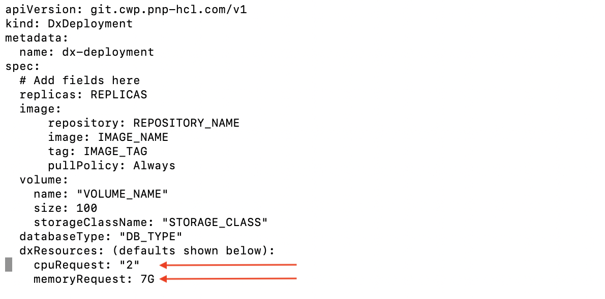
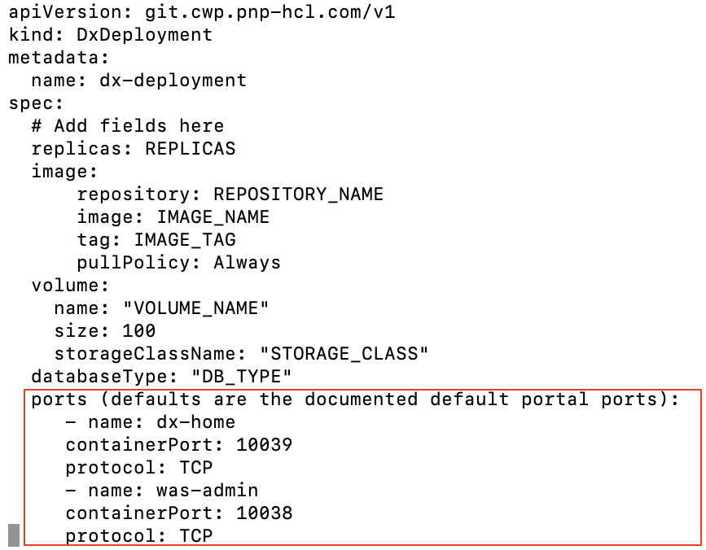

# Customizing the Kubernetes EKS deployment

This section describes how to customize your HCL Portal deployment.

## About this task

Follow this procedure to deploy or update your HCL Portal deployment.

DX 9.5 containerization is focused on deployment and it uses an operator-based deployment.

**Goals**

-   To introduce a supported containerized deployment that HCL Digital Experience can continually extend to provide customers with the best possible experience.
-   To provide a high level of customization in the deployment and continue to expand on that, along with increased automation.

## Before you begin

Customers need to follow the recommended deployment model to ensure the availability of future functions and prevent potential conflicts.

Customizing the deployment requires updating the deploy/crds/git\_v1\_dxdeployment\_cr.yaml file located in the hcl-dx-cloud-scripts/deploy/crds directory in the `hcl-dx-kubernetes-v95-CF184` package downloaded from the HCL Software Licensing Portal.

Once modified, the `deployDx.sh` or the `updateDx.sh` scripts should be run to perform \(or update\) the target deployment.

**Note:** All modifications should be made to the custom resource instance and **not the individual parts** of the deployment.

## Procedure

1.  Create a backup of the git\_v1\_dxdeployment\_cr.yaml file.
2.  Open the original file in edit mode.
3.  Find the line with the text labeled, `# Add fields here`. Customizations should be done below this line.
4.  Add the following customizations as applicable:
    -   Volume Size

        By default, the volume size is **100 GB**. This can be modified by changing the following:

        

        **Note:** The `volume name` and `storageClassName` should not be modified here.

    -   Resources

        By default, the resource requests are set at `**2**` CPU and `**7G**` RAM. These values can be changed. It is recommended to adjust the server heap size before changing these values.

        

        **Note:** Limits are not enforced in the initial 9.5 release.

    -   Probes

        The default readiness and liveness probes run against the ../ibm/console. This can and should be overridden.

        

        **Notes:** There are two types of checks:

        -   `**command**` runs a command against the server
        -   `**http**` hits either an **http** or an **https** URL. The syntax and required fields are shown in the above image.
    -   Logging

        By default, logging is done on the shared profile so all instances are writing to a single set of logs, with the volume set for each instance at `**1G**`. For diagnosing production issues this is not ideal. This option allows each instance to write the log to its own log directory.

        

        **Notes:**

        -   The environment must have a self-provisioning storage class provisioner.
        -   `**Enabled**` must be set to `**true**`.
        -   Adjusting the log settings must be done to prevent running out of disk storage.
    -   Ports

        By default, the deployment uses the default DX ports. The routes in these ports expose Portal through **http** and **https**.

        

        **Note:** If there is a need to configure the containerized Portal to use different ports, the defaults can be overwritten.

5.  Once modified, the `deployDx.sh` and the `updateDx.sh` scripts should be run to create \(or update\) the target deployment.

**Parent topic:**[Deploy DX Container to Amazon EKS](../containerization/kubernetes_eks.md)

