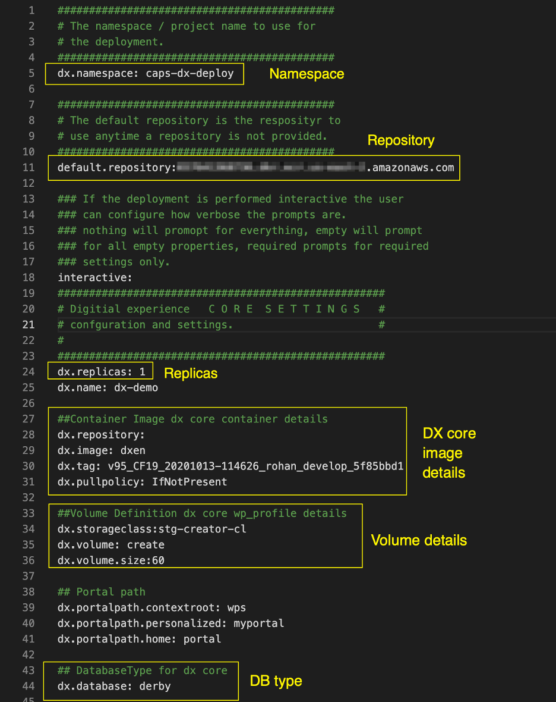
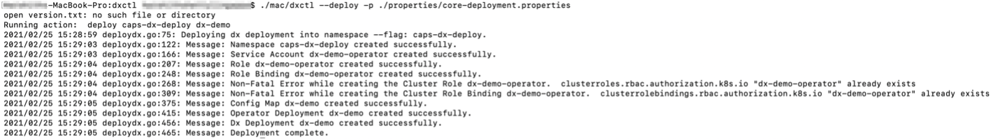

# Deploying DX CF192 and later release Containers to Red Hat OpenShift

Learn how to deploy HCL Digital Experience \(DX\) 9.5 DX CF192 and later release Containers using the Red Hat OpenShift platform.

## Prerequisites

Prior to using the procedure below, it is assumed that the HCL DX Administrator is generally experienced in using Kubernetes. Additionally, the DX Administrator must have cluster admin access to the OpenShift environment.

-   The following tools must be installed on a machine other than the Portal server:
    -   Docker
    -   Red Hat OpenShift Command Line Interface \(CLI\) or kubectl
    -   If deploying Digital Experience Container Update CF192 and later, the **dxctl tool** is used to install and configure the deployment
-   Volume requirement:
    -   Requires an AccessMode of ReadWriteMany
    -   Requires a minimum of **40 GB**, with the default request set to **100 GB**
    -   RECLAIM POLICY = Retain

        **Note:** HCL Digital Experience is input-output \(I/O\) intensive which requires a high performing file system for optimization.


## About this task

Follow these steps to deploy HCL Digital Experience 9.5 container release in Red Hat OpenShift Container Update CF192 and later. If deploying a Container Update CF191 and earlier, see the instructions to deploy using script commands instead of the dxctl tool in this section.

**Note:** Reference the latest HCL DX 9.5 Container Release and Update file listings in the [Docker deployment](../containerization/docker.md) topic.

Video: [Getting Started to deploy HCL DX 9.5 in Red Hat OpenShift](https://www.youtube.com/watch?v=xXsRECRoV7g&feature=youtu.be)

## Procedure

Follow these steps to deploy the HCL Digital Experience \(DX\) 9.5 CF192 and later container release in Red Hat OpenShift.

**Note:** Reference the latest HCL DX 9.5 Container Release and Update file listings in the **Docker deployment topic**.

1.  Download the HCL Digital Experience Container Update CF192 and later release container product and extract it to your local file system:

    ```
    -rw- r--r-- 1 hcl-dx-cloud-operator-image-v95_xxxxxxxx-xxxx.tar.gz
    ```

    ```
    -rw- r--r-- 1 hcl-dx-core-image-v95_xxxxxxxx-xxxx.tar.gz
    ```

    ```
    -rw- r--r-- 1 hcl-dx-openshift-scripts-v95_xxxxxxxx-xxxx.zip
    ```

    **Note:** If using HCL DX 9.5 container update release CF183 and later, the hcl-dx-openshift-scripts-v95\_xxxxxxxx-xxxx.zip file is renamed to hcl-dx-cloud-scripts-v95\_xxxxxxxx-xxxx.zip. The file name change also affects the directory name for future steps.

2.  Open a terminal window and change to the root directory of the extracted package.
3.  Load the containers into your Docker repository:

    -   ```
docker load < hcl-dx-cloud-operator-image-v95_xxxxxxxx-xxxx.tar.gz
```

    -   ```
docker load < hcl-dx-core-image-v95_xxxxxxxx-xxxx.tar.gz
```

    

4.  Extract the HCL DX deployment scripts:

    ```
    unzip hcl-dx-openshift-scripts-v95_xxxxxxxx-xxxx.zip
    ```

    

5.  Distribute the Docker images in your local Docker repository to your target OpenShift repository by tagging and pushing them appropriately. **If you used**`docker load`**to place your images in the target repository, skip this and proceed to the next step.**

    Syntax for tagging:

    ```
    docker tag <image_name>:<image_tag>  <openshift_registry>/<image_name>:<tag>
    ```

    Syntax for pushing:

    ```
    docker push <openshift_registry>/<image_name>:<tag>
    ```

6.  Create \(or have the OpenShift administrator create\) a persistent volume where the AccessMode is set to **ReadWriteMany**and the persistent volume reclaim policy set to **Retain**. For more details refer to the Volume requirements section above.

    

7.  Deploy using the HCL **DX dxctl tool**. Before using the dxctl tool to deploy, you must be logged in to the targeted cluster using the cloud platform specific CLI. \(Red Hat OpenShift, Amazon EKS, Microsoft Azure AKS, Google GKE\).

    Example:

    

8.  Change to the extracted files directory, using DX Container Update CF192 and later, the directory structure appears as follows:

    ```
    ./hcl-dx-openshift-scripts
    ```

    

9.  Configuring dxctl properties for the DX 9.5 Container CF192 and later deployment:
    -   Copy one of the provided properties files to further modify for your deployment.
    -   The modified properties file can be used for the deployment and the same file must be used for further updates.

        Example:

        ```
        mkdir -p /home/$USER/deployments/
        ```

        ```
        cp dxctl/properties/full-deployment.properties /home/$USER/deployments/myfirst_deployment.properties
        ```

    -   Update the dxctl properties file values.

        Sample values:

        ```
        dx.namespace: caps-dx-deploy
        dx.image: dxen
        dx.tag: v95_CF192_20210223-004909 _release_95_CF192_603477b7
        dx.storageclass:dx-deploy-stg
        dx.volume: caps-dx-core
        dx.volume.size:100
        remote.search.enabled:false
        openldap.enabled:false
        api.enabled: false
        composer.enabled: false
        dam.enabled: false
        dx.operator.image: dx-build-output/hcldx-cloud-operator/hcldx-cloud-operator
        dx.operator.tag: v95_CF192_20210223-0546 _release_95_CF192
        ```

        Example:

        

        **Important:** With HCL DX 9.5 Container Update CF197 and later, dam.features in full-deployment properties is added for use in a future container update release, and should not be modified except with direct guidance from HCL Support.

        **Note:** With HCL DX 9.5 Container Update CF193 and later, persist.force.read in full-deployment properties is added to enable a read-only Postgres pod for Digital Asset Management. This enables a failover capability for the Postgres service supporting DAM. Another option to enable a read-only pod is to set the persist.minreplicas: option set to greater than 1.

        Example:

        

10. Deploy using **dxctl**:

    Run the command below using the **dxctl tool** to deploy the HCL DX 9.5 CF192 and later container on Red Hat Openshift:

    ```
    ./mac/dxctl --deploy -p /home/$USER/deployments/myfirst_deployment.properties
    ```

    Example:

    

    **Note:** This set of steps result in a DX 9.5 CF192 and later deployment being created.

    

    **Note:** For more information, see sections on [Understanding the OpenShift deployment](understanding_openshift_deployment.md)and [Customizing the container deployment](customizing_container_deployment.md).


## Update

To update the deployment to later **[HCL DX 9.5 Container Update](https://help.hcltechsw.com/digital-experience/9.5/containerization/docker.md)** releases, follow these steps:

1.  If using HCL DX 9.5 Container Update CF191 and earlier release, update the deployment properties file with the new image values, and then run the Update command.

    Examples:

    -   On Mac:

        ```
        ./mac/dxctl --update -p properties/myfirst_deployment.properties
        ```

    -   On Windows:

        ```
        .\win\dxctl.exe --update -p properties\myfirst_deployment.properties
        ```

    -   On Linux:

        ```
        ./linux/dxctl -–update -p properties/myfirst_deployment.properties
        ```


**Additional considerations:**

For example, once the database is transferred, the **DBTYPE** must be updated so you can scale the instances higher. Additionally, once the database is transferred, the number of replicas could be increased. There are additional options to [customize the deployment](customization.md).

**Note:** If using HCL DX 9.5 Container Update CF192 and later, the [dxctl](dxtools_dxctl.md) tool can be used to update the deployment.

The dxctl tool does not deploy or update the DxDeployment custom resource definition. Prior to running an update process, administrators should check the DxDeployment custom resource definition \(hcl-dx-cloud-scripts/deploy/crds/git.cwp.pnp-hcl.com\_dxdeployments\_crd.yaml\) for changes and update accordingly:

-   **Red Hat OpenShift command:**

    ```
    oc delete crd dxdeployments.git.cwp.pnp-hcl.com
    ```

    CAUTION:

    Since `crd` is a cluster-wide resource, the use of `oc delete crd dxdeployments.git.cwp.pnp-hcl.com` causes a service outage for all the **dx-deployment** across the cluster.

-   **Red Hat OpenShift command:**

    ```
    oc create -f deploy/crds/git.cwp.pnp-hcl.com_dxdeployments_crd.yaml
    ```

    **Note:** The default IBM WebSphere certificate that ships with Digital Experience 9.5 Docker images \(only\) expired on April 26, 2021. A new certificate is added to Digital Experience 9.5 Container Update CF194 and later docker images.

    If you are unable to update to CF194 for any reason, see the following HCL Digital Experience support tech note for manual steps to update the expired certificate: [Manual Steps to Apply the Digital Experience 9.5 Container Deployment Core Certificate Update](https://support.hcltechsw.com/csm?id=kb_article&sysparm_article=KB0089699). The updated certificate included with Digital Experience Container Update CF194 updates the Kubernetes secrets used by the DX 9.5 Red Hat OpenShift routes.

    Following a successful upgrade to DX 95 Container Update CF194, it is necessary to manually delete the secure Digital Experience 9.5 route if deployed on OpenShift. The operator recreates the route using the updated secrets data. If you are using additional custom routes that utilize the Digital Experience 9.5 container secrets, edit or delete/recreate them to use the updated secrets data.

    **For example:**

    ```
    oc delete route `<deployment name>`-service-dx-home-sec
    ```


## Delete

To delete the deployment, follow one of two methods:

-   **Method 1:** Remove the deployment but allow for redeployment with the same volumes:

    Examples:

    ```
    . ./linux/dxctl --destroy -p properties/myfirst_deployment.properties
    ```

-   **Method 2:** Remove the entire namespace/project:

    Example:

    ```
    ./linux/dxctl --destroy -p properties/myfirst_deployment.properties -all true
    ```

    NAMESPACE - the project or the namespace created or used for deployment.

    If some deployment resources such as services are not deleted, the following command can be run:

    ```
    kubectl patch services $(kubectl get services -n $NAMESPACE  | grep -v "NAME" |awk  '{print $1}') -p '{"metadata":{"finalizers":null}}' -n $NAMESPACE
    ```


**Parent topic:**[Deploying DX Container to Red Hat OpenShift](../containerization/deploy_openshift.md)

