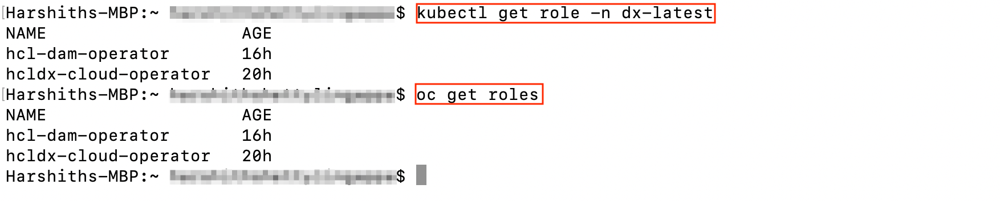
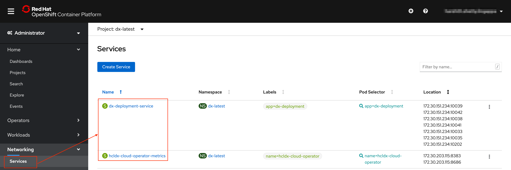
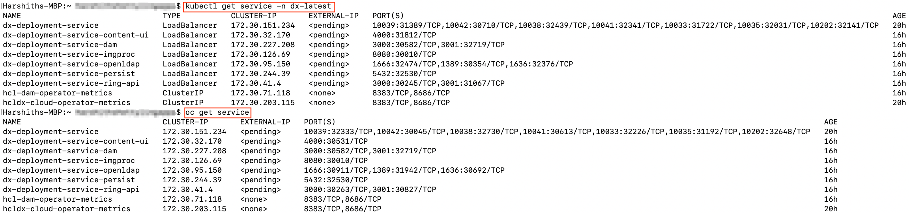
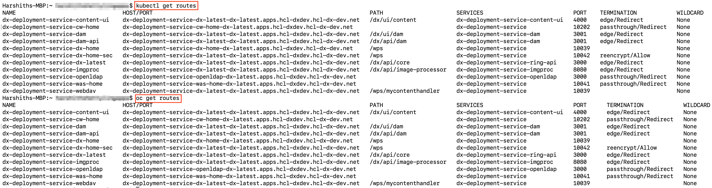

# Understanding the OpenShift deployment

This section describes the output and artifacts created when deploying HCL Digital Experience 9.5 Docker images to Red Hat OpenShift.

**Note:** All modifications must be done on the custom resource instance and not the individual pieces of the deployment. See [Customizing the container deployment](customizing_kubernetes_eks_deployment.md) for details.

Deploy with the following command:

```
./scripts/deployDx.sh your_namespace 1 your_repository dxen v95_CF184_20200916-2009 dxh1-dam dx deploy-stg derby
```

Results in the following output:

```
Namespace:  your_namespace
- REPLICAS:  1
- Repository:  your_repository
- Image Name:  dxen
- Image Tag:  v95_CF184_20200916-2009
- Volume Name:  dxh1-dam
- Storage Class Name:  dx-deploy-stg
- Database Type:  derby
-
namespace/your_namespace created
serviceaccount/hcldx-cloud-operator created
role.rbac.authorization.k8s.io/hcldx-cloud-operator created
rolebinding.rbac.authorization.k8s.io/hcldx-cloud-operator created
deployment.apps/hcldx-cloud-operator created
dxdeployment.git.cwp.pnp-hcl.com/dx-deployment created
```

The following artifacts are created during deployment:

## Artifacts

**Note:** Before executing OpenShift CLI, we need to set the project:

```
oc project project_name
```


Project/Namespace

The **Project**/**Namespace** gets created if it does not already exist.


-   **Example Kubernetes command:**

    ```
    kubectl get namespaces your_namespace
    ```

-   **Example OpenShift CLI command:**

    ```
    oc get project your_namespace
    ```


**Note:** `dx-latest` is the project name in this example.

Service Account

The operator is scoped to the same namespace as the project namespace. It is also possible to implement multiple DX 9.5 deployments in one namespace, sharing a single operator.

**Note:** The Operator is used to deploy, configure, and manage the HCL DX9.5 deployment to Red Hat OpenShift. Consult the **[Red Hat OpenShift Operator documentation](https://www.openshift.com/learn/topics/operators)** for more information.


-   **Example Kubernetes command:**

    ```
    kubectl get serviceaccounts -n your_namespace
    ```

-   **Example OpenShift CLI command:**

    ```
    oc get serviceaccount
    ```


Role

A **Role** that defines the access required by the operator.


-   **Example Kubernetes command:**

    ```
    kubectl get role -n your_namespace
    ```

-   **Example OpenShift CLI command:**

    ```
    oc get roles
    ```

    


Role Binding

A **Role Binding** that binds the operator service account to the operator role.


-   **Example Kubernetes command:**

    ```
    kubectl get rolebinding -n your_namespace
    ```

-   **Example OpenShift CLI command:**

    ```
    oc get rolebinding
    ```

    


Deployment

A **Deployment** that defines/describes the operator Replica Set.


-   **Example Kubernetes command:**

    ```
    kubectl get deployment -n your_namespace
    ```

-   **Example OpenShift CLI command:**

    ```
    oc get deployment
    ```

    


Replica Sets

A **Replica Set** based on the deployment. This maintains a stable set of replica pods.


-   **Example Kubernetes command:**

    ```
    kubectl get replicaset -n your_namespace
    ```

-   **Example OpenShift CLI command:**

    ```
    oc get replicasets
    ```

    


Metrics and Services

Services are created to expose HCL Digital Experience running as part of the Stateful Set and to provide metrics for the operator.



-   **Example Kubernetes command:**

    ```
    kubectl get service -n your_namespace
    ```

-   **Example OpenShift CLI command:**

    ```
    oc get service
    ```

    


Secrets

There are several secrets that are created.


-   **Example Kubernetes command:**

    ```
    kubectl get secrets -n your_namespace
    ```

    **Example OpenShift CLI command:**

    ```
    oc get secret
    ```

    

-   **Example Kubernetes details command:**

    ```
    kubectl describe secret dx-deployment-wps -n your_namespace
    ```

-   **Example Kubernetes update existing secrets command:**

    ```
    kubectl edit secret dx-deployment-wps -n your_namespace
    ```

    -   Use double `base64` encoded values when updating secrets. Most Linux operating systems will allow you to generate double `base64` values with this command:

        ```
        echo 'wpsadmin' | base64 | base64
        ```


Config Map

A **Config Map** is created to handle clustering in scenarios where multiple operators are deployed.


-   **Example Kubernetes command:**

    ```
    kubectl get configmap -n your_namespace
    ```

-   **Example OpenShift CLI command:**

    ```
    oc get configmap
    ```

    


Persistent Volume Claims

One or more **Persistent Volume Claims** are created, one for the shared profile, and another, if configured, for the logs of each pod.


-   **Example Kubernetes command:**

    ```
    kubectl get pvc -n your_namespace
    ```

-   **Example OpenShift command:**

    ```
    oc get pvc
    ```

    

    **Note:** Logs are shown when logging is configured.


Stateful Set

A **Stateful Set** is created for the HCL Digital Experience core. A Stateful Set manages pods that are based on an identical container specification.


-   **Example Kubernetes command:**

    ```
    kubectl get statefulset -n your_namespace
    ```

-   **Example OpenShift CLI command:**

    ```
    oc get statefulset
    ```

    


Pods

**Pods** are part of the Stateful Set, running HCL Portal.


-   **Example Kubernetes commands:**

    ```
    kubectl get pods -n your_namespace
    ```

    ```
    kubectl get pods -l app=app_name -n your_namespace
    ```

-   **Example OpenShift CLI command:**

    ```
    oc get pods
    ```

    ```
    oc get pods -l app=app_name
    ```

    


Routes

These are used to expose various ports in the HCL Digital Experience service, including those used to access HCL Portal, the WAS console, and the Config Wizard.


-   **Example Kubernetes command:**

    ```
    kubectl get routes
    ```

-   **Example OpenShift CLI command:**

    ```
    oc get routes
    ```

    


Extras

There are several files created for each deployment. It is recommended to keep these files.


-   File 1 `'dxNameSpace_NAMESPACE.yaml'` can be used to delete the `namespace`/`project` if needed.
-   File 2 `'git_v1_dxdeployment_cr_NAMESPACE.yaml'` is a representation of the last deployed deployment for the given `namespace`/`project`.

**Note:** With multiple instances of Digital Experience 9.5 containers writing to a shared **[Transaction log](https://www.ibm.com/support/knowledgecenter/SSEQTP_9.0.5/com.ibm.websphere.base.doc/ae/tjta_settlog.md)** \(tranlog\) directory, there is a possibility of data corruption which could lead to DX server startup issues. To avoid this possibility, beginning with CF192, for each DX 9.5 instance the deployment creates an additional dynamic Persistent Volume \(pv\) and Persistent Volume Claim \(pvc\) to contain the tranlog data of the individual instances.

**Parent topic:**[Deploy DX 9.5 Container to Red Hat OpenShift](../containerization/openshift.md)

