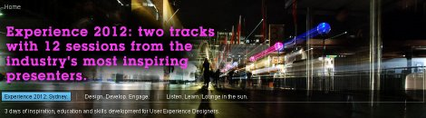

# Slideshows 

These slideshows can be added to your page from the Create Content Slideshows view when in Edit mode.

The Slideshow template is similar to the List template, but has extra fields for configuring the behavior of the slideshow widget. The configuration includes the type of transition, duration, automatic or manual starts, when to pause, and what controls to display. The widget that is used to render the slideshow is a Dojo widget calleddojox.widget.AutoRotator. The widget rotates through the elements in a list, adding a transition between them. Content Template Catalog has examples that show linked images, but the list can contain any type of content.

The configuration information that is entered into a Slideshow configuration item is translated into parameters for the widget by using a JavaScript method in content.js. This code also instantiates the Dojo widget.

The styling of the slideshows is complex as they have a separate "caption" container that is populated as it rotates through the slideshow. The caption is stored in a hidden `DIV` element with each slide and is then copied into the visible container through event handlers that are attached to the widget.

The following example shows a promotional slideshow, with overload captions and title controls.

This second example shows a content slideshow with number controls and formatted captions.

## Slideshow configuration

Each slideshow uses a configuration document based on the **Slideshow** authoring template in the **CTC Design** library. The following configuration parameters are used by the slideshow:

-   **Transition**

    You can select from a range of transitions including fades, slides, pans, and wipes.

-   **Rotation**

    Select the type of rotation to apply to a slideshow. This determines how often the slides in the slideshow are shown and in what order.

-   **Slide Duration**

    This determines how long each slide in the slideshow is displayed before the next image is displayed.

-   **Suspend**

    The rotation of a slideshow can be stopped by using the different methods that are chosen in this parameter.

-   **Controls**

    Different slideshow controls can be displayed by using the different control options that are selected in this parameter.

-   **Height**

    This determines the height of the slideshow.

-   **List Title**

    Some list designs include a title in their header design. The title entered here is displayed in those list designs.

-   **CSS Style**

    Much of the design of each slideshow is defined in the CSS file that is linked to that slideshow. You can enter the name of alternative CSS files here to change some design elements of the content that is displayed in the slideshow.

-   **List component**

    The list component that is selected here defines what content is displayed in the slideshow.

-   **List Presentation Component**

    The list presentation that is selected here defines the layout of the header, footer, and body of the content that is retrieved by the list component.

-   **Context Override**

    You can select a site, site area, content item to use as the default context of the slideshow. This is used instead of the default slideshow context.

-   **List Templates**

    Some list components display content that uses a specific authoring template. Extra authoring templates can be specified here.

-   **List Categories**

    Some list components display content that is profiled by using specific categories. Extra authoring templates can be specified here.

-   **[Events Recent Featured Slideshow ](../ctc/ctc-portlet-events-recent-featured.md)**  
Displays a set of featured recent events in a slideshow. By default, any items created by using the Event content template is displayed in this portlet. This is similar to the Events Recent portlet, but displays extra items after the slideshow.
-   **[Events Recent Featured Slideshow with Overflow ](../ctc/ctc-portlet-events-recent-featured-overflow.md)**  
Displays a set of featured recent events in a slideshow. By default, any items that are created by using the Event content template are displayed in this portlet. This is similar to the Events Recent portlet, but displays extra items following the slideshow.
-   **[Events Upcoming Featured Slideshow ](../ctc/ctc-portlet-events-upcoming-featured.md)**  
Displays a set of featured upcoming events in a slideshow. By default, any items that are created by using the Event content template are displayed in this portlet.
-   **[Events Upcoming Featured Slideshow with Overflow ](../ctc/ctc-portlet-events-upcoming-featured-overflow.md)**  
Displays a set of featured upcoming events in a slideshow. By default, any items that are created by using the Event content template are displayed in this portlet.
-   **[News Featured Slideshow with Overflow ](../ctc/ctc-portlet-news-featured-overflow.md)**  
Displays a set of featured news items in a slideshow. By default, any items created by using the News content template is displayed in this portlet.
-   **[News Featured Slideshow ](../ctc/ctc-portlet-news-featured.md)**  
Displays a set of featured news items in a slideshow. By default, any items created by using the News content template is displayed in this portlet.
-   **[Promotions Slideshow Grid Design ](../ctc/ctc-portlet-promotions-slideshow-grid-design.md)**  
Displays a set of slides and text in the form of a slideshow. It is designed to work with content created by using the Promotion content template. This is similar to the Promotions Slideshow, but this portlet displays a grid of slideshows.
-   **[Promotions Slideshow ](../ctc/ctc-portlet-promotions-slideshow.md)**  
Displays a set of slides and text in the form of a slideshow. It is designed to work with content created by using the Promotion content template.
-   **[Topics Featured Slideshow ](../ctc/ctc-portlet-topics-featured.md)**  
Displays a set of featured topics in a slideshow. By default, any items that are created by using the Topic content template are displayed in this portlet.
-   **[Topics Featured Slideshow with Overflow ](../ctc/ctc-portlet-topics-featured-overflow.md)**  
Displays a set of featured topics in a slideshow. By default, any items created by using the Topic content template is displayed in this portlet. Additional items are displayed in a list following the slideshow.

**Parent topic:**[Page components ](../ctc/ctc-portlet-types.md)

