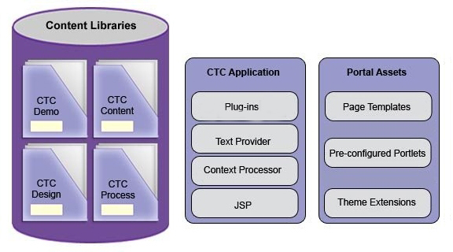

# Components installed with Content Template 

When you install Content Template Catalog, you receive several types of components.

-   Content libraries
-   An application containing the plug-ins, text providers, context processors, and JSPs
-   A set of portal assets including page templates, pre-configured portlets, and theme extensions that enhance the base Portal theme with options suited to content-rich websites delivered on various mobile devices
-   A set of configuration parameters that are added during the installation

The following illustration shows how the components are organized.

## Context Processors

-   **PostBodyContextProcessor**

    This is used in Dynamic Post-Body portlet. This context processor looks for a link element that is named Post Body and sets this linked content as the content to render.

-   **SidebarContextProcessor**

    This is used in Dynamic Sidebar portlet. This context processor looks for a link element that is named Sidebar and sets this linked content as the content to render.

## JSP files

The CTC JSP files are located at [wp\_profile\_root](../reference/wpsdirstr.md)/installedApps/CTC.ear/ctc.war/jsp.

These JSP files are often customized:

-   **footer.jsp**

    The footer of the page that is created by scanning the pages in the site.

-   **nav.jsp**

    The popup navigation menu that is created by scanning the pages in the site.

-   **setupIndexFilter.jsp**

    This JSP handles the **Index Page Filtered Search** that is used on index pages that contain search input, such as News and Events. It retrieves the search terms that are set as request parameters and sets up the search component to display results for these search terms.

-   **setupSearchResults.jsp**

    This JSP handles the **Search Results Page Site Search**. It uses the search component located at **CTC Design** \> **Components** \> **List Components** \> **Search Results List** to show rendered page search results within the current site on a search results page that has been created by the Search Results page template. It retrieves the search terms that are set as request parameters and sets up the search component to display results for these search terms.

Further information is found in the JSP files themselves. Some of the JSPs in this directory are contributed to the theme by the file `/WEB-INF/plugin.xml`. For example, **nav.jsp** is defined as a JSP that can create the portal primary navigation. Any theme profile that contains the theme module **primaryNav\_overlay** uses **nav.jsp** to generate the primary navigation. Other JSPs are included using JSP components. For example, **setupIndexFilter.jsp**.

**Note:** Any customization of JSP files should be made by copying the JSP to a new Web application and referencing these JSP files from your content. Otherwise, the changes will have to be reapplied whenever CTC is upgraded.

**Parent topic:**[Assets contained in the Content Template ](../ctc/ctc-assets.md)

**Related information**  

[Writing modules ](../dev-theme/themeopt_mod_plugin_xml.md)

