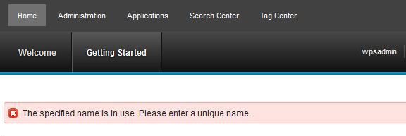

# Displaying messages in the status bar module 

You can display messages in the status bar to share important information with users.

Go to [Adding a message module](themeopt_themedev_status_bar.md#) to learn more about customizing status bar messages in the Simple Theme.

All ready-to-use theme profiles include the status\_bar module, which provides an area beneath the header for displaying error, warning and information messages. The following image shows an example error message in red.



1.  Add a line of JavaScript to Use this status bar in your themes, modules, and portlets can use this status bar.

    The following example shows the StatusMessage JavaScript code:

    ```
    i$.fireEvent("/portal/status",[{message: new com.ibm.widgets.StatusMessage
    ("error", "The specified name is in use. Please enter a unique name.", ""), uid: 'ibmStatusBox'}]);
    ```

    `i$.fireEvent` is the recommended syntax. If you are using the `dojo.publish` alternative syntax, refactor this code to use the `i$.fireEvent` procedure.

    1.  The first argument in the StatusMessage can be either "error", "warning" or "info" to control the icon and color of the message box.

    2.  The second argument in the StatusMessage is a String representing the message itself to be displayed in the message box.

    3.  The third argument in the StatusMessage is an optional String representing any further details about the message. The details are not presented to the user by default, rather only if the user clicks the **Show Details** icon to expand the message box.

2.  If you have an error that originates on the server, you can set a ibm.portal.operations.error cookie in the response, and the client shows the message when the response completes. Use parsable JSON code for the cookie string value, such as:

    ```
    ibm.portal.operations.error={"errorType":"error","errorMessage":"The specified name is in use. Please enter a unique name.","errorDetails":""}
    ```

3.  Messages are cleared automatically on page reload. If you must clear one or more messages from the client by using JavaScript, then you can use the following code:

    ```
    i$.fireEvent("/portal/status/clear", [{message: mymessage, uid: 'ibmStatusBox'}]);
    ```

    where mymessage is the StatusMessage instance you saved when displaying the message. Code like the following example is fine too:

    ```
    i$.fireEvent("/portal/status/clear", [{message: new com.ibm.widgets.StatusMessage ("error", "The specified name is in use. Please enter a unique name.", ""), uid: 'ibmStatusBox'}]);
    ```

    The event clears any messages whose StatusMessage type, message, and details strings match, so you do not have to reuse the same actual StatusMessage instance.

    If no StatusMessage is passed, then it clears all messages. You can clear everything with the following code sample:

    ```
    i$.fireEvent("/portal/status/clear", [{uid: 'ibmStatusBox'}]);
    ```


**Parent topic:**[Customizing the theme ](../dev-theme/themeopt_cust.md)

