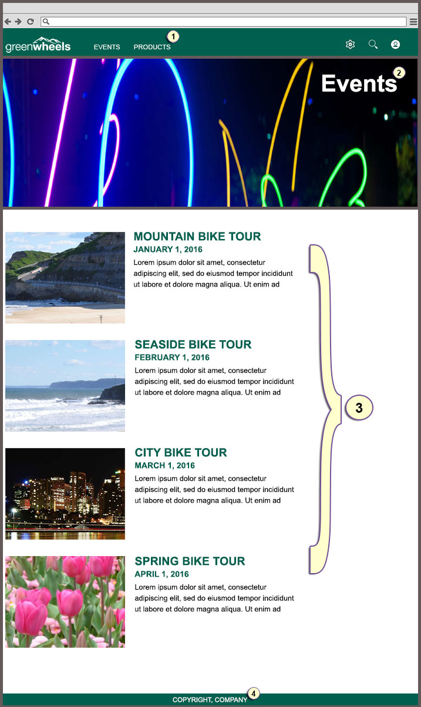

# HTML prototype design requirements 

View sample HTML prototypes for landing pages and explore how to separate the design into pieces with specific design requirements and technical considerations.

**Parent topic:**[Setting up the site for the content author ](../install/rm_create_site.md)

# Home page HTML prototype

You are an information architect that receives a design HTML prototype for a new home page. From the design, you see multiple design pieces that must be developed before a content author can create the new home page.

Some of these pieces of the design are controlled by the theme. Other pieces of the design, such as page components, are developed in your web content library and are developed for content authors to add to the page with Site Manager.

-   **1. Header with company logo and navigation**

    The theme controls the header, company logo, and navigation. To create a new theme, the theme developer can create a copy of the simple theme in Theme Manager.

    You can set the theme for the root page of the site. Go to the Roadmaps section and find *Roadmap: Creating a custom theme* for more topic information.

-   **2. Banner with image and text**

    -   A content author adds a banner to the page by selecting a predefined banner page component from the page component palette.
    -   As a developer, you must first generate a banner page component by using the generate feature of the web content authoring application. Go to the Roadmaps section and find *Roadmap: Creating the banner page component* for more topic information.
-   **3. Promotional text**

    -   A content author adds promotional text to the page by selecting a predefined promotional text page component from the page component palette.
    -   As a developer, you must first generate a promotional text page component from a teaser template type by using the generate feature of the web content authoring application. Then, you can customize the style of your text. For example, you can specify font-size, font-weight, and more to match the HTML prototype. Go to the Roadmaps section and find *Roadmap: Creating the promotional text page component* for more topic information.
-   **4. Content item reference**

    -   Highlight a content item on the Products landing page from your Home page. A content author can use Site Manager to add a reference to a content item that is stored on the hidden Content page of the Products landing page to showcase a new product release. The Products landing page is a child page to the Home page of the site.
-   **5. Teaser that takes you directly to the Products landing page**

    -   A content author can add site navigation to the page by selecting a predefined teaser page component from the page component palette that links to the Products landing page in the site. The Products landing page is a child page to the Home page of the site.
    -   As the developer, you must first generate a teaser page component by using the generate feature of the web content authoring application. Then, you can customize the teaser that you generate. For example, you can customize the button that links you to the Events page to match the design that is shown in the HTML prototype. Go to the Roadmaps section and find *Roadmap: Creating the teaser page component* for more topic information.
-   **6. Content item reference**

    -   Highlight a content item on the Events landing page from your Home page. A content author can use Site Manager to add a reference to a content item that is stored on the hidden Content page of the Events landing page to showcase the latest event. The Events landing page is a child page to the Home page of the site.
-   **7. Teaser that takes you directly to the Events landing page**

    -   A content author adds site navigation to the Home page by selecting a predefined teaser page component from the page component palette that links to the Events landing page in the site. The Events landing page is a child page to the Home page of the site.
    -   As the developer, you must first generate a teaser page component by using the generate feature of the web content authoring application. Then, you can customize the teaser that you generate. For example, you can customize the button that links you to the Events page to match the design that is shown in the HTML prototype. Go to the Roadmaps section and find *Roadmap: Creating the teaser page component* for more topic information.
-   **8. Second promotional text**

    -   A content author adds promotional text to the page by selecting a predefined promotional text page component from the page component palette.
    -   As the developer, you must first generate a promotional text page component from a teaser template type by using the generate feature of the web content authoring application. Then, you can customize the style of your text. For example, you can specify font-size, font-weight, and more to match the HTML prototype. Go to the Roadmaps section and find *Roadmap: Creating the promotional text page component* for more topic information.
-   **9. Sign-up application**

    -   A content author adds a sign-up application to the page by selecting a predefined HCL Script Application from the page component palette.
    -   As the site manager, you create a custom script portlet that was configured as a sign-up application.
-   **10 Footer**

    The theme controls the footer. See item 1.

# Landing page HTML prototype

The landing page HTML prototype features many of the same design pieces that are included in the home page HTML prototype. The landing page HTML prototype contains the same header and footer as the home page. The banner page component is also used on both the landing page and home page HTML prototypes. However, the landing page HTML prototype features a dynamic list page component that showcases multiple content items. The home page HTML prototype does not require the dynamic list page component.

-   **1 Header with company logo and navigation**

    The theme controls the header, company logo, and navigation. To create a new theme, the theme developer can create a copy of the simple theme in Theme Manager.

    You can set the theme for the root page of the site.

-   **2 Banner with image and text**

    -   A content author adds a banner to the page by selecting a predefined banner page component from the page component palette.
    -   As the developer, you must first generate a banner page component by using the generate feature of the web content authoring application.
-   **3 Dynamic list page component**

    -   A content author adds a dynamic list to the landing page by selecting a predefined dynamic list page component from the page component palette.
    -   As the developer, you must generate a dynamic list page component by using the generate feature of the web content authoring application. You can generate your starting point for your list from the teaser template type. Then, you can customize your authoring template and create a menu page component to define the sort order of your list. Finally, you can modify the generated presentation template to use a summary presentation and allow the content author to specify the path to query for the content items that should display in the list.
-   **4 Footer**

    The theme controls the footer. See item 1.

# Creating a design library

Create a design library to separate design content items from web content items. Generate your page components and page templates in the design library. Separating your design content from your web content has the following two benefits:

-   You can control syndication of your design elements separately from your web content
-   You can keep portal updates, such as combined cumulative fixes, from overriding updates that you made to your design elements

1.  Click the **Administration menu** icon. Then, click **Portal Content** \> **Web Content Libraries**.

2.  Create your design library.

    For example, you can name the library Greenwheels Design.

3.  Click the **Set Permissions** icon to open the Resource Permission pane.

4.  Click the **Edit Role** icon for the following resources to edit the role:

    -   **Contributor**
    -   **Editor**
    -   **Manager**
    -   **Administrator**
    Add the appropriate users and groups to the roles to give them access.

5.  Click the **Applications menu** icon. Then, click **Content** \> **Web Content Authoring**.

6.  Click **Preferences** \> **Configure**.

7.  Expand **Library Selection**.

8.  Add your design library to the **Selected Libraries** list.

9.  Click **OK**.

