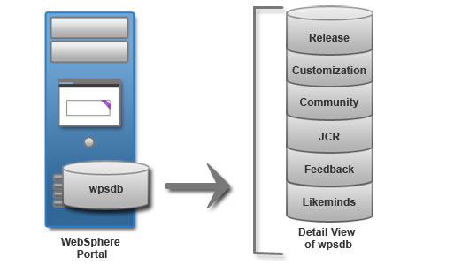

# Database topologies 

Consider the database configuration options in relation to your HCL Portal deployment scenario.

HCL Portal data is separated into six portal database domains: release, customization, community, JCR, feedback, and likeminds. The portal database domains facilitate the flexibility that is required to meet different availability requirements. The database topology varies depending on the deployment scenario. A proof-of-concept or development environment has different database topology requirements than a production environment. Review the topologies to determine your portal deployment requirement.

## Local database

For proof-of-concept, demonstrations, and development environments, you can use a local database. You can install the database management software on the same server as HCL Portal. When the database is on the same server as the portal, it is referred to as a local database. Using a local database can make administering your environment easier. However, this setup is best used for proof-of-concept deployments only. A local database competes for server resources with your portal.

In the topology diagram, all of the portal database domains are stored in one database, wpsdb.

## Remote database

For normal load balancing, you can use one or more remote databases. You can install the database management software on a different server from HCL Portal. When the database is on a different physical server than the portal, it is referred to as a remote database. Using a remote database can provide performance benefits, depending on the speed of the network.

When multiple lines of production are involved and each line of production is implemented as a cluster of servers, share portal database domains. Each database domain can be placed on a separate database for efficient maintenance. The release and JCR portal database domains cannot be shared. Sharing of database domains refers to concurrent access to the same physical database by multiple lines of production. A setup in which each line of production owns a copy of the shareable database domains and data replication is used to synchronize these copies is not supported.

The topology diagram is similar to the local database topology. The main difference is that the database is on a different server than the portal.

## High capacity and availability

For high capacity load balancing, use one or multiple remote databases. When you deploy the portal in a large-scale, high-demand environment, you can dedicate a server specifically for database transactions. As more users access the portal, the portal application becomes database intensive. Database activity can take up processor resources and disk I/O time. Separating the database from the server that the portal is running on increases its capacity.

The topology diagram shows a remote database server with four databases. The JCR and release portal database domains have unique databases. They cannot be shared. Also, the release portal database domain cannot be taken offline. Another database contains the customization and community portal database domains. Finally, another database to contain the feedback and likeminds portal database domains.

**Parent topic:**[Database considerations ](../plan/db_considerations.md)

