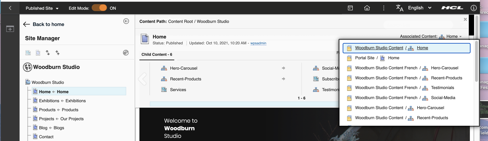
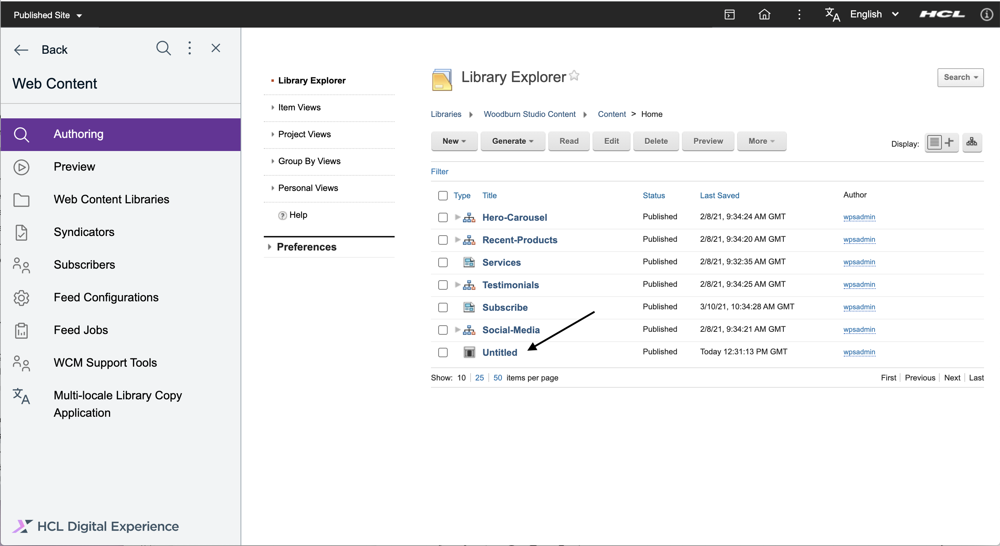

# Filtering the Results of a WCM Navigator Component 

This document helps to filter navigator component results and use the Woodburn Studio site as an example of when this type of filtering might be needed.

A WCM navigator component is designed to run through the WCM artifacts located under a site area or content and display those resources. Under certain circumstances, it might be necessary to filter the results of the navigator component to determine what needs to be displayed.

## Woodburn Studio Home page issue

The Woodburn Studio Home page implements a navigator component to display the contents of the page. In addition the page has associated content defined which points to the Woodburn Studio Content/Home site area.

The OOB \(Out Of Box\) Script Application uses the associated content page to determine where the application will be placed. For example, if the Script Application is added to the Woodburn Studio Home page you will see the application in the Web Content Management \(WCM\) UI under the site area.

Adding the Script Application to the Woodburn Studio Home page appears to cause an issue because the portlet displays twice at the bottom of the page. The navigator is configured to display every item under the Home site area so it is displayed first as part of the navigator, and secondly, as an additional portlet on the page. Having the portlet appear twice on the page is not desirable, and can be fixed in the following two ways:

-   [Fix by reconfiguring the page properties](#Fix_by_reconfiguring_the_page_properties)
-   [Fix by filtering the navigator results](#Fix_by_filtering_the_navigator_results)

## Fix by reconfiguring the page properties

The issue on the Woodburn Studio Home page can be fixed by changing the page associations in the page properties dialog to something other than Woodburn Studio Content/Home. However, it is a WCM best practice to associate the page with a WCM site area or other WCM artifact, so this fix is not recommended.

## Fix by filtering the navigator results

The better option to fix the Woodburn Studio Home page issue is to filter the results in the navigator.

The navigator used for the Home page can be found by looking at the Home page site area presentation template override.

The presentation template override in the Home page site area identifies PT-Override as the presentation template which will be used to render the page. The **Presentation Template Options** section in the **PT-Override** template pulls in the nav-render-content-per-site-area navigator component.

The Nav-Render-Content-Per-Site-Area navigator is configured to start at the current top level site area \(in this case, the Woodburn Studio Content/Home\) and there is no filtering in the **Result design 1** section, so the Script Application shows up in the navigator list and is subsequently displayed twice on the page.

The following filter can be added to the navigator to filter the Script Application from the results. The filter displays all artifacts which do not have a title of **Script Portlet**.

As a result of the filter, the Script Application is removed from the navigator list and the page displays correctly showing only one instance of the portlet.

**Parent topic:**[The Woodburn Studio demo site ](../woodburn_studio/woodburn_studio.md)

