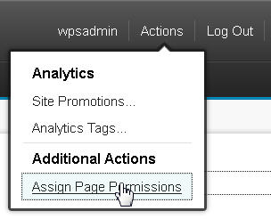

# Adding a link to the resource permissions administration portlet in a menu

You can add a link to the resource permissions portlet to see or modify role types or inherited access.

To view or modify role types or inherited access, you must use the **Resource Permissions** portlet. Click the **Administration menu** icon. Then, click **Access** \> **Resource Permissions**.

1.  Connect your WebDAV client, to http://host:port/wps/mycontenthandler/dav/fs-type1/.

2.  Go to /themes/YourCustomTheme/menuDefinitions and open the menu file to which you want to add the new permissions entry. By default, the pageAction.json file corresponds to the **Actions** menu.

3.  Add this menu entry to the JSON array:

    If you make this the last entry, add a comma before the following example.

    ```
    {
       "type":"DynamicMenuitem",
       "id":"ibm.portal.operations.assignPagePermissions",
       "titles": [
          {
             "value":"Assign Page Permissions",
             "lang":"en"
          }
       ]
    }
    ```

4.  Restart the server to apply your changes.


The following screen shot shows the modified **Actions** menu. The link in the menu opens a resource page permissions portlet that affects the page that the user is currently viewing.




