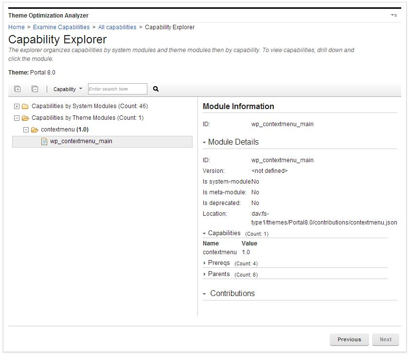

# Examine capabilities

Use the Capabilities section to explore capabilities that are defined as part of modules.

You can view the various names and versions in one list, with the modules that exposed them shown.

## Capabilities by pages

Use the Examine capabilities by page section to explore capabilities that are defined on a specific page. Capabilities can be contributed to a page via its profile or portlets. Select a page in the Select Page screen and then advance to the Capability Explorer to explore the capabilities on that page.

The Select Page screen displays the site's page hierarchy in the tree view and shows details on the selected branch in the details view. You can now learn more about the pages before you select one to examine.

In the tree view, when a page has a specified profile that is not inherited from the parent, the profile name displays in parentheses after the page name. All other information is shown in the details view, such as the page, profile and theme information.

After you select a page, the Capability Explorer screen displays.

## Capabilities by profile

Use the **Examine capabilities by profile** section to explore capabilities that are defined as part of modules for a specific profile. To do that you must first select a profile in the Profile Selection screen and then advance to the Capability Explorer.

The **Select Profile** screen displays the themes and their profiles in the tree view and shows details on the selected branch in the details view. You can now learn more about the various artifacts that are installed in the system before you select a profile to examine.

The tree view also shows in parentheses which theme and profile is the default so this information is easily visible. All other information is shown in the details view, such as the location of the profile JSON file. The profile JSON file is an element that can be clicked and opens a new window and serves the resource in the browser when clicked.

After you select a profile, the Capability Explorer screen will display.

## All Capabilities

Use the **Examine all capabilities** section to explore all capabilities that are provided by modules available with the system, theme, or both. Select a theme or the system module branch in the **Select Theme** screen and then advance to the Capability Explorer.

The **Select Theme** screen displays a system modules branch and all themes in the tree view. Select a theme to view more information about the various artifacts that are installed in the system before you decide on a theme and continue to the Capability Explorer. To view the capabilities in a theme, double-click the theme or select the theme and click **Next**.

## Capability explorer

The capability explorer displays the capability names and versions that are provided by a set of modules in a split view. The tree view shows the capabilities and respective module that defines the capability, the details view shows details on the selected module from the tree view.

You can get to the capability explorer from different paths in the UI.

1.  When you examine the capabilities that are scoped by page, you have two root branches, each with two children:

    -   Capabilities from Profile: The root for all capabilities that are provided by modules in the profile.
        -   Capabilities: All capabilities that are provided by modules in the non-deferred section of the profile.
        -   Capabilities by a deferred section: All capabilities that are provided by modules in the deferred section of the profile.
    -   Capabilities from Portlets: The root for all capabilities that are assigned by the page's portlets.
        -   Capabilities: All non-deferred capabilities that are provided by the page's portlets.
        -   Capabilities by a deferred section: All deferred capabilities that are provided by the page's portlets.
    

2.  When you examine the capabilities that are scoped by profile, you have two root branches:

    -   Capabilities: The root for all capabilities that are provided by modules in the none deferred section of the profile.
    -   Capabilities by a deferred section: The root for all capabilities that are provided by modules in the deferred section of the profile.
    

3.  When you examine the system and theme capabilities, you have one or two branches:

    -   Capabilities by System Modules Contain all capabilities that are provided by modules that are defined globally through a plugin.xml.
    -   Capabilities by Theme Modules Contain all capabilities that are provided by modules that are defined within the themes capabilities folder as part of the JSON files. This branch is only shown when a theme is selected.
    

When you expand a tree or branch, if it is large and takes more than 30 seconds to expand, the expansion process is stopped. You must expand those branches individually.

The details view displays the details for the selected module such as:

-   ID: Displays the module ID.
-   Version: Displays the module version, if one was defined.
-   Is system-module: Yes if the module is globally defined through a plugin.xml file.
-   Is meta-module: Yes if the module does not contain any contributions, but instead contains only prerequisites.
-   Is deprecated: Yes, if the module was deprecated.
-   Location: Displays the file path for the module.
-   Capabilities: Displays all capabilities for the module.
-   Prereqs: Displays all prerequisites for the module.
-   Parents: Displays all parent modules for the module
-   Contributions: Displays all contributions by contribution and sub contribution. The resources are elements that can be clicked, which open a new window and serves the resource in the browser when clicked.

    !!! note
        In simulation mode, the resources cannot be clicked.

## Searching within the capability explorer.

Use the search bar to search the tree view and the details view for various information. The following search scopes are supported:

-   Module Identifier: Search for a specific module by name. For example, `wp_client_main`.
-   Resource: Search for the module that exposes a certain resource. For example, enter master.css to identify the module that exposes this resource. This search is useful if you find an error in a JavaScript file in your browser. You can easily find the module that this resource belongs to.
-   Capability: Search for the modules that are associated with a specific capability. For example, if you want to know which module provides the `dojo` capability. Then, you know which module you must add as a prerequisite for your own module.
-   Reference Identifiers: Search for which dynamic content spot or module reference is exposed by which module.

Enter a term into the search field in the toolbar and press Enter or click the **Find** icon. The found item is then highlighted for a short time with a yellow background. Pressing Enter again or clicking **Find** icon again will find the next item. If no item is found, either a pop-up dialog opens to instruct you to start the search from the beginning or the background of the search field is marked in red.

