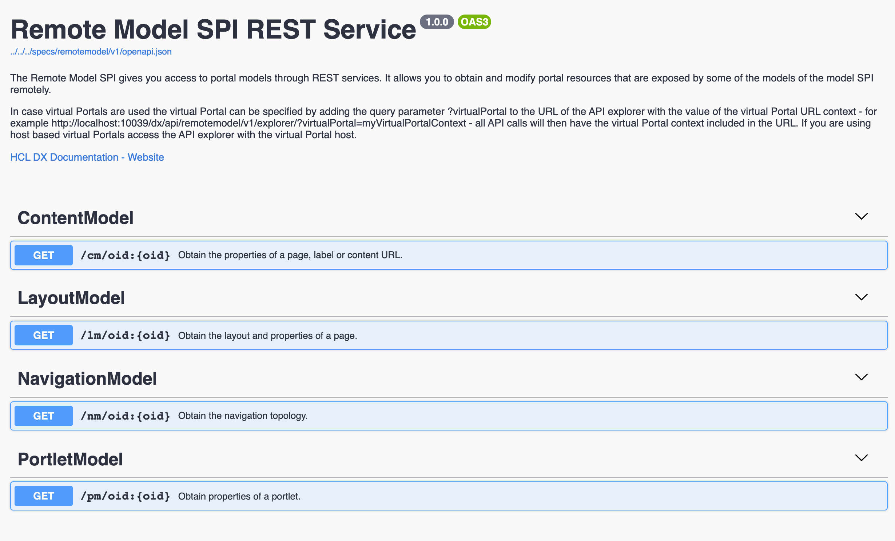

# Digital Experience Remote Model API REST Explorer

The Digital Experience Remote Model REST API explorer can be used by developers creating solutions for HCL DX 9.5 on premises and container deployments to explore and test the Remote Model APIs.

The Remote Model SPI gives you access to portal models through REST services. It allows you to obtain and modify portal resources that are exposed by some of the models of the model SPI remotely, that is from clients that are outside the JVM of the server. This is achieved by means of REST services. For more information, see the following Help Center documentation: [Remote Model SPI REST Service](../model_spi/model-spi_rest_service/index.md).

The Digital Experience Remote Model REST API explorer is available for use with [HCL DX 9.5 CF and Container Update 200](../../../whatsnew/cf20/newcf200.md) and later deployments on supported Kubernetes container-based and on-premises platforms. The Digital Experience Remote Model REST API explorer allows developers to explore and test the Remote Model APIs.

## Access and launch the Digital Experience Remote Model REST API explorer

To access the Digital Experience Remote Model REST API explorer, after installing HCL DX 9.5 CF or Container Update CF200 or later, launch the following URL located at:

```
/dx/api/remotemodel/v1/explorer/
```

Example:

```
http://localhost:10039/dx/api/remotemodel/v1/explorer/
```



## Using the Digital Experience Remote Model REST API explorer

-   **Authentication**

    Authentication is required to use the Digital Experience Remote Model REST API explorer, and the user also needs to be authorized to execute the requested operations.


-   **Endpoint**

    Open the web browser with:

    ```
    http://host:port/dx/api/remotemodel/v1/explorer/
    ```

    Sample URL:

    ```
    http://localhost:10039/dx/api/remotemodel/v1/explorer/
    ```

-   **Payload**

    See the [Remote Model SPI REST Service](../model_spi/model-spi_rest_service/index.md) Help Center topic for details on the body, headers, query parameters, response body, and other information.


