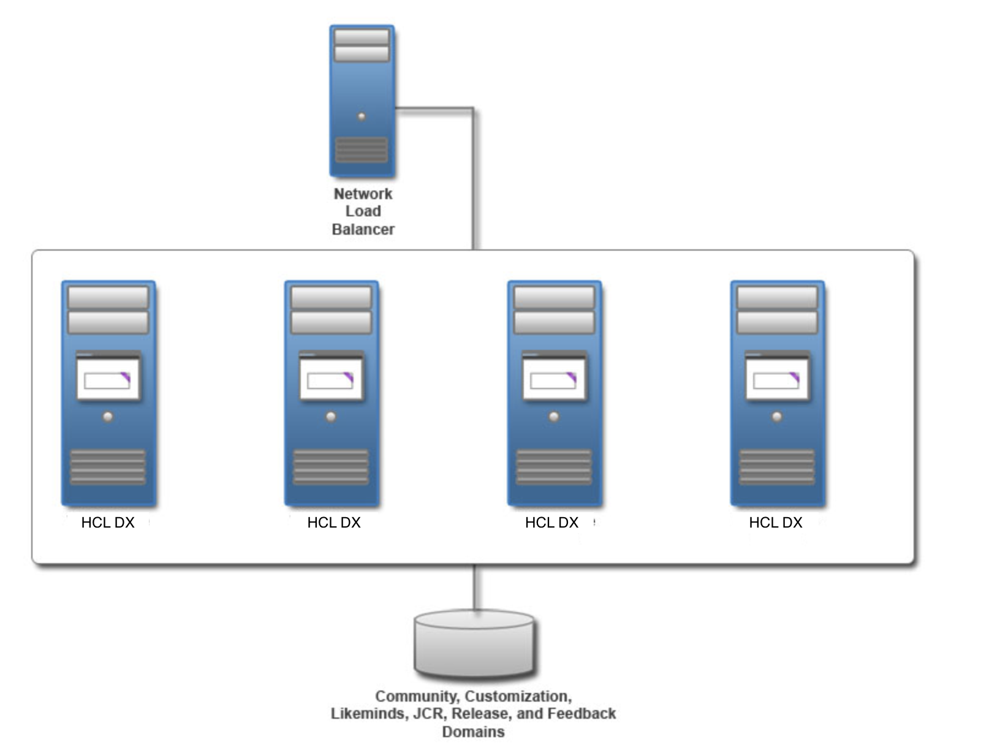

# HCL Digital Experience roadmap: Portal farm

Server farms offer a simple way to build and maintain a highly scalable, highly available server environment.

!!!remember
    Ensure that you configure the web server plug-in after you transfer your database.


## Who should use this roadmap

Use this roadmap if you are an organization with the following requirements:

-   An organization that requires a simple way to build and maintain a highly scalable, highly available server environment
-   An organization that requires an elastic environment where servers can be added or removed dynamically without much effort
-   An organization that does not want to depend on a Deployment Manager for deployments

## Topology diagram

The topology includes a network load balancer to direct incoming traffic to the farm. Each stand-alone server has a database for JCR and Release domains. The JCR and Release domain cannot be shared between portal servers in a farm. However, the Community, Customization, LikeMinds, and Feedback portal database domains can be shared. The share portal database domains are depicted on a common database server.



## Preparing for the installation process

Gather information and software before you install HCL Digital Experience.

1.  Check requirements.

    -   Documentation resource: [Detailed system requirements](../../../../../system_requirements/index.md)

2.  Get the software. New and existing users need to [sign up or register at HCL Software](https://www.hcltechsw.com/wps/portal/about/welcome) and download their preferred HCL Digital Experience package


## Installing prerequisite

You can use existing prerequisite software installations. Verify that your existing version is supported. If it is not, upgrade to the appropriate version. Otherwise, install a web server, database server, and user registry server. Typically the database and user registry servers are already installed and configured. However, there might be specific configuration steps that are required to integrate them with the portal server. Visit *Installing and preparing the prerequisite software* for more topic information.

1.  Install a web server.

2.  Prepare a database server.

3.  Prepare a user registry.


## Installing the HCL Digital Experience

Installing HCL Digital Experience involves preparing your operating system, installing or upgrading the installation manager, and running the installation program.

-   Documentation resource: [Installing the HCL Digital Experience software](../../../../../../deployment/install/traditional/installing_dx/index.md)

## Applying the latest cumulative fix

Portal maintenance is delivered through individual fixes (Fixes) and Combined Cumulative Fixes (CFs), which is recommended to your environment.

Documentation resource: [HCL Digital Experience roadmap: Applying maintenance](../rm_cf.md)

## Setting up a stand-alone server

Start the configuration wizard to set up your stand-alone server. First, transfer your database. The **Database Transfer** configuration option in the Configuration Wizard assigns users and permissions, creates databases, obtains support for database collation, and transfers your database. After you transfer your database, enable your federated LDAP user registry.

Log in to HCL Digital Experience to verify that you have a working portal:

```
http://hostname.example.com:10039/wps/portal,
where hostname.example.com is the fully qualified host name of the server where
Portal is running and 10039 is the default transport port that is created by DX® Application Server. The port number might be different
for your environment.
```

1.  To get the latest updates for the wizard, apply the most recent Combined Cumulative Fix. For more information about applying the latest fix pack, visit [Apply Combined Cumulative Fix](../../../../../../deployment/install/traditional/cf_install/index.md) for more topic information.

    !!!note
        Skip this step, if you have the most recent fix pack applied.

2.  Access the Configuration Wizard. Go to http://your_server:10200/hcl/wizard.

    !!!note
        If working with HCL Digital Experience 8.5 or 9 software level prior to CF18, the wizard address will be: http://your_server:10200/ibm/wizard. After installing CF18, the configuration wizard will automatically be adjusted to http://your_server:10200/hcl/wizard.

    !!!restriction
        There is a known issue with Chrome version 45.x and the Configuration Wizard. If you are experiencing difficulties, use a different browser when you access the wizard.

3.  Log in to the Configuration Wizard with the administrative ID for the configuration wizard profile, cw\_profile.

    !!!note
        If the language is not currently supported for the user interface, you might see the English version. For details on supported languages and the language codes for all of the HCL Digital Experience user interfaces, see [Language support](../../../../../../deployment/manage/portal_admin_tools/language_support/index.md).

4.  Select **Set Up a Stand-alone Server** \> **Database Transfer**.

5.  Provide information about your environment.

6.  Save your configuration settings.

7.  Choose one of the following options:

    -   Click **Download Files** to run the steps remotely.
    -   Click **Run All Steps** to run the steps locally.

8.  If you changed the context root during the installation or configuration of HCL Digital Experience, then you must complete the optional next step from the Configuration Wizard to update parameters with the new context path after you complete the Create a Deployment Manager configuration option. For more information about this configuration option and completing the next steps, see [Create a deployment manager](../../../../../../deployment/manage/config_cluster/cw_dmgr_profile.md).

9.  Log in to HCL Digital Experience to verify that you have a working portal server.

10. Select **Set Up a Stand-alone Server** \> **Enable Federated Security**.

    !!!note
        If you set **Use Administrator IDs stored in your LDAP user registry** to yes, the and HCL Digital Experience user IDs and passwords are changed to the LDAP user ID and password. If you do not want to change both user IDs and passwords to match the LDAP user ID and password, set this value to no. After you configure your LDAP user registry, you can manually change the user IDs and passwords.

    -   Documentation resource: [Updating user ID and passwords](../../../../../../deployment/manage/security/people/authentication/updating_userid_pwd/index.md)

11. Provide information about your environment.

12. Save your configuration settings.

13. Choose one of the following options:

    -   Click **Download Files** to run the steps remotely.
    -   Click **Run All Steps** to run the steps locally.

14. Log in to HCL Portal to verify that you have a working portal server.

15. If you want to shorten your site URL for search engine optimization benefits, you can modify your context root and remove navigational state information from your URL by using the **Modify Site URLs for Search Engine Optimization** configuration option.

    -   Documentation resource: [Configuration Wizard instructions: Modify site URLs for search engine optimization](../../../../../../deployment/manage/siteurl_cfg/changing_siteurl/cw_shorten_url/index.md)

# Configuring the web server

-   Move the web server plug-in from the WebSphere Application Server to the web server.

    -   Documentation resource: [Web servers](../../../../../../deployment/manage/config_webservers/index.md)

## Tuning the servers in your environment

Tuning the servers is important to the performance of your portal environment. HCL Digital Experience is not tuned for a production environment after installation and deployment. Your database needs tuning for improved performance. You can organize your database now or soon after you finish your configuration. You need to tune and maintain your database on a regular basis.

1.  Run the performance tuning tool to complete an initial tuning of your servers.

    -   Documentation resource: [Portal server performance tuning tool](../../../../../../deployment/manage/tune_servers/wp_tune_tool.md)
2.  Check the tuning guide for more instructions. Use the tuning guide for the previous product version when the tuning guide for the current release is unavailable.

    -   Documentation resource: [Performance tuning guide](https://support.hcltechsw.com/csm?id=kb_article&sysparm_article=KB0074411)

## Choosing the type of portal farm

You can choose from two supported portal farm configurations when you set up your portal farm. You can set up a unique installation where each farm has a unique installation or you can set up one instance that is shared between multiple farm instances.

-   Configure a farm instance with a shared configuration.


## Configuring an HTTP server

Use a web server to handle load balancing across your portal farm.

-   Set up the HTTP server plug-in on the portal farm.


## Configuring remote and JCR search

HCL Digital Experience provides two distinct search capabilities. You can use both types of search capabilities in a portal farm environment.

1.  Configure a remote search.

2.  Configure a JCR search.


