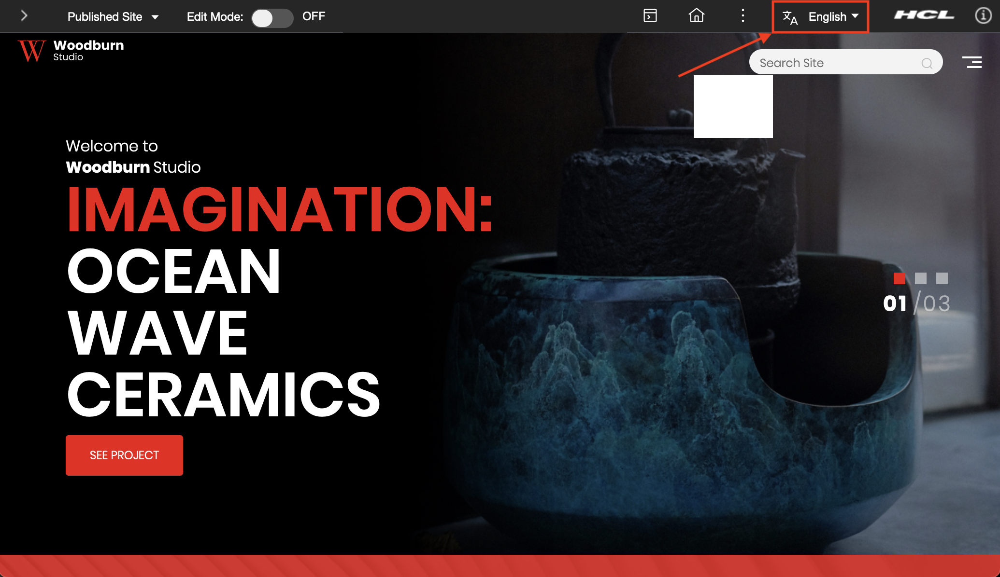
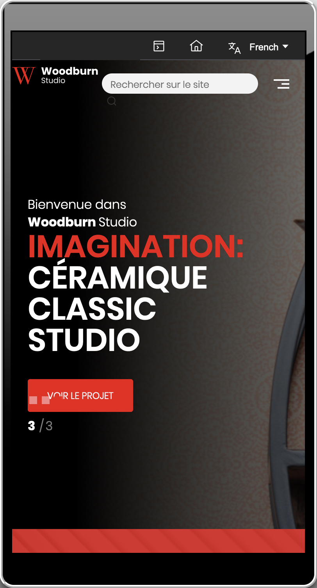

# Using the language switcher 

You can use the language switcher to switch from any of the supported languages. This feature is available only for authenticated portal users.

## In portal themes

Introduced in Container Update CF193, the language switcher allows you to switch between supported languages in portal themes.

You can switch between supported languages by clicking on the translate button in the navigation header.



You can select from any of the supported languages listed.


The theme is updated with the selected language.


## In mobile view

Introduced in Container Update CF196, the language switcher in allows you to switch between supported languages in mobile view. This updated view is accessible from your mobile devices or with a mobile simulator.

You can switch between supported languages by tapping on the menu icon to see the language list.


You can select from any of the supported languages listed.


The portal content is updated with the selected language.



## Disabling the language switcher

Introduced in Container Update CF201, you can disable the language switcher by setting the following parameter to true at the root page level in the configuration page:

```
disable.languageSwitcher=true
```

When set to true, the language switcher is hidden from the interface for both desktop and mobile views.

For more information about setting this parameter, see the [Disabling the language switcher](../wcm/wcm_mngpages_disable_lang_switch.md) Help Center topic.

**Parent topic:**[Language support ](../admin-system/adintern.md)

**Related information**  


[Disabling the language switcher](../wcm/wcm_mngpages_disable_lang_switch.md)

