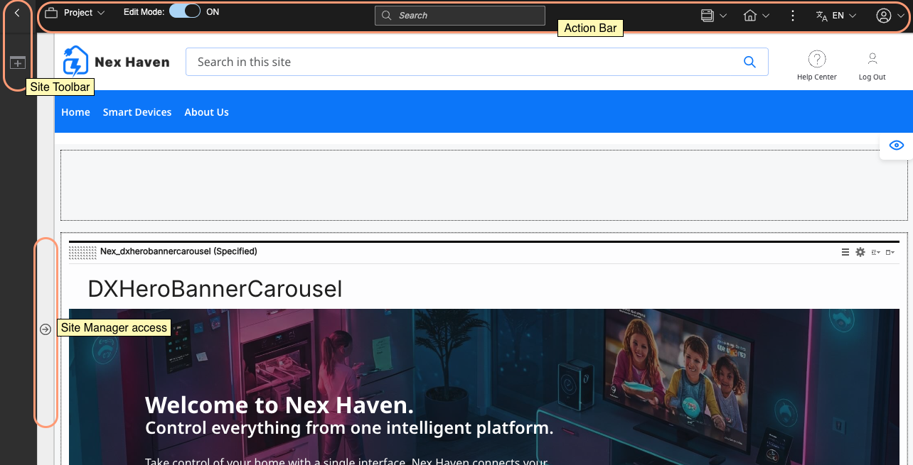
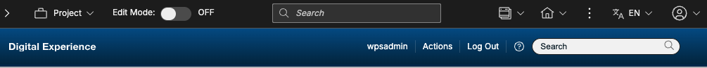
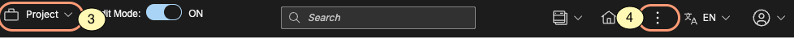

# Exploring the Site Toolbar and Site Manager

The Site Toolbar and Site Manager provide quick access to common content author tools and a complete view of your site's navigation. Without leaving the context of your website, content authors can create and modify pages and content items, create vanity URLs for promotions, and much more.

!!! note
    Since the toolbar now contains a centralized search input, themes that included their own search input will have duplicated search functionality. Refer to the following image for a visual example.

## Action Bar

The Action Bar functions as the entry point into the Site Toolbar and Site Manager, where you can preview your site, access projects, and more. It is also where content authors can enable editing and information modes.

1\. **Edit Mode**

Turn on edit mode to begin. Edit mode must be on to edit pages and content items in the website. When you turn on edit mode, the Site Toolbar and Site Manager open automatically.

2\. **User Profile**

Use the Profile menu to view your user profile details, access impersonation options, toggle information mode, and log out of the site.

3\. **Projects**

Create a new project or manage existing project from the Projects menu. Projects group content and page edits across your website together to make managing and publishing related changes easier.  When you are working on a project, the project indicator displays the project name. If you are not working in a project, the indicator displays "Published Site," indicating you are editing the live site.

4\. **Preview**

Use the Preview menu to ensure your changes display as intended. You can preview your site as an authenticated user or as an unauthenticated site visitor.

5\. **Site Toolbar and Site Manager access**

Use this toggle to open and close the Site Toolbar. The Site Toolbar provides access to page components and applications to add to your page, as well as a main point of entry into the online help. Your administrator can configure the toolbar with additional tabs as needed. By default, opening the Site Toolbar also opens the Site Manager, where you can view the hierarchy of all of the pages in your site, and create and edit pages and content items. You can also delete, copy and paste, move, and rename pages and content items from within the Site Manager.

## Site Manager

Site Manager has optimized features for content authors. If you are a content author who is responsible for creating and editing content items and pages, expect to spend most of your working time in Site Manager.

It provides content authors and administrators with a comprehensive view of a website's hierarchy and navigation. In the Site Manager tree view, you can view the pages and content items that make up your website. You can also view hidden items and associated site areas in the Site Manager tree view. To view a page in your website, click the name of that page in Site Manager. The page loads in the page view frame.

The Site Manager tree view provides more than a central user interface for managing pages and content items. You can also complete common actions such as creating, editing, and deleting pages and content items. You can also move, copy, and paste pages and content items from the site manager tree view. To access these functions, hover over a page or content item in Site Manager tree view and click the context menu icon  for that page or content item. The following image shows how to access the context menu for a page in Site Manager.

The context menu displays different options, depending on whether you are viewing the context menu for a page or a content item.

When you create a content item from the context menu of a page, that content item is added to the site area that is associated with the parent page. This site area can either be the portal page site area within the portal site library or a different site area that is mapped to the page.
