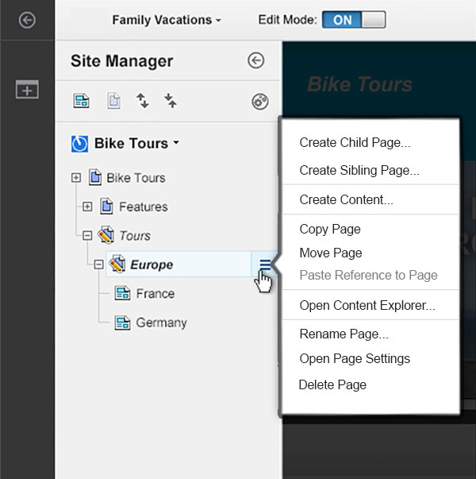

# Exploring site toolbar and site manager

Site toolbar and site manager provide quick access to common content author tools as well as a complete view of your site's navigation. Without leaving the context of your website, content authors can create and modify pages and content items, create vanity URLs for promotions, and much more.

## Action Bar

The action bar functions as the entry point into the site toolbar and site manager. The action bar is also where content authors can enable editing and information modes. Additionally, you can preview your site, access projects, and more.

-   **1 Edit Mode**

    To begin, turn on edit mode. Edit mode must be on to edit pages and content items in the website. When you turn on edit mode, site toolbar and site manager open automatically.

-   **2 Information mode**

    If you are new to the site toolbar, turn on information mode. Information mode controls the user assistance in the user interface. When information mode is on, inline user assistance and hover help is available for many controls. After you are familiar with the site toolbar, you can turn off information mode.

-   **3 Projects**

    Projects group content and page edits across your website together to make managing and publishing related changes easier. From the projects menu, you can create a new project or manage existing projects. If you are not working in a project, then the project indicator reads Published Site, which means that you are editing the live site. If you are working in a project, then the project indicator displays the project name.

-   **4 Preview menu**

    Use the preview menu to make sure that your changes display as intended. You can preview your site as an authenticated user or as an unauthenticated site visitor.

-   **5 Site toolbar and site manager access**

    Use this toggle to open and close the site toolbar. By default, the toolbar provides access to page components and applications to add to your page, as well as a main point of entry into the online help. Your administrator can configure the toolbar with additional tabs as needed. By default, opening the site toolbar also opens site manager, where you can view the hierarchy of all of the pages in your site and create and edit pages and content items. You can also delete, copy/paste, move, and rename pages and content items from within site manager.

## Site Manager

Site manager has optimized features for content authors. If you are a content author who's responsible for creating and editing content items and pages, expect to spend most of your working time in site manager.

Site manager provides content authors and administrators with a comprehensive view of a website's hierarchy and navigation. In the site manager tree view, you can view the pages and content items that make up your website. You can also view hidden items and associated site areas in the site manager tree view. To view a page in your website, click the name of that page in site manager. The page loads in the page view frame.

Site manager tree view provides more than a central user interface for managing pages and content items. You can also complete common actions such as creating, editing, and deleting pages and content items. You can also move, copy, and paste pages and content items from the site manager tree view. To access these functions, hover over a page or content item in site manager tree view and click the context menu icon  for that page or content item. The following image shows how to access the context menu for a page in site manager.

The context menu displays different options, depending on whether you are viewing the context menu for a page or a content item.

When you create a content item from the context menu of a page, that content item is added to the site area that is associated with the parent page. This site area can either be the portal page site area within the portal site library or a different site area that is mapped to the page.

