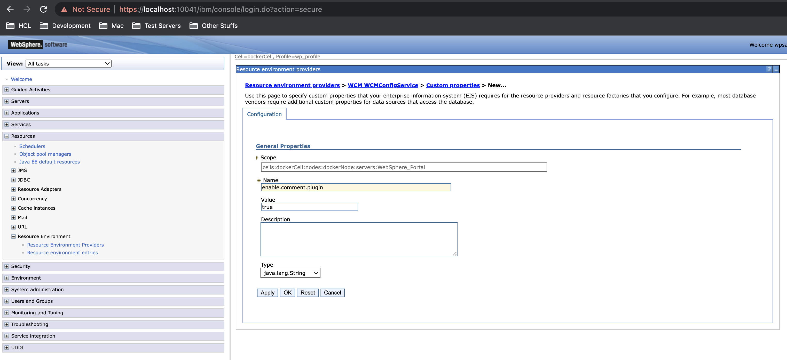
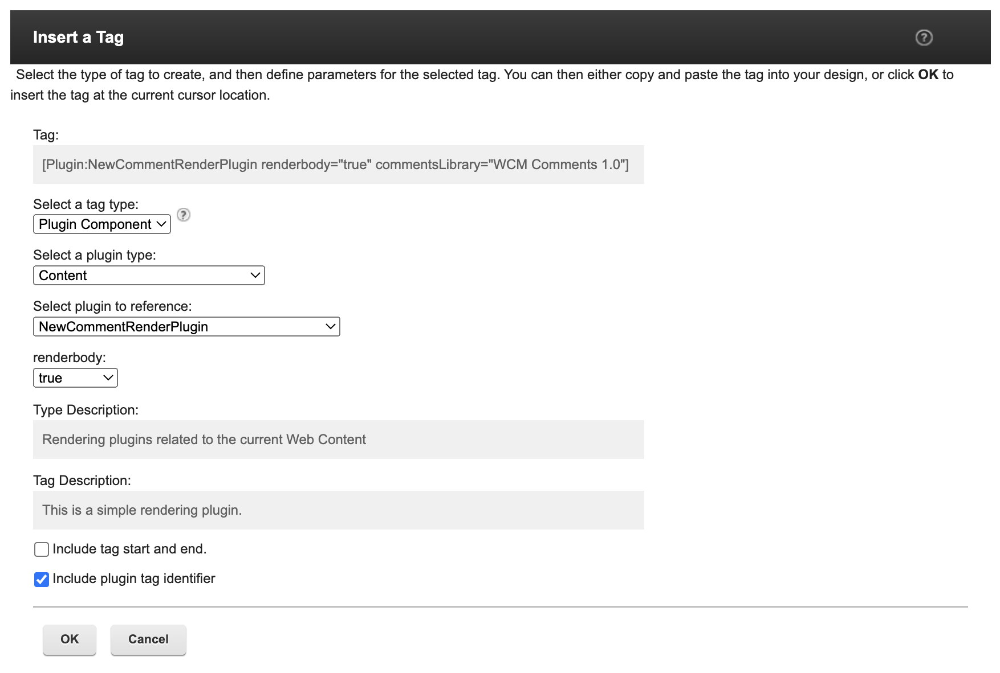
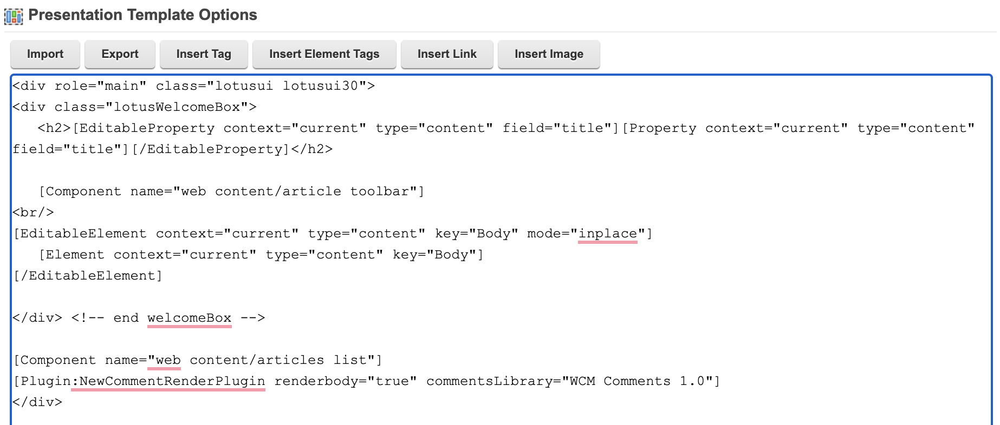
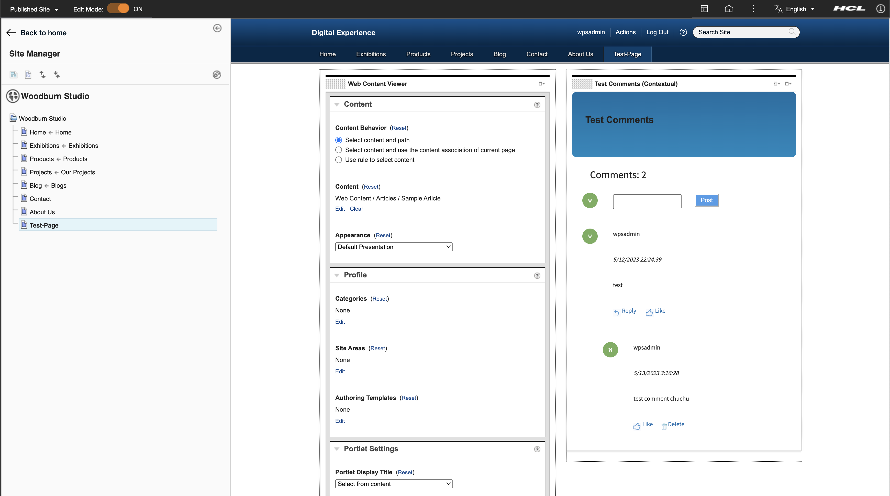

# Comments in WCM

Learn more about Comments in WCM from configuration, custom library and access controls.

## Enable comments plugin in WAS Console 

In order to make comments plugin visible in the plugin component tag which we will add to presentation template, we need to add the configuraton in WAS Console. In WAS Console, go to **Resources > Resources Environment Providers > WCM_WCMConfigService > Custom properties > New Property**. Input the details below:

- Name: enable.comment.plugin
- Value: true
- Type: String

Note: After adding the configuration, JVM restart is required.

## Adding Admin Group Configuration in WAS Console for User Access Control

In order to make sure that users in the admin group be able to do all the operations on the comments as per portal access control feature, we need to configuration in WAS Console. In WAS Console, go to **Resources > Resources Environment Providers > WCM_WCMConfigService > Custom properties > New Property**. Input the details below:

- Name: comments.admin.group
- Value: cn=wpsadmins,o=defaultWIMFileBasedRealm
- Type: String

Note: After adding the configuration, JVM restart is required. Also note that, we are in the process of including manager role to do all the operation on comments as per the portal access control feature.

## Adding Custom Plugin

1. To use the custom plugin, add it to **Libraries > Web Content > Presentation Templates > Article Presentation**.
2. In the Presentation Template Options, click the Insert Tag button to add the custom plugin.
3. In Insert Tag window, select a tag type as **Plugin Component**, select a plugin type as **Content** and select plugin to reference as **NewCommentRenderPlugin**. Click OK button after selecting all the values.

4. The plugin tag for custom plugin already added on the Article Presentation body. Click Save and Close button to save changes.

Note: We can specify our own library for commentsLibrary field to store comments.
5. Setup and View Comments UI in page. 
    1. Create Page and add above content directly
    2. Render content on the page and select content with custom plugin in Web Content Viewer
    3. Click OK after selecting content.

6. After setting up comments UI in page, you can now add, reply, like/unlike, and delete comments. You can also view total comments count on the page.

