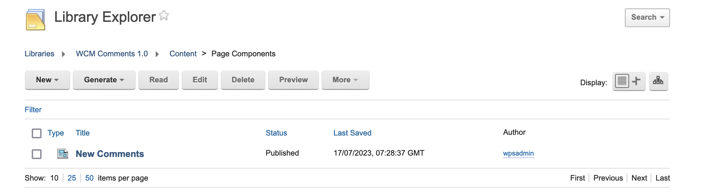
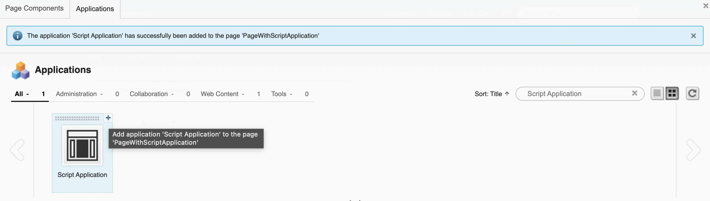
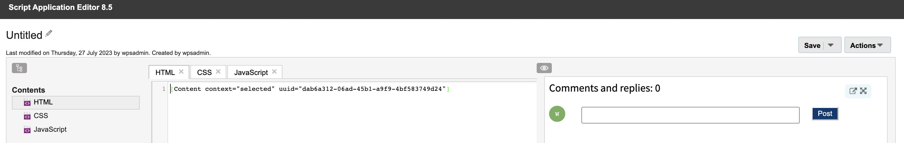

# Comments in WCM

Starting from CF213, the product contains a new solution that allows users to leave comments for Web Content Manager (WCM). These comments can be used in Intranet scenarios or in controlled settings allowing external comments. 

## WCM Comments as Custom Plugin Component

Starting from CF213, WCM Comments can be enabled as Custom Plugin Component for a WCM content. WCM Comments can be rendered on page and on the Web Content Viewer​ Portlet.

This section describes how to enable, configure, and disable the WCM commenting solution as as Custom Plugin Component for a WCM content.

### Overview

WCM Comments is a feature that allows customers to enhance their presentation template by adding in a plugin for commenting. The actual comments are also stored in WCM and can be managed like regular content. You can choose which library is being used for storing the comments.

Note that this solution is not related to the existing comments for blogs/wikis ability.

### Enabling the comments plugin in WAS Console 

To make the comments plugin visible in the plugin component tag which should be added to presentation template, you must first add the configuraton in WAS Console. In WAS Console, go to **Resources > Resources Environment Providers > WCM_WCMConfigService > Custom properties > New Property**. Enter the following details:

- Name: enable.comment.plugin
- Value: true
- Type: String

!!!important
    After adding the configuration, a JVM restart is required.


### Adding Admin User Group Configuration in WAS Console for User Access Control (Optional)

By default, if the configuration for the admin user group is not present in the console, only users with manager-level access can delete comments.

For security purposes, if you need to limit the delete comments option to a specific user group, you must add the following configuration. In WAS Console, go to **Resources > Resources Environment Providers > WCM_WCMConfigService > Custom properties > New Property**. Enter the details below:

- Name: comments.admin.group
- Value: cn={user-group},o=defaultWIMFileBasedRealm
- Type: String

**user-group** can be any user group such as managers, admins, editors, etc.


### Adding Custom Plugin

1. To use the custom plugin, add it to **Libraries > Web Content > Presentation Templates > Article Presentation**.

2. In the **Presentation Template Options**, click the **Insert Tag** button to add the custom plugin.

3. In the **Insert Tag** window, select the following values:
    - In **Select a tag type** field, select **Plugin Component**.
    - In **Select a plugin type** field, select **Content**.
    - In **Select plugin to reference** field, select **NewCommentRenderPlugin**. 
    

4. Click **OK** after selecting all the values.

5. The plugin tag for custom plugin is added on the Article Presentation body. Click **Save and Close** to save changes.

    

    !!!note
        You can specify the library you want to use for storing comments in the commentsLibrary field.

6. Set up and view the Comments UI on the page. 
    1. Click **Create Page** and add the content created in Step 5. 
    2. Using the Web Content Viewer portlet, select the content to render.
    3. Click **OK**.
    
    

After setting up the comments UI on the page, you can now add, reply, like/unlike, and delete comments. You can also view the total comments count on the content item.


## Rendering WCM comments in external components

Starting from CF214, WCM comments can be rendered in external components such as Page Components and Rich Text, Script applications or Custom Portlet. For these scenarios, enabling and configuring Custom Plugin Component for WCM comments as described in the [WCM Comments as Custom Plugin Component](#wcm-comments-as-custom-plugin-component) are not required.

This section provides an overview of the page component shipped as part of CF214. It also describes how to configure WCM comments in external components such as Rich Text Editor, Script Application, and Custom Portlet.

### Custom Page Component for WCM Comments

Starting from CF214, the default WCM Comments library is shipped with a new custom page component and an additional authoring template that uses a new presentation template. This presentation template is for rendering the WCM comments HTML markup component inside the new page component.

This section provides an overview of the components related to the newly shipped page component. You can see the different components in the following images.

#### Authoring Template of Page Component


#### Presentation Template of Page Component


#### WCM comments HTML markup component


#### Newly added Custom Page Component



#### Page Component accessible in Site Manager

Use the Site Manager on Edit mode. Go to **Applications > Page Components**. Only administrators can view the new custom page component.


#### Showing and Hiding Comments Page Component in Site Manager

To show the Comments page component in Site Manager, go to the **Profile** section. In the **Keywords** property, enter ```ibm.portal.toolbar.NewContent```. Removing the keyword hides the Comments page component in the Site Manager.


### Rendering and configuring new page component to have WCM comments HTML markup component on the page

1. Open the Site Manager in Edit mode.
2. Add the newly shipped page component to any page where the comments functionality needs to be enabled. After adding the page component to the page, the WCM comments UI should be visible. 
3. In the **Library Name** field, specify the library name to be used for storing the comments.

4. In the **Content uuid** field, specify the content UUID to which comments need to be added.


After setting up the page component with comments UI on the page, actions such as add, reply, like/unlike, and delete comments can be done. The total comments count on the content item can also be viewed. 

### Rendering and configuring WCM comments HTML markup component in Rich Text Editor

1. Go to the content to which the WCM comments feature needs to be available. Edit the content.


2. In the **Rich Text Editor**, click the **Insert Tag** button to add the WCM tag.

3. In the **Insert a Tag** window, select the following values:
    - In **Select a tag type** field, select **Content**.
    - In **Select item context** field, select **Selected**.
    - In **Select the content item to reference** field, select **New Comments content under WCM Comments 1.0/Page Component**. 

    

4. Click **OK** after selecting all the values. 


5. Currently, there is a CSS alignment issue while rendering comments inside Rich Text. To avoid it, refer to the following steps:
    1. Click the **Source** button in the **Rich Text Editor**.
    2. Remove **<p dir="ltr" style="margin: 0px;"></p>** from the last line of the body. 
    3. Enclose the Content tag you added as a part of Step 4 inside the div blocks exactly as how it appears in the following example: ```</div><div>[Content context="selected" uuid="dab6a312-06ad-45b1-a9f9-4bf583749d24"]</div><div>```.


6. Save the content to enable the commenting feature for that particular content. After setting up the comments UI on the rich text editor, this content can be added to any page.

7. After the WCM Comments UI is rendered for the content on the page, specify the library name to be used for storing the comments and the current content UUID. Refer to [Rendering and configuring new page component to have WCM comments HTML markup component on the page](#rendering-and-configuring-new-page-component-to-have-wcm-comments-html-markup-component-on-the-page) for instructions.

After configuring the WCM comments HTML markup component in the Rich Text Editor, actions such as add, reply, like/unlike, and delete comments can be done. The total comments count on the content item can also be viewed.

### Configuring WCM comments in Script Application

1. Open the Site Manager on Edit mode. Go to **Applications > Page Components**. Click the **+** button to add it to the page.

2. Click **Edit > Actions > Insert WCM Tag**. The **Insert a Tag** window appears.

3. In the **Insert a Tag** window, select the following values:
    - In **Select a tag type** field, select **Content**.
    - In **Select item context** field, select **Selected**.
    - In **Select the content item to reference** field, select **New Comments content under WCM Comments 1.0/Page Component**. 

4. Click **OK** after selecting all the values.
5. Click **Save**.

6. Close the **Script Application Editor** window.
7. After the WCM Comments UI is rendered for the content on the page, specify the library name to be used for storing the comments and the current content UUID. Refer to [Rendering and configuring new page component to have WCM comments HTML markup component on the page](#rendering-and-configuring-new-page-component-to-have-wcm-comments-html-markup-component-on-the-page) for instructions.

After configuring WCM comments in a Script Application, actions such as add, reply, like/unlike, and delete comments can be done. The total comments count on the content item can also be viewed. 

### Configuring WCM comments in a custom DX Portlet

1. Create the custom DX Portlet. For more information, see [Creating Custom DX Portlet](https://github.com/HCL-TECH-SOFTWARE/dx-portlet-development-utilities/tree/main/hcl_dx_jsp_demoportlet_archetype).
2. Go to the custom DX Portlet you created.
3. Go to the folder that contains the view files inside the created custom DX Portlet. In this example, navigate to: ```src/main/webapp/_JSPDemoPortlet/jsp/html/```.
   
4. Add the following piece of code in any of the view files where the Comments feature should be enabled.
    ```
    <%@ taglib uri="/WEB-INF/tld/wcm.tld" prefix="wcm"%>
    <wcm:initworkspace>login fail</wcm:initworkspace>
    <wcm:setExplicitContext path="WCM Comments 1.0/Page Components/New Comments" >
        Setting Explicit Context Failed
    </wcm:setExplicitContext>
    <wcm:content>
        Content Rendering Failed
    </wcm:content>
    ```
    
    For more information, see [Web Content Manager JSP tags](../../../manage_content/wcm_development/wcm_dev_api/wcm_reference_wcm-jsp-tags.md).

5. Copy the ```/wcm.ear/wcm-inplaceEdit.war/WEB-INF/tld/wcm.tld``` file from the DX core container into the path ```/WEB-INF/tld```.
6. Build the WAR file. See [Build the WAR file](https://github.com/HCL-TECH-SOFTWARE/dx-portlet-development-utilities/tree/main/hcl_dx_jsp_demoportlet_archetype#build-the-war-file-deployment-artifact) for instructions.
7. Deploy the portlet. For instructions, refer to [Deploy the portlet](https://github.com/HCL-TECH-SOFTWARE/dx-portlet-development-utilities/tree/main/hcl_dx_jsp_demoportlet_archetype#deployupdate-or-undeploy-the-portlet-using-dxclient-optional).
8. Add the custom DX Portlet to the page. For more information, see [Testing Custom DX Portlet](https://github.com/HCL-TECH-SOFTWARE/dx-portlet-development-utilities/tree/main/hcl_dx_jsp_demoportlet_archetype#test-the-generated-portlet-optional).
9. After the WCM Comments UI is rendered for the custom DX Portlet, specify the library name to be used for storing the comments in and the current content UUID. Refer to [Rendering and configuring new page component to have WCM comments HTML markup component on the page](#rendering-and-configuring-new-page-component-to-have-wcm-comments-html-markup-component-on-the-page) for instructions.

After configuring WCM comments in a custom DX Portlet, actions such as add, reply, like/unlike, and delete comments can be done. The total comments count on the content item can also be viewed.

### Configuring WCM comments in a theme

1. Create a new Site Area inside a WCM content library where you want to store a copy of the comments page component with the pre-populated library name and content UUID.


2. In the created site area, create a new copy of a page component which is created in [Custom Page Component for WCM Comments](#custom-page-component-for-wcm-comments).

3. In the **Properties** tab, copy the content UUID for which comments should be rendered. 


4. Edit the page component and enter the content UUID. 


5. Save the page component. 

6. Add the highlighted code snippets in the following screenshot to any of the view files of a theme (for example, default85) where the comments feature should be enabled. In this example, navigate to ```/opt/HCL/PortalServer/theme/wp.theme.themes/default85/installedApps/DefaultTheme85.ear/DefaultTheme85.war/themes/html/dynamicSpots/``` and open the ```footer.jsp``` view file.


7. Add the following code snippet in the ```footer.jsp``` view file to enable the comments for the new page component with pre-populated content UUID.

    ```
    <%@ taglib uri="/WEB-INF/tld/wcm.tld" prefix="wcm"%>
    <wcm:initworkspace>login fail</wcm:initworkspace>
    <wcm:setExplicitContext path="Custom Library/Custom Comments/Copy of New Comments" >
        Setting Explicit Context Failed
    </wcm:setExplicitContext>
    <wcm:content>
        Content Rendering Failed
    </wcm:content>
    ```
     For more information, see [Web Content Manager JSP tags](../../../manage_content/wcm_development/wcm_dev_api/wcm_reference_wcm-jsp-tags.md).
     
8. Copy the ```/wcm.ear/wcm-inplaceEdit.war/WEB-INF/tld/wcm.tld``` file from the DX core container into the TLD path of the theme to update. In this example, copy the TLD file to ```/opt/HCL/PortalServer/theme/wp.theme.themes/default85/installedApps/DefaultTheme85.ear/DefaultTheme85.war/WEB-INF/tld```.


After configuring WCM comments in a theme, actions such as add, reply, like/unlike, and delete comments can be done. The total comments count on the content item can also be viewed. In the following example, WCM comments is configured in ```footer.jsp```:


## Access Roles and Permissions for WCM Comments

Only authorized users can view, edit, and delete the comments in the library where the comments are stored. It is required to have at least a **View** access to the WCM content library. For more information, see [Managing users and groups](../../../deployment/manage/security/people/authorization/controlling_access/managing_users_groups/index.md). 

The actions available for a user depend on their role:

- The **User** role or higher is required to see the comments.
- The **Contributor** role or higher is required to create comments.
- The **Manager** role or higher is required to delete comments. In addition to the Manager role, you can configure a specific group solely for deleting comments.

## Limitations

- Nested replies to comments are not yet supported.
- Posting and replying are limited to 500 characters. 
- Rendering Comments outside the WCM rendering process (for example, from REST or a custom Servlet or JSP via the java WCM API) is not yet supported.
- HTML tags are not rendered in the comments. If HTML tags are present, the system skips HTML tags that are added in a comment.

## Update global "Article" presentation template

If you want to perform a replacement of the OOB components that are shipped, see [Adding the sample web content libraries in the authoring portlet](../../../manage_content/wcm_delivery/deliver_webcontent_on_dx/getting_started/creating_contentsamples/wcm_delivery_ctsamples_libraries.md).

## Cleaning up orphaned comments data stored in the library

Starting from CF214, a new API is available for soft deleting all the comments that are no longer mapped to content (for example, if the content was deleted). When you soft delete, it marks a comment as no longer active without deleting it from the database.

In the libraries query parameter, pass all the library names containing the orphaned comments data. 
The API finds all comments based on the authoring template and site area ```Comments``` of each of the defined libraries and soft deletes them. 


**Sample request:**

{{host}}/{{WpsContextRoot}}/mycontenthandler/wcmrest/deleteComments?libraries=Web Content&libraries=Demo Library​

**Sample response body:**

```
{
    "deletedCommentsStatus": {
        "deletedCommentsList": [
            "3346bd13-dfef-456c-bb94-ff4f829f626e",
            "e04e2e4f-2ec2-4d7a-b22d-e502eb1a80bc"
        ]
    }
}
```


For purging deleted comments, refer to [How to use REST with Web Content Manager to Purge Deleted Content Items](../../../manage_content/wcm_development/wcm_rest/wcm_rest_deleted_content/wcm_rest_crud_purge_deleted.md).
