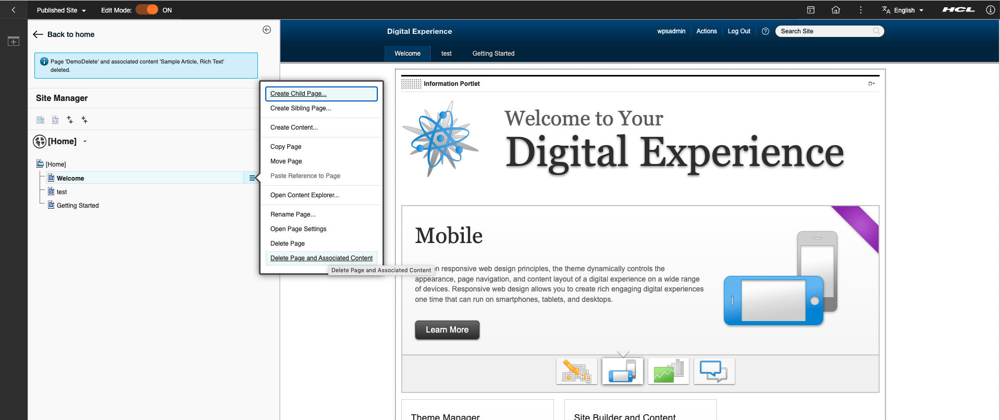

# Deleting pages and their contents

When you delete a page (or tree of pages) while using Site Manager, the page, its child pages or child content are also deleted. But, the content that is referred by WCM rendering portlets on the page is not deleted. Beginning with CF205, a new feature is added that allows you to delete the page as well as the content that is referenced by the WCM rendering portlets on the page. The new delete feature comes disabled by default, and you can enable the same by setting the following in the **WP ConfigService Resources Environment Provider**:

`sitemanager.showDeleteWithContent=true`

After setting the configuration, restart Core. When the feature is enabled, a new option called **Delete Page and Associated Content** is displayed in the **Managed Pages Site Manager** UI. When the **Delete Page and Associated Content** option is selected, the content referenced by the WCM portlets of the page and all affected sub pages will be deleted. The result message shows the content that was deleted and also if some content could not be deleted (for example, due to references or insufficient access).

The following screen shot shows the new option as well as the message after a successful delete.

