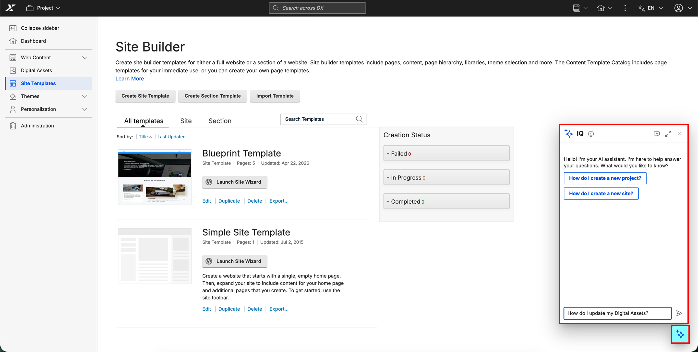

# Accessing IQ

This section explains how to access the IQ AI assistant from within HCL Digital Experience (DX).

!!! info "Availability"
    The IQ chat button is only visible to users whose environment and accounts meet the core [IQ Prerequisites](enable.md#prerequisites).

To open the assistant, select the **Open IQ chat** button. Depending on the page or application you are using, the button location and display mode vary:

- **In the DX toolbar:** A sparkle button in the top toolbar on standard DX pages that opens the panel view sidebar.
- **In Site Templates:** A floating sparkle button on **Site Templates** pages that opens the compact view chat window.

The page layout determines which access method is available. Navigating to a page with a different layout closes the active chat view, so you must open the chat again from the new button location. From either view, you can expand the assistant into a full view for an expanded interactive workspace.

## Opening the panel view

On standard DX pages, access the assistant by selecting the **Open IQ chat** sparkle button in the DX toolbar. It is positioned at the top-right of the toolbar in LTR locales and the top-left in RTL locales, opening the panel view sidebar on the corresponding side.

1. Log in to HCL DX and navigate to the **Dashboard**.
2. Select the **Open IQ chat** button in the toolbar.

    {: style="display: block; margin: 0 auto;"}

## Opening the compact view

On pages where the panel view is incompatible with the page layout (such as **Site Templates** pages or non-responsive applications), the **Open IQ chat** button appears as a floating sparkle button at the bottom corner of the page instead of a toolbar button. It is positioned at the bottom-right corner in LTR locales and the bottom-left corner in RTL locales, opening the compact view on the corresponding side.

1. Log in to HCL DX and navigate to **Site Templates**.

2. Select the **Open IQ chat** button at the bottom-corner of the page to open the compact view chat window.

    {: style="display: block; margin: 0 auto;"}
