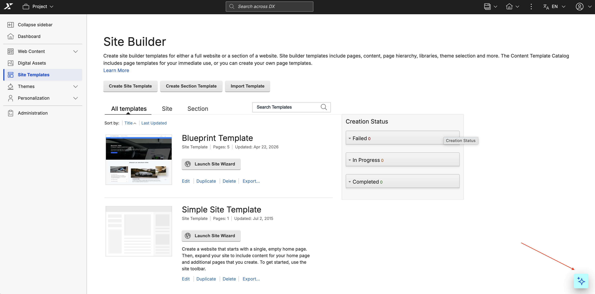
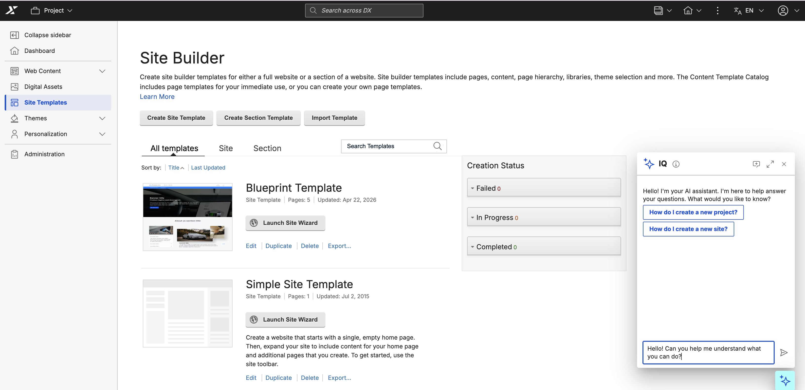
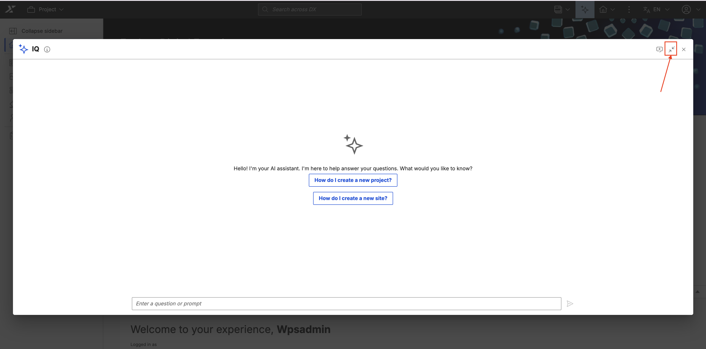
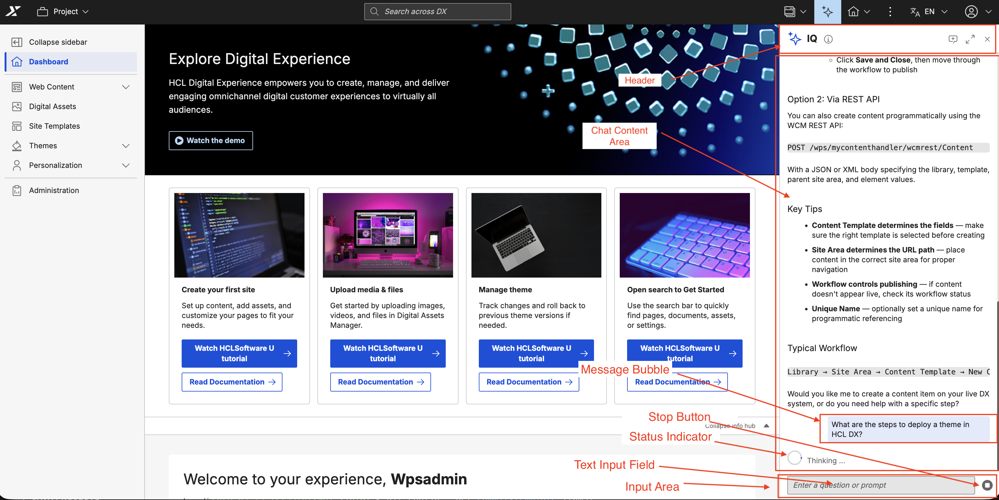

# Accessing IQ

This section explains how to access the IQ AI assistant from within HCL Digital Experience (DX).

IQ automatically adapts its presentation based on the available space on the current DX page. On pages with sufficient horizontal space, IQ appears as a **side panel**. On pages where space is limited, IQ instead provides a **Floating Action Button (FAB)** that opens a **compact view**. You do not need to choose between these — DX allows developers to control the layout mode of individual pages. You can optimize the display by configuring a true/false parameter based on the page's available horizontal space.

From either the side panel or compact view, you can expand IQ to a **Full View** (expanded dialog) for a more spacious and interactive experience.

## Prerequisites

- HCL Digital Experience (DX) version 236 or higher must be installed and running.
- IQ must be installed and configured. For installation instructions, refer to [Installing IQ](./installation.md).
- You must be authenticated with appropriate credentials and permissions.

---

## Side Panel

On DX pages with sufficient horizontal space, IQ is accessed via the **sparkle icon** in the DX Toolbar.

- In **LTR** locales, the sparkle icon is at the **top-right** of the Toolbar; the side panel opens from the **right**.
- In **RTL** locales, the sparkle icon is at the **top-left**; the side panel opens from the **left**.

### Steps

1. **Log in to HCL DX** and click the **Sparkle Icon** in the Toolbar.

    The IQ side panel slides in from the right (or left in RTL).

    

2. **Begin Interacting**

    Type your question in the input field and press **Enter** or click **Send**.

    

---

## Compact View (via FAB)

On DX pages where horizontal space is insufficient for the side panel (for example, Site Templates pages), IQ provides a **Floating Action Button (FAB)** instead of the toolbar sparkle icon.

- In **LTR** locales, the FAB is at the **bottom-right** corner; the compact view opens on the **right**.
- In **RTL** locales, the FAB is at the **bottom-left** corner; the compact view opens on the **left**.

### Steps

1. **Locate the FAB**

    Look for the FAB button with the AI sparkle icon at the bottom-right corner of the page.

    

2. **Click the FAB**

    The IQ compact view opens on the same side.

    

3. **Interact with IQ**

    Type your question and press **Enter** or click **Send**.

    

---

## Expanding to Full View

From either the side panel or compact view, click the **Full View** icon in the IQ header to expand IQ into a full expanded dialog view. Click **Compact View** to return to the previous view.

---

## Understanding the IQ Interface

Regardless of the view (side panel, compact, or full), the IQ interface contains the following components:

### Header

- **Title**: "IQ"
- **Full View / Compact View Button**: Toggles between the expanded dialog and the current view
- **Start a new conversation Button**: Starts a fresh session — current context will be cleared permanently
- **Close Button**: Closes IQ

### Chat Content Area

- **Message Bubbles**: Displays your questions and IQ's responses
- **Markdown Support**: Rich formatting including headings, lists, code blocks, and links
- **Scroll Area**: Automatically scrolls to the latest message

### Input Area

- **Text Input Field**: Type your questions here
- **Send Button**: Send your message (or press Enter)
- **Stop Button**: Appears while IQ is processing; click to cancel

### Status Indicators

- **Loading Indicator ("Thinking...")**: Appears while IQ is processing
- **Error Messages**: Displays connectivity or processing errors

---

## Next Steps

Now that you know how to access IQ, learn how to use its features effectively:

- **[Using IQ](./usage.md)** — Interact with IQ, manage conversations, and leverage its capabilities
