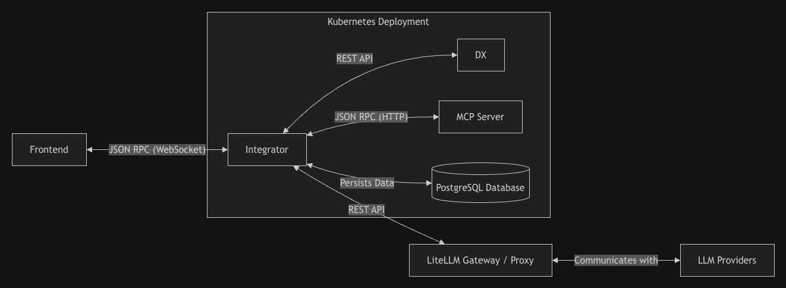
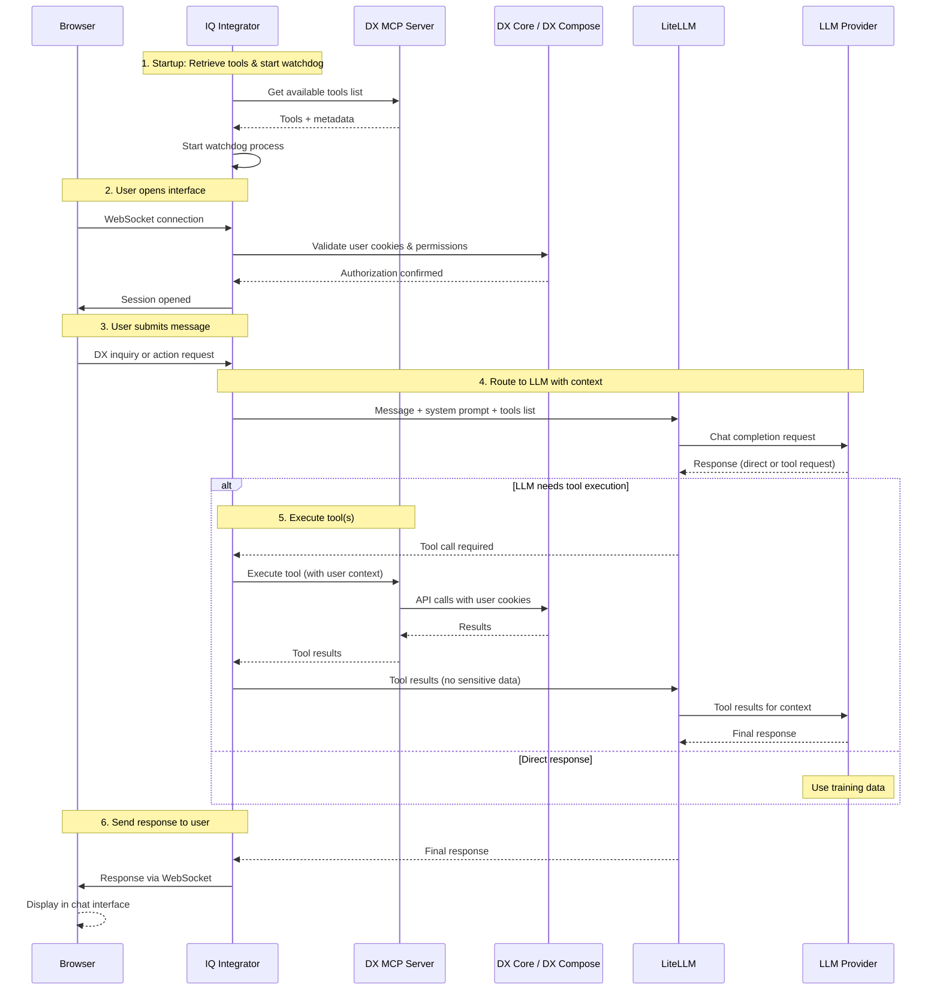

# IQ

IQ is an AI-powered assistant integrated into HCL Digital Experience (DX) that handles content creation and management through real-time, context-aware automation. Built on the Model Context Protocol (MCP), IQ offers a conversational interface directly within the DX environment where you can ask questions or have the assistant perform actions for you, such as creating templates, updating content, and searching for assets.

The IQ assistant is accessible through a chat interface integrated into HCL DX. Depending on the page context, the interface displays in either a panel view or a compact view, and both options can expand to a full-screen view. Responses are delivered over WebSocket connections once the AI model finishes processing the request. The assistant maintains conversational context within an active session. The user interface menus and labels are available only in English. However, the assistant can process prompts and generate responses in multiple languages, supporting both left-to-right (LTR) and right-to-left (RTL) text layouts.

To streamline your workflow, IQ performs actions directly within your DX system. You can instruct the assistant to build and organize your workspace, including creating, updating, or deleting content items, site areas, pages, and templates. The assistant also handles project management tasks by adding assets and publishing changes, and can run comprehensive searches across your libraries and collections.

!!! note
    IQ is a separate assistant from the Doc IQ chatbot. For more information, refer to [Differences between IQ and Doc IQ](../../get_started/product_overview/doc_iq_chatbot.md#differences-between-iq-and-doc-iq).

## Prerequisites

Ensure your environment meets the following requirements:

1. HCL DX version 236 or higher is installed and running in a container-based deployment.
2. IQ is installed and configured in your DX environment. For detailed instructions on the installation process, refer to [Installing IQ](installation/index.md).
3. Network connectivity is open for WebSocket communication between the browser and the IQ backend service.
4. Virtual Resource permission to access IQ. Users must be granted access to the `wps.DX_IQ_INTEGRATOR_API` Virtual Resource. For more information, refer to [Resource Permission Portlets](../../deployment/manage/security/people/authorization/controlling_access/sec_rpp.md).

## Architecture

IQ is deployed as a set of services inside a Kubernetes cluster alongside your existing HCL DX environment.

| Component | Description |
| :-------- | :---------- |
| Frontend | The browser-based chat interface that connects to the Integrator over a persistent WebSocket connection using JSON-RPC. |
| IQ Integrator | The central backend service that manages WebSocket sessions with the IQ UI, coordinates communication with the LLM through the LiteLLM Gateway Proxy, orchestrates tool execution through the DX MCP Server, and persists session data in PostgreSQL. |
| DX | The HCL DX services (DX Core or DX Compose) that the MCP Server calls to perform content and site management operations. |
| MCP Server | The service that exposes DX capabilities as tools the LLM can invoke. It communicates with DX services on behalf of the Integrator using the user's session cookies and virtual portal context. |
| PostgreSQL Database | The database that stores session data. If you use the KMS-based key flow, it also stores the deployment key and access token for LiteLLM authentication. |
| LiteLLM Gateway / Proxy | The single entry point for all AI calls (chat completions and embeddings) that abstracts the underlying LLM provider and handles routing, authentication, and model aliasing. |
| LLM Providers | The external AI model providers (for example, OpenAI) reached exclusively through the LiteLLM Gateway Proxy. |

## Communication flow

IQ processes user requests and coordinates actions across deployment components using a synchronized communication loop.

**Communication flow steps:**

1. **Startup initialization** — The Integrator retrieves the list of available tools from the MCP Server and starts a watchdog process to check for tool updates based on your configuration.

2. **Session establishment** — When you open the user interface, your browser starts a WebSocket connection to the Integrator. The Integrator validates your cookies and verifies your authorization to access the `wps.DX_IQ_INTEGRATOR_API` virtual resource against DX Core or DX Compose. After validation, the Integrator opens a session scoped to your user and virtual portal context.

3. **User request** — You submit a DX inquiry to ask a question about DX, or an imperative action to trigger a task. Your browser sends this message to the Integrator over the active WebSocket connection.

4. **LLM routing** — The Integrator routes your message to the LLM through the LiteLLM Gateway Proxy along with the system prompt that defines IQ behavior, the conversation summary, recent messages for context, and the list of available MCP tools. The LLM then selects one of the following actions:
    - Responds directly using its training data without running tools
    - Requests one or more MCP tool executions to collect data or complete the task

5. **Tool execution** — If the LLM requires a tool, the Integrator calls the MCP Server on your behalf and passes your cookies and virtual portal context. The MCP Server runs the corresponding API calls against DX and returns the results. This loop can repeat up to the configured iteration limit. The Integrator removes sensitive data, such as cookies, before it sends the results back to the LLM.

6. **Response delivery** — The LLM generates the final response, and the Integrator sends it to the user interface over the WebSocket connection.

## Overview

Refer to the following pages for comprehensive information about IQ:

- **[Installing IQ](installation/index.md)**  
This section describes the steps to install and configure the IQ backend services (IQ Integrator and MCP Server) in your DX environment.
- **[Enabling IQ](enable.md)**  
This section provides detailed instructions for enabling, configuring, and deploying IQ in your DX environment.
- **[Accessing IQ](./access.md)**  
This section explains the different methods available to access the IQ interface within DX.
- **[Using IQ](./usage.md)**  
This section provides a step-by-step guide for interacting with IQ, managing conversations, and leveraging its features effectively.
- **[IQ limitations](./limitations.md)**  
This section highlights current limitations and known issues.
- **[Troubleshooting IQ](./troubleshooting.md)**  
This section provides guidance for resolving common connectivity or functionality problems.
