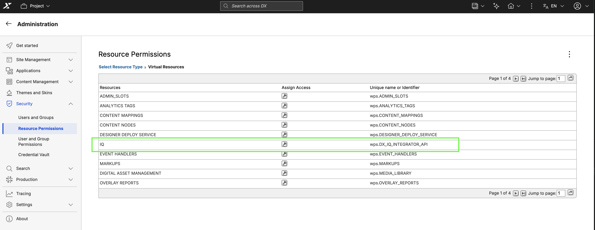

# IQ

IQ is an AI-powered assistant integrated into HCL Digital Experience (DX) that handles content creation and management through real-time, context-aware automation. Built on the Model Context Protocol (MCP), IQ offers a conversational interface directly within the DX environment where you can ask questions or have the assistant perform actions for you, such as creating templates, updating content, and searching for assets.

The IQ assistant is accessible through a chat interface integrated into HCL DX. Depending on the page context, the interface displays in either a panel view or a compact view, and both options can expand to a full-screen view. Responses are delivered over WebSocket connections once the AI model finishes processing the request. The assistant maintains conversational context within an active session. The user interface menus and labels are available only in English. However, the assistant can process prompts and generate responses in multiple languages, supporting both left-to-right (LTR) and right-to-left (RTL) text layouts.

To streamline your workflow, IQ performs actions directly within your DX system. You can instruct the assistant to build and organize your workspace, including creating, updating, or deleting content items, site areas, pages, and templates. The assistant also handles project management tasks by adding assets and publishing changes, and can run comprehensive searches across your libraries and collections.

## Prerequisites

Ensure your environment meets the following requirements:

1. HCL Digital Experience (DX) version 236 or higher is installed and running in a container-based deployment.
2. IQ is installed and configured in your DX environment. For detailed instructions on the installation process, refer to [Installing IQ](installation/index.md).
3. Network connectivity is open for WebSocket communication between the browser and the IQ backend service.
4. Virtual Resource permission to access IQ.

## Overview

Refer to the following pages for comprehensive information about IQ:

- **[Installing IQ](installation/index.md)**  
This section describes the steps to install and configure the IQ backend services (IQ Integrator and MCP Server) in your DX environment.
- **[Enabling IQ](enable.md)**  
This section provides detailed instructions for enabling, configuring, and deploying IQ in your DX environment.
- **[Accessing IQ](./access.md)**  
This section explains the different methods available to access the IQ interface within DX.
- **[Using IQ](./usage.md)**  
This section provides a step-by-step guide for interacting with IQ, managing conversations, and leveraging its features effectively.
- **[IQ limitations](./limitations.md)**  
This section highlights current limitations and known issues.
- **[Troubleshooting IQ](./troubleshooting.md)**  
This section provides guidance for resolving common connectivity or functionality problems.
