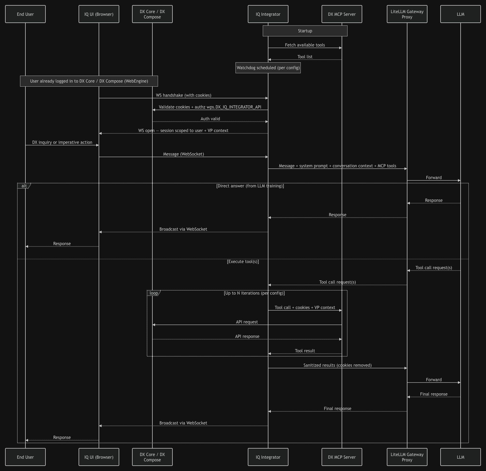

# IQ

IQ is an AI-powered assistant integrated into HCL Digital Experience (DX) that handles content creation and management through real-time, context-aware automation. Built on the Model Context Protocol (MCP), IQ offers a conversational interface directly within the DX environment where you can ask questions or have the assistant perform actions for you, such as creating templates, updating content, and searching for assets.

The IQ assistant is accessible through a chat interface integrated into HCL DX. Depending on the page context, the interface displays in either a panel view or a compact view, and both options can expand to a full-screen view. Responses are delivered over WebSocket connections once the AI model finishes processing the request. The assistant maintains conversational context within an active session. The user interface menus and labels are available only in English. However, the assistant can process prompts and generate responses in multiple languages, supporting both left-to-right (LTR) and right-to-left (RTL) text layouts.

To streamline your workflow, IQ performs actions directly within your DX system. You can instruct the assistant to build and organize your workspace, including creating, updating, or deleting content items, site areas, pages, and templates. The assistant also handles project management tasks by adding assets and publishing changes, and can run comprehensive searches across your libraries and collections.

!!! note
    IQ is a separate assistant from the Doc IQ chatbot. For more information, refer to [Differences between IQ and Doc IQ](../../get_started/product_overview/doc_iq_chatbot.md#differences-between-iq-and-doc-iq).

## Prerequisites

Ensure your environment meets the following requirements:

1. HCL Digital Experience (DX) version 236 or higher is installed and running in a container-based deployment.
2. IQ is installed and configured in your DX environment. For detailed instructions on the installation process, refer to [Installing IQ](installation/index.md).
3. Network connectivity is open for WebSocket communication between the browser and the IQ backend service.
4. Virtual Resource permission to access IQ. Users must be granted access to the `wps.DX_IQ_INTEGRATOR_API` Virtual Resource. For more information, refer to [Resource Permission Portlets](../../deployment/manage/security/people/authorization/controlling_access/sec_rpp.md).

## Overview

Refer to the following pages for comprehensive information about IQ:

- **[Installing IQ](installation/index.md)**  
This section describes the steps to install and configure the IQ backend services (IQ Integrator and MCP Server) in your DX environment.
- **[Enabling IQ](enable.md)**  
This section provides detailed instructions for enabling, configuring, and deploying IQ in your DX environment.
- **[Accessing IQ](./access.md)**  
This section explains the different methods available to access the IQ interface within DX.
- **[Using IQ](./usage.md)**  
This section provides a step-by-step guide for interacting with IQ, managing conversations, and leveraging its features effectively.
- **[IQ limitations](./limitations.md)**  
This section highlights current limitations and known issues.
- **[Troubleshooting IQ](./troubleshooting.md)**  
This section provides guidance for resolving common connectivity or functionality problems.
- **[How IQ Works](#how-iq-works)**  
This section describes the end-to-end communication flow between IQ components.

## Architecture Overview

IQ is deployed as a set of services inside a Kubernetes cluster alongside your existing HCL DX environment. The following describes each component and its role:

- **IQ Integrator** — the central backend service. It manages WebSocket sessions with the IQ UI, coordinates communication with the LLM via the LiteLLM Gateway Proxy, orchestrates tool execution through the DX MCP Server, and persists session data in PostgreSQL.
- **DX MCP Server** — exposes DX capabilities as tools that the LLM can invoke. It communicates with DX services on behalf of the Integrator using the user's session cookies and virtual portal context.
- **PostgreSQL Database** — stores session data and, when the KMS-based key flow is used, the deployment key and access token for LiteLLM authentication.
- **DX** — the HCL Digital Experience services (DX Core or DX Compose) that the MCP Server calls to perform content and site management operations.
- **IQ UI (Frontend)** — the browser-based chat interface. It connects to the Integrator over a persistent WebSocket connection using JSON-RPC.
- **LiteLLM Gateway Proxy** — the single entry point for all AI calls (chat completions and embeddings). It abstracts the underlying LLM provider and handles routing, authentication, and model aliasing.
- **LLM Services** — the external AI model providers (for example, OpenAI) reached exclusively through the LiteLLM Gateway Proxy.

## How IQ Works

The following steps describe the end-to-end communication flow between IQ components:

1. **Startup** — On startup, the IQ Integrator fetches the list of available tools from the DX MCP Server and sets up a watchdog to periodically re-check for tool updates based on configuration.

2. **WebSocket Handshake** — When you open the IQ interface, your browser initiates a WebSocket connection to the IQ Integrator. The Integrator validates your cookies and verifies that you are authorized to access the IQ Virtual Resource (`wps.DX_IQ_INTEGRATOR_API`) against DX Core or DX Compose. Once validated, an open session is established scoped to your user and virtual portal context.

3. **Sending a Message** — You can submit two types of requests: a **DX inquiry** (a question about DX) or an **imperative action** (an instruction to perform a task in DX). Your message is sent to the Integrator over the open WebSocket connection.

4. **Forwarding to LLM** — The Integrator forwards your message to the LLM via the LiteLLM Gateway Proxy, along with the system prompt that defines IQ behavior, the conversation summary and most recent messages for context, and the list of currently available MCP tools.

    - **Answer directly** — based on its training data, it responds without invoking any tools.
    - **Execute tool(s)** — it requests one or more MCP tool executions to gather the information or perform the action needed.

6. **Tool Execution (if applicable)** — If the LLM requests tool execution, the Integrator calls the DX MCP Server on your behalf, passing your cookies and virtual portal context. The MCP Server makes the necessary API calls to DX and returns the results. This can repeat for multiple iterations up to the configured limit. Sensitive data such as cookies is stripped before results are shared back with the LLM.

7. **Final Response** — The LLM crafts a final response, which the Integrator broadcasts to the IQ UI over the WebSocket connection.
