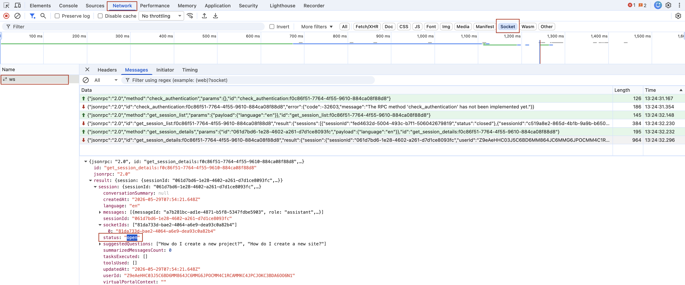
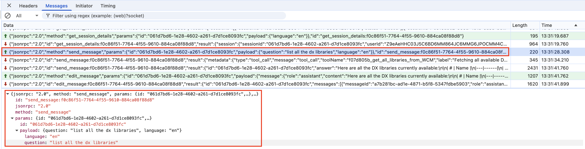
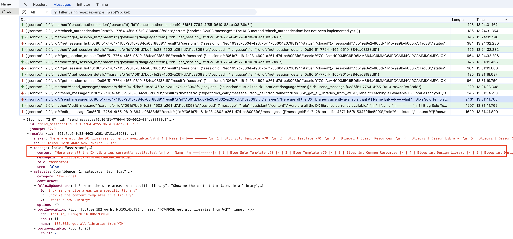

# Validating the IQ backend deployment

After completing any of the installation steps—whether you deployed services via [deploy-services.md](deploy-services.md), configured a database via [prepare-database.md](prepare-database.md), or set up a deployment key via [prepare-license.md](prepare-license.md)—validate that the IQ backend server is functioning correctly using the steps below.

!!! note "When to use this guide"
    Use this guide to verify the IQ services are running, pods are healthy, and the services can communicate with each other and external systems (database, KMS, WebSocket). This guide applies to all IQ installations, regardless of whether you configured a database or deployment key.

## Step 1: Verify Pod Health

Check that all IQ pods are running:

```bash
kubectl get pods -n <YOUR_NAMESPACE> | grep dx-iq
```

Expected output:

```
dx-iq-integrator-xxxxxxxxxx-xxxxx       1/1     Running   0          5m
dx-iq-mcp-server-xxxxxxxxxx-xxxxx       1/1     Running   0          5m
```

If pods are not in `Running` state, check the pod description:

```bash
kubectl describe pod -n <YOUR_NAMESPACE> -l app=dx-iq-integrator
```

## Step 2: Check Pod Logs

Examine logs for any errors:

```bash
# Integrator logs
kubectl logs -n <YOUR_NAMESPACE> deployment/dx-iq-integrator --tail=50

# MCP Server logs
kubectl logs -n <YOUR_NAMESPACE> deployment/dx-iq-mcp-server --tail=50
```

Look for startup messages indicating successful initialization. Check for any error or warning messages that indicate misconfiguration.

## Step 3: Verify Database Connection

If you configured a database, verify the IQ service can connect to it:

```bash
kubectl logs -n <YOUR_NAMESPACE> deployment/dx-iq-integrator | grep -i "database"
```

Look for messages like:

```
Database initialized successfully.
Database connection initialized.
Using database: PostgreSQL
```

If you see errors like `Connection refused` or `Password authentication failed`, verify your database configuration in the Helm values and the database credentials in your secret. If database is disabled and you're using SQLite (the fallback), you'll see: `Using database: In-memory SQLite`

## Step 4: Test WebSocket Connectivity

1. **Get the IQ service endpoint:**

    ```bash
    kubectl get service -n <YOUR_NAMESPACE> | grep dx-iq
    ```

2. **Access the DX environment and verify IQ UI components are loaded:**

    Open your DX environment in a browser and navigate to a page with IQ chatbot integration. The chatbot should be visible and interactive.

## Step 5: Verify MCP Server Integration

Check MCP server logs for successful tool registration:

```bash
kubectl logs -n <YOUR_NAMESPACE> deployment/dx-iq-mcp-server | grep -i "Registering\|disabled"
```

Look for messages indicating which tools are enabled:

```
Registering WCM tools
Registering DAM tools
API endpoints available at https://localhost:...
```

If tools are disabled, you'll see:

```
WCM tools are disabled
DAM tools are disabled
```

Check the Helm values `mcpServer.enableWcm` and `mcpServer.enableDam` to enable them if needed.

## Step 6: Test End-to-End Functionality

1. Open the HCL Doc IQ chatbot interface in your DX environment
2. Submit a test query (e.g., "What is HCL Digital Experience?")
3. Verify that:
    - **The WebSocket connection is established**

      You can verify this in your browser developer tools: open the **Network** tab, select **Socket/WS**, and confirm the `ws` connection is established.

      

    - **The query is processed**

      In your browser developer tools, open **Network** and select **Socket/WS**. Select the `ws` connection, open **Messages**, and verify an outbound JSON-RPC message with method `send_message` is sent for your query.

      

    - **A response is returned from the AI model**

      In the same **Messages** view, verify an inbound JSON-RPC response is returned for your `send_message` request and includes the AI-generated answer payload.

      

    - **The conversation state is preserved**

      You can validate this by reloading the page and confirming the prior conversation is still available. You can also log out and log back in, then verify the same conversation state is restored.

## Troubleshooting

If validation fails, check the following:

| Issue | Possible Cause | Solution |
|-------|----------------|----------|
| Pods not starting | Image pull errors | Verify image tags and Artifactory access |
| Database connection fails | Incorrect credentials or host | Verify database secret and configuration in [Preparing the database](prepare-database.md) |
| WebSocket errors | Network policy restrictions | Check Kubernetes network policies |
| MCP integration issues | WCM/DAM not enabled | Verify `mcpServer.enableWcm` and `mcpServer.enableDam` settings in Helm values |
| No AI responses | LiteLLM configuration issue | Check LITELLM_API_KEY and LITELLM_URL in [Preparing the license and deployment key](prepare-license.md) |
| Deployment Key not working | KMS connectivity issue | Verify KMS is reachable and [Deployment Key is valid](prepare-license.md#obtaining-the-deployment-key) |

For detailed logs:

```bash
kubectl logs -n <YOUR_NAMESPACE> deployment/dx-iq-integrator --previous
kubectl describe pod -n <YOUR_NAMESPACE> -l app=dx-iq-integrator
```
