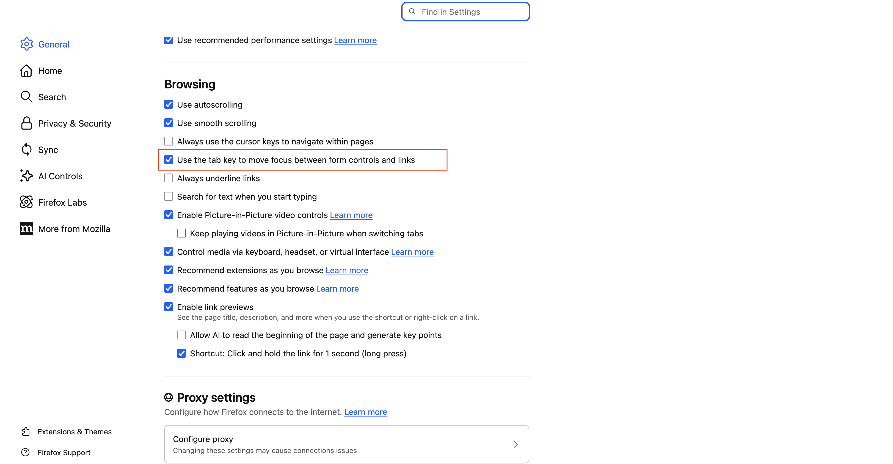
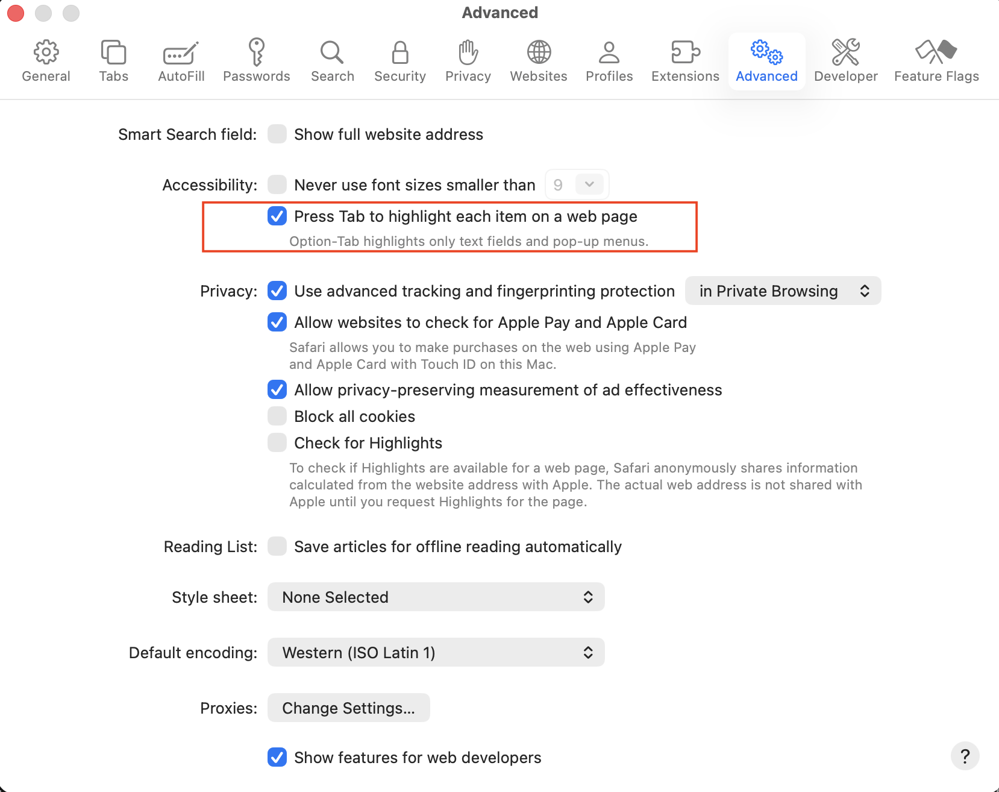

# IQ Limitations

This page lists the known limitations of IQ in the initial release (compatible with HCL Digital Experience version 236).

---

## UI Limitations

### Conversation History
- Conversation history is **not persisted** in this release.
- Starting a new conversation or ending the session permanently clears the current context — it cannot be recovered.
- There is no ability to export or review previous conversations.

### Localization
- The IQ interface supports all DX locales, including both LTR and RTL layouts.
- **Translations are available in English only** in this release. All other locales show placeholder (untranslated) text in the UI.

### Input and Output
- Text input only — rich text input editor, file attachments, images, and documents are not supported.
- Voice input and text-to-speech are not supported.

## Accessibility

To ensure full accessibility on the Search page, users must enable keyboard navigation settings in their browser.

### Firefox

### Safari

---

## Reporting Issues

If you encounter issues not listed here:

1. Review the [Troubleshooting IQ](./troubleshooting.md) section.
2. Contact your DX administrator.

---

## Next Steps

- **[Troubleshooting IQ](./troubleshooting.md)** — Resolve common issues with IQ