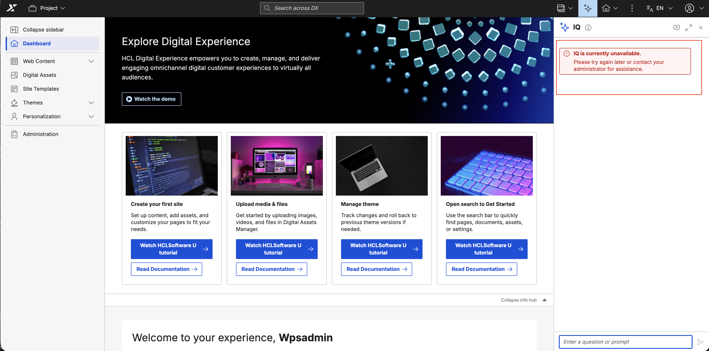
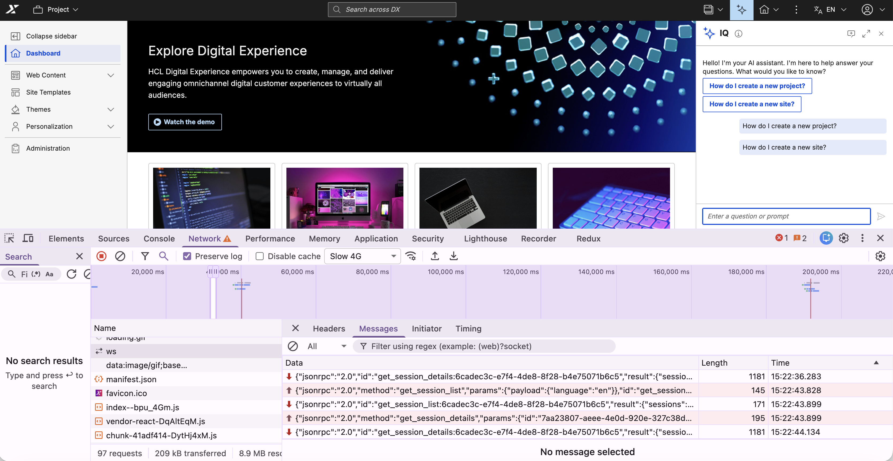

# Troubleshooting IQ

This section provides guidance on resolving common issues and capturing diagnostic information while using IQ. HCL Digital Experience (DX) log files and browser developer tools help isolate and analyze interface and connection errors.

Before investigating specific errors, perform these basic checks:

- Sign in to HCL DX with valid credentials and permissions.
- Update your browser to the latest version of Chrome, Firefox, Edge, or Safari.
- Turn on JavaScript in your browser settings.
- Verify your network connection is stable.
- Confirm your corporate firewall or proxy allows WebSocket connections.
- Verify that IQ is installed and enabled on your deployment.

If the issue appears to be MCP-related, also verify that the `dx-mcp-server` service is deployed, reachable, and matched to the IQ chart version you installed.

## User interface

If interface or display issues occur, clear the browser cache and perform a hard refresh using **Ctrl+Shift+R** (or **Cmd+Shift+R** on Mac). For Safari, use **Cmd+Option+R**.

**Missing interface icon**

If the sparkle icon or floating action button (FAB) does not appear:

- Verify that IQ is installed and enabled. For instructions, refer to [Enabling IQ](enable.md).
- Confirm that all IQ components upgraded successfully and the deployment is healthy after a Helm upgrade.
- Verify your account permissions with a system administrator. While IQ is optimized for the Practitioner persona, any authorized DX user can access it.

**Incorrect message display**

If responses appear garbled, lack formatting, or fail to render code blocks:

- Verify you are using the latest version of a supported browser.
- Open an incognito window, log into HCL DX, and check if the messages display correctly. This rules out interference from browser extensions.

### Connection and performance issues

**Unresponsive interface**

If the interface opens but messages receive no response, or the "Thinking..." indicator runs indefinitely:

- Select **Start a new conversation** in the header, close and reopen the interface, or refresh the page to clear an expired session.
- Temporarily disable your VPN to rule out network routing interference. If connectivity is restored, configure the VPN to allow WebSocket connections to the IQ endpoint.
- Check if a corporate proxy or firewall is blocking the WebSocket connection to `/dx/api/iq/v1/ws`. Refer to [Client-side tracing](#enabling-client-side-tracing) for instructions on inspecting this connection in your browser.
- If the network connection is valid but the interface remains frozen, contact your DX administrator to verify that the `dx-iq-integrator` backend service is running and reachable.
- If IQ was recently upgraded, confirm that the `dx-mcp-server` service was upgraded at the same time and that the endpoint is responding.

**Slow response times**

If IQ is consistently slow to respond:

- Break complex or multi-part questions into shorter, more specific prompts.
- Test the connection from an alternate network to isolate local network latency.
- Temporarily disable your VPN to determine if the network tunnel is introducing latency.
- Contact your system administrator to check the backend load. High usage may require scaling the IQ container service.

### Error messages

When a backend operation fails, the IQ interface displays a generic alert banner to the user:

{: style="width: 400px; display: block; margin: 0 auto;"}

To identify the underlying cause behind this banner, review the backend response payloads within the browser developer tools or examine the container logs to classify the issue:

| Error | Description | Solution |
|-------|-------------|----------|
| Communication error | An error occurred while communicating with the core DX server during a backend operation. | Make sure the core HCL DX server is active and reachable from the IQ integrator container. |
| Connection error | The client-side WebSocket connection between the browser and the IQ backend failed to establish. | Check local network connectivity. Make sure corporate firewalls, VPNs, or reverse proxies allow WebSocket traffic on `/dx/api/iq/v1/ws`. |
| Invalid format | The core DX server responded, but the data payload was in an unexpected or invalid format. | Make sure the HCL DX base platform and IQ components are running compatible versions. Check logs for API contract mismatches. |
| No response or timeout | A backend request took too long, or the core DX server failed to return a response. | Try a shorter or simpler prompt. Check backend logs for connection drops or high resource utilization on the core platform. |
| Unable to connect to AI service | The IQ backend is active but cannot establish a connection to the external LLM provider. | Wait and try the request again. Contact a system administrator to check the LLM provider credentials, API keys, and outbound network connectivity. |
| Unauthorized | The active user session does not have the necessary roles or permissions to access IQ. | Contact your HCL DX system administrator to check your user persona configuration and role assignments. |
| Unsupported operation | The AI assistant does not have the capability required to perform the action requested by your prompt. | Rephrase the prompt. If the operation is supported on your system, make sure the required backend modules or integrations are fully configured and enabled. |

## LiteLLM

**LiteLLM pod startup failure**

If the LiteLLM pod fails to start and remains in a `CrashLoopBackOff` state:

- Run the following command to examine recent deployment logs:

    ```bash
    kubectl logs -n dxns -l app=litellm --tail=50
    ```

- Verify external database endpoints and credentials if database connections fail.
- Check the `proxy_config` structure in the Helm values file for syntax errors.
- Confirm all referenced secrets exist in the `dxns` namespace.
- Verify that Kubernetes nodes have sufficient unallocated CPU and memory resources.

**Health probe failure**

If the readiness probe fails and the pod does not accept traffic:

- Diagnose pod deployment issues:

    ```bash
    kubectl describe pod -n dxns -l app=litellm
    ```

- Test database network accessibility from the pod:

    ```bash
    kubectl exec -it <litellm-pod> -- nc -zv <db-host> 5432
    ```

- Increase the `failureThreshold` parameter in the startup probe to give database migrations more time to complete.
- Review LiteLLM pod logs to identify database initialization errors.

**Models not available**

If IQ cannot locate the `iq-general-purpose` or `iq-summary` models:

- Check for upstream API errors and startup failures:

    ```bash
    kubectl logs -n dxns -l app=litellm
    ```

- Verify the available proxy models:

    ```bash
    curl -H "Authorization: Bearer <LITELLM_MASTER_KEY>" \
      http://litellm.dxns.svc.cluster.local:4000/v1/models
    ```

- Verify model names (`iq-general-purpose`, `iq-summary`) match the values defined in proxy_config.
- Confirm LLM provider credentials exist in Kubernetes secrets.
- Verify the upstream provider account has access to the specified models.

**Connection refused from IQ**

If the IQ backend service cannot establish network communication with LiteLLM:

- Test endpoint accessiblity from the IQ pod:

    ```bash
    kubectl exec -it <iq-integrator-pod> -n dxns -- \
      curl http://litellm.dxns.svc.cluster.local:4000/health/readiness
    ```

- Verify that the LiteLLM service is running:

    ```bash
    kubectl get svc -n dxns litellm
    ```

- Check Kubernetes network policies to ensure traffic is allowed between IQ and LiteLLM pods.
- Verify cluster DNS resolution:

    ```bash
    kubectl exec -it <iq-integrator-pod> -n dxns -- nslookup litellm.dxns.svc.cluster.local
    ```

## Backend services

If [validation](./installation/validation.md) fails, use this table to isolate the cause:

| Issue | Possible cause | Solution |
|-------|----------------|----------|
| Pods not starting | Image pull errors | Verify image tags and repository access. |
| Database connection fails | Incorrect credentials or host | Verify database secret and configuration in [Preparing the database](./installation/prepare-database.md). |
| WebSocket errors | Network policy restrictions | Check Kubernetes network policies. |
| Model Context Protocol (MCP) integration issues | Web Content Manager (WCM) or Digital Asset Management (DAM) not enabled | Verify `mcpServer.enableWcm` and `mcpServer.enableDam` settings in Helm values. |
| No AI responses | LiteLLM configuration issue | Check `LITELLM_API_KEY` and `LITELLM_URL` in [Deploying IQ services](../../deployment/install/container/helm_deployment/preparation/optional_tasks/optional_deploy_iq_services.md). |

To inspect pod configurations and system logs:

```bash
kubectl logs -n <YOUR_NAMESPACE> deployment/dx-iq-integrator --tail=200
kubectl describe pod -n <YOUR_NAMESPACE> -l app=dx-iq-integrator
```

### Integrator pod startup failures

If the Integrator pod fails to start, check the container logs and verify these common issues:

**MCP_SERVER_LIST misconfiguration**

If connection errors to the MCP Server occur in the Integrator logs, run these commands to check the deployment status and network resolution:

```bash
kubectl get pod -n <YOUR_NAMESPACE> -o jsonpath='{.items[?(@.metadata.labels.app=="<IQ_RELEASE_NAME>-mcp-server")].metadata.name}' && echo ""
# Expected output: <IQ_RELEASE_NAME>-mcp-server-<random>

# Verify the service DNS name resolves and responds
kubectl run -it --rm debug --image=curlimages/curl --restart=Never -n <YOUR_NAMESPACE> -- \
  curl -w "\nHTTP Status: %{http_code}\n" http://<IQ_RELEASE_NAME>-mcp-server:3000/probe/live
# Expected output: "MCP server live" with "HTTP Status: 200"
```

**Incorrect release name used**

Confirm your release name matches the value used in the `MCP_SERVER_LIST` property. For example, if you installed the chart using `helm install dx-iq`, use `http://dx-iq-mcp-server:3000`.

**LiteLLM connectivity**

Verify that the Integrator can reach the LiteLLM proxy using the API key specified in the `LITELLM_API_KEY` variable.

### Connection failures

If you encounter errors such as `Connection refused` or `Password authentication failed` while [verifying your database connectivity](./installation/validation.md#verifying-database-connectivity), the IQ Integrator cannot reach the database. Use the verification steps for your database type to locate the root cause.

#### Internal database

Check the persistence node logs to confirm the database and user were created automatically:

```bash
kubectl logs -n <YOUR_NAMESPACE> <DX_RELEASE_NAME>-persistence-node-0 -c persistence-node | grep -i "iq"
```

Expected output:

```
Creating IQ user "dx_iq_db_user"...
Creating IQ database "iqdb"...
```

If the `security.iq.dbPassword` parameter was missing during the deployment upgrade, the log shows this warning:

```text
WARNING: No password specified for "dx_iq_db_user". Skipping IQ user and database creation.
```

#### External database

Verify network connectivity from within the cluster to your external database instance. The correct tool, flags, and command structure depend entirely on your database type and network security configuration. Adjust the connection parameters in this sample command to match your specific database engine:

```bash
kubectl run pg-test --rm -it --image=postgres:16 --restart=Never -n <YOUR_NAMESPACE> -- \
  psql "host=<DB_HOST> port=5432 dbname=iqdb user=<DB_USERNAME> password=<DB_PASSWORD> sslmode=require"
```

#### Runtime Controller (RTC)-managed database

Check the Runtime Controller logs to confirm the automatic provisioning completed successfully:

```bash
kubectl logs -n <YOUR_NAMESPACE> deployment/<DX_RELEASE_NAME>-runtime-controller | grep -i "iq database"
```

Expected output:

```text
IQ database setup completed successfully.
```

If the logs show `IQ database setup failed.`, verify that the `custom-credentials-iq-db` secret exists in the namespace and that `security.iq.customDbSecret` was defined correctly during deployment.

## MCP Server

Before investigating MCP-related errors, perform these basic checks:

1. Confirm IQ is installed and enabled.
2. Confirm `dx-iq-integrator` and `dx-mcp-server` services are running and healthy.
3. Confirm network routing and DNS resolution between DX, IQ, and MCP services.
4. Confirm no recent release mismatch between IQ and MCP server components.
5. Confirm MCP endpoint reachability for your deployment path (`/mcp` or `/dx/api/iq/v1/mcp`).
6. Confirm probe endpoint status (`/probe/live` healthy and `/probe/ready` ready). For readiness pass or fail behavior, refer to [Managing endpoints and security](./installation/configuring-mcp.md#managing-endpoints-and-security).

| Issue | Possible cause | Solution |
|-------|----------------|----------|
| IQ request does not return a response | MCP Server is unreachable, unhealthy, or routed incorrectly | Validate service health, route configuration, and MCP endpoint reachability. |
| Repeated timeout behavior | Network latency, backend load, or upstream dependency delay | Test from an alternate network path, review backend load, and inspect IQ and MCP logs. |
| Intermittent failures in scaled environments | Pod-level instability or routing inconsistency | Check pod health, replica status, and restart patterns. |
| Payload-related request failures | Request body exceeds configured size limit | Validate payload size and review the `BODY_PARSER_JSON_LIMIT` configuration. |
| Unable to connect to AI service | MCP Server cannot reach configured AI provider dependencies | Check provider credentials, secrets, and outbound connectivity from cluster services. |
| Invalid format or protocol errors | Service version mismatch or contract mismatch across components | Verify compatible DX, IQ integrator, and MCP Server versions, and then review logs for parsing or schema failures. |

## Advanced diagnostics

Use advanced diagnostics to isolate complex network, interface, or server-side issues. Administrators can trace client-side browser traffic or adjust server log levels to capture detailed backend performance data.

### Enabling client-side tracing

Capture detailed diagnostic information using browser developer tools to investigate WebSocket and interface issues.

1. Open browser Developer Tools by pressing **F12** or right-clicking the page and selecting **Inspect**.
2. Select the **Console** tab and check for error logs or warnings related to IQ.
3. Select the **Network** tab and filter by **WS** to inspect the active WebSocket connection. Ensure the connection to `/dx/api/iq/v1/ws` shows a status code of `200`. Select the connection string to view the individual JSON-RPC messages exchanged between the browser and IQ.

    

4. To export a full trace for [HCL Support](#contacting-hcl-support), right-click inside the **Console** tab and select **Save as** to export the log file.

### Enabling server-side logging and tracing

To isolate deployment issues, enable debug logs for the IQ Integrator and MCP Server. Comparing timestamps across both logs helps pinpoint where processing failures occur.

The `logging` block in the Helm values sets logging levels. The deployment writes these settings to a shared `ConfigMap ({{ .Release.Name }}-global-iq)` and mounts the configuration into each pod at `/etc/global-config/`. The Integrator reads its log settings from the file path defined by `LOG_SETTINGS_FILE` (default: `/etc/global-config/log.integrator`).

| Helm values key | Type | Default | Description |
|-----------------|------|---------|-------------|
| `logging.integrator.level` | Array of strings | `["api:server-v1:*=info"]` | Log rules for the IQ Integrator pod. |
| `logging.mcpServer.level` | Array of strings | `["api:server-v1:*=info"]` | Log rules for the DX MCP Server pod. |

Each entry in the array follows the internal logger package format: `namespace=level`. The runtime joins multiple rules with commas. Both pods initialize logging with `LOG_CONTEXT=api`, so the root namespace prefix for all log rules is `api:server-v1`.

| Level | Description |
|-------|-------------|
| `error` | Error events only |
| `info` | General operational messages (recommended for production) |
| `debug` | Detailed diagnostic output |

The following example shows how to enable debug output for all integrator namespaces:

```yaml
logging:
  integrator:
    level:
      - "api:server-v1:*=debug"
```

The following example shows how to mix levels across namespaces:

```yaml
logging:
  integrator:
    level:
      - "api:server-v1:llm*=debug"
      - "api:server-v1:*=info"
```

To apply these configurations during a troubleshooting session, update the custom values file and upgrade the Helm release.

1. Change the `logging` level in your `custom-iq-debug-values.yaml` file:

    ```yaml
    logging:
      integrator:
        level:
          - "api:*=debug"  # Revert to "info" when done
      mcpServer:
        level:
          - "api:*=debug"  # Revert to "info" when done
    ```

    Adjust the logging granularity using these patterns:

    !!! warning
        `debug` logging produces high-volume output. Only use it while investigating an active issue, then revert the level to `info`.

    | Pattern | Description |
    |---------|-------------|
    | `api:*=info` | Info-level logging for the API layer |
    | `api:*=debug` | Debug-level logging for the API layer |
    | `ui:*=info` | Info-level logging for the UI layer |
    | `ui:*=debug` | Debug-level logging for the UI layer |

2. Apply the updated settings:

    ```bash
    helm upgrade dx-iq \
      https://<YOUR_REPOSITORY_FQDN_AND_PATH>/<IQ_HELM_CHART_VERSION>.tgz \
      --namespace <YOUR_NAMESPACE> \
      --reuse-values \
      --values custom-iq-debug-values.yaml
    ```

    - `<IQ_HELM_CHART_VERSION>`: The Helm chart version (for example, `hcl-dx-iq-v1.0.0_20260518-2104.tgz`).
    - `<YOUR_NAMESPACE>`: The Kubernetes namespace.
    - `<YOUR_REPOSITORY_FQDN_AND_PATH>`: The repository fully qualified domain name (FQDN) and chart path.

3. Reproduce the issue, then pull the logs from both services:

    ```bash
    kubectl logs -n <YOUR_NAMESPACE> deployment/dx-iq-integrator --tail=200
    kubectl logs -n <YOUR_NAMESPACE> deployment/dx-iq-mcp-server --tail=200
    ```

## Contacting HCL Support

If you encounter issues that cannot be resolved using these steps, open a ticket through the [HCL Support portal](https://support.hcl-software.com/csm){target="_blank"}.

!!! tip
    Collect your Helm deployment values for both your HCL DX and IQ releases before opening a ticket. Support engineers require both datasets to diagnose configuration issues effectively.

Collect your DX and IQ deployment values:

```bash
helm get values <DX_RELEASE_NAME> --namespace <YOUR_NAMESPACE>
helm get values <IQ_RELEASE_NAME> --namespace <YOUR_NAMESPACE>
```

- `<DX_RELEASE_NAME>`: The DX Helm release name (for example, `dx-deployment`).
- `<IQ_RELEASE_NAME>`: The IQ Helm release name (for example, `dx-iq`).

!!! warning "Sensitive values"
    The output might contain passwords and secrets. Review and redact all sensitive credentials before sharing the data.

If you are [using an external database](./installation/prepare-database.md#configuring-an-external-database), include these additional connectivity details:

- Database host and port (for example, `iq-postgres.c9akciq32.us-east-1.rds.amazonaws.com:5432`).
- Database name (for example, `iqdb`).
- Whether TLS is enabled (`dbTlsEnabled: true` or `false`).
- Network reachability confirmation, such as the output of this connection test:

    ```bash
    kubectl run -it --rm debug --image=postgres:15 --restart=Never -n <YOUR_NAMESPACE> -- \
      psql "host=<DB_HOST> port=<DB_PORT> dbname=<DB_NAME> user=<DB_USER> sslmode=require" -c "\conninfo"
    ```

- Relevant database connection error segments from the IQ Integrator pod logs.

???+ info "Related information"
    - [Deploying IQ services](../../deployment/install/container/helm_deployment/preparation/optional_tasks/optional_deploy_iq_services.md)
    - [Configuring the MCP Server](./installation/configuring-mcp.md)
    - [Preparing the database](./installation/prepare-database.md)
    - [Validating the deployment](./installation/validation.md)
    - [Enabling IQ](enable.md)
    - [Using IQ](usage.md)
    - [IQ limitations](limitations.md)
    - [HCL Support portal](https://support.hcl-software.com/csm){target="_blank"}