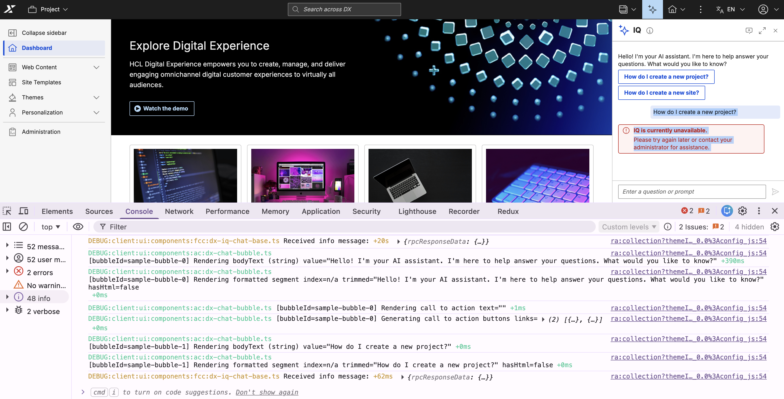

# Troubleshooting IQ

This section provides guidance on resolving common issues and capturing diagnostic information while using IQ. HCL DX log files and browser developer tools help isolate and analyze interface and connection errors.

## Initial validation

Before investigating specific errors, perform these basic checks:

- Sign in to HCL DX with valid credentials and permissions.
- Update your browser to the latest version of Chrome, Firefox, Edge, or Safari.
- Turn on JavaScript in your browser settings.
- Verify your network connection is stable.
- Confirm your corporate firewall or proxy allows WebSocket connections.
- Verify that IQ is installed and enabled on your deployment.

## Symptoms and solutions

Review the following symptoms and solutions to resolve interface, performance, and connectivity issues with IQ.

### Interface and display issues

If interface or display issues occur, clear the browser cache and perform a hard refresh using **Ctrl+Shift+R** (or **Cmd+Shift+R** on Mac). For Safari, use **Cmd+Option+R**.

**Missing interface icon**

If the sparkle icon or floating action button (FAB) does not appear:

- Verify if IQ is installed or enabled. For more information, refer to [Installing IQ](./installation.md).
- Verify your account permissions with a system administrator. While IQ is optimized for the Practitioner persona, any authorized DX user can access it.

**Incorrect message display**

If responses appear garbled, lack formatting, or fail to render code blocks:

- Verify you are using the latest version of a supported browser.
- Open an incognito window, log into HCL DX, and check if the messages display correctly. This rules out interference from browser extensions.

### Connection and performance issues

**Unresponsive interface**

If the interface opens but messages receive no response, or the "Thinking..." indicator runs indefinitely:

- Select **Start a new conversation** in the header, close and reopen the interface, or refresh the page to clear an expired session.
- Temporarily disable your VPN to rule out network routing interference. If connectivity is restored, configure the VPN to allow WebSocket connections to the IQ endpoint.
- Check if a corporate proxy or firewall is blocking the WebSocket connection to `/dx/api/iq/v1/ws`. Refer to [Client-side tracing](#client-side-tracing) for instructions on inspecting this connection in your browser.
- If the network connection is valid but the interface remains frozen, contact your DX administrator to verify that the `dx-iq-integrator` backend service is running and reachable.

**Slow response times**

If IQ is consistently slow to respond:

- Break complex or multi-part questions into shorter, more specific prompts.
- Test the connection from an alternate network to isolate local network latency.
- Temporarily disable your VPN to determine if the network tunnel is introducing latency.
- Contact your system administrator to check the backend load. High usage may require scaling the IQ container service.

## Error messages

When a backend operation fails, the IQ interface displays a generic alert banner to the user:

{: style="width: 400px; display: block; margin: 0 auto;"}

To identify the underlying cause behind this banner, administrators can review the backend response payloads within the browser developer tools or examine the container logs to classify the issue:

| Error | Meaning | Resolution |
|-------|---------|------------|
| Communication error | An error occurred while communicating with the core DX server during a backend operation. | Make sure the core HCL DX server is active and reachable from the IQ integrator container. |
| Connection error | The client-side WebSocket connection between the browser and the IQ backend failed to establish. | Check local network connectivity. Make sure corporate firewalls, VPNs, or reverse proxies allow WebSocket traffic on `/dx/api/iq/v1/ws`. |
| Invalid format | The core DX server responded, but the data payload was in an unexpected or invalid format. | Make sure the HCL DX base platform and IQ components are running compatible versions. Check logs for API contract mismatches. |
| No response or timeout | A backend request took too long, or the core DX server failed to return a response. | Try a shorter or simpler prompt. Check backend logs for connection drops or high resource utilization on the core platform. |
| Unable to connect to AI service | The IQ backend is active but cannot establish a connection to the external LLM provider. | Wait and try the request again. Contact a system administrator to check the LLM provider credentials, API keys, and outbound network connectivity. |
| Unauthorized | The active user session does not have the necessary roles or permissions to access IQ. | Contact your HCL DX system administrator to check your user persona configuration and role assignments. |
| Unsupported operation | The AI assistant does not have the capability required to perform the action requested by your prompt. | Rephrase the prompt. If the operation is supported on your system, make sure the required backend modules or integrations are fully configured and enabled. |

## Advanced diagnostics

Use advanced diagnostics to isolate complex network, interface, or server-side issues. Administrators can trace client-side browser traffic or adjust server log levels to capture detailed backend performance data.

### Client-side tracing

Capture detailed diagnostic information using browser developer tools to investigate WebSocket and interface issues.

1. Open browser Developer Tools by pressing **F12** or right-clicking the page and selecting **Inspect**.
2. Select the **Console** tab and check for error logs or warnings related to IQ.
3. Select the **Network** tab and filter by **WS** to inspect the active WebSocket connection. Ensure the connection to `/dx/api/iq/v1/ws` shows a status code of `200`. Select the connection string to view the individual JSON-RPC messages exchanged between the browser and IQ.

    

4. To export a full trace for [HCL Support](https://support.hcl-software.com/csm){target="_blank"}, right-click inside the **Console** tab and select **Save as** to export the log file.

### Server-side logging and tracing

IQ integrator logging is configured on the server side using the Helm chart. A configuration file (`log.aiIntegration`) mounts into the IQ integrator container at `/etc/global-config/log.aiIntegration`. This matches the standard pattern used across other DX services.

Follow these steps to configure and apply new log levels:

1. Configure log levels in the `hcl-dx-iq` Helm chart under the logging section of your `values.yaml` file.

    ```yaml
    logging:
      integrator:
        level:
          - ui:*=info,api:*=info  # Change to "debug" for detailed tracing
      mcpServer:
        level:
          - "api:*=info"
    ```

    Adjust the logging granularity using these patterns:

    | Pattern | Description |
    |---------|-------------|
    | `api:*=info` | Info-level logging for the API layer |
    | `api:*=debug` | Debug-level logging for the API layer |
    | `ui:*=info` | Info-level logging for the UI layer |
    | `ui:*=debug` | Debug-level logging for the UI layer |

2. Apply the configuration changes by running the `helm upgrade` command:

    ```bash
    helm upgrade <release-name> hcl-dx-iq -f values.yaml
    ```

    

If you encounter issues that cannot be resolved using these steps, contact [HCL Support](https://support.hcl-software.com/csm){target="_blank"}.
