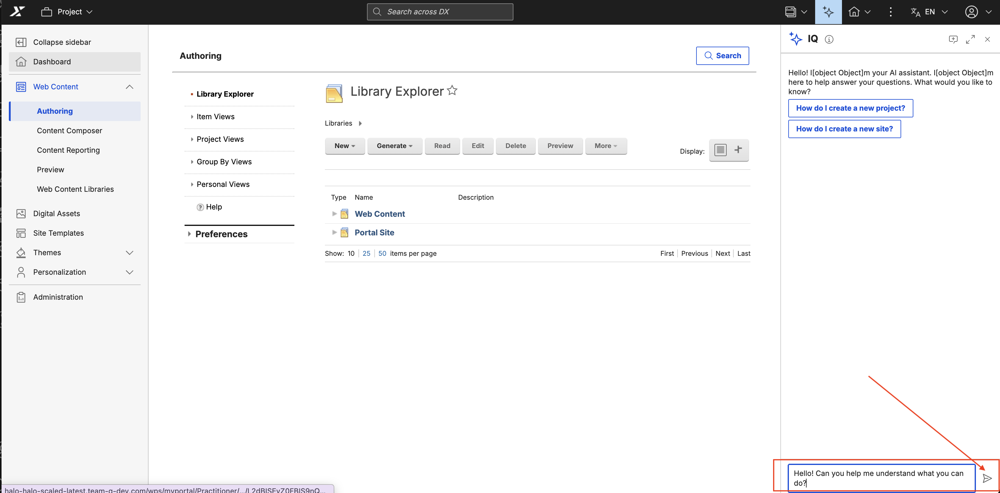
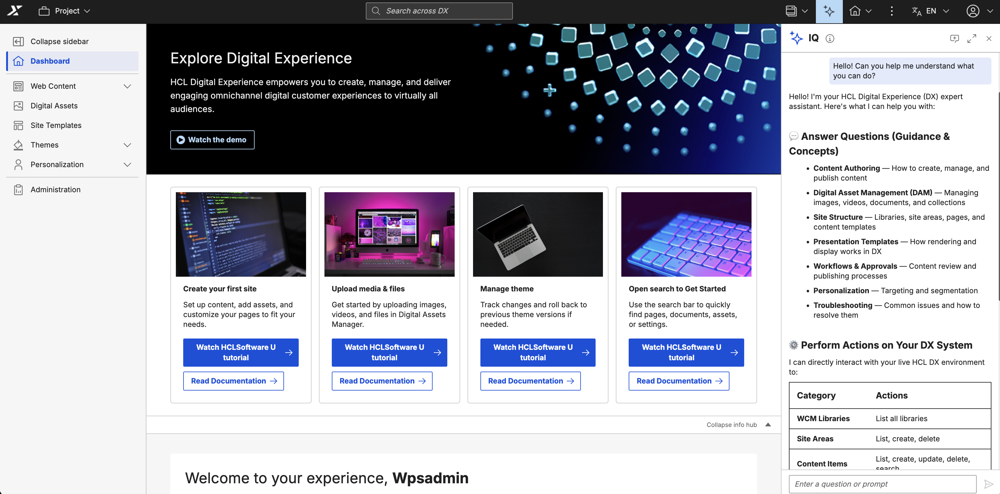
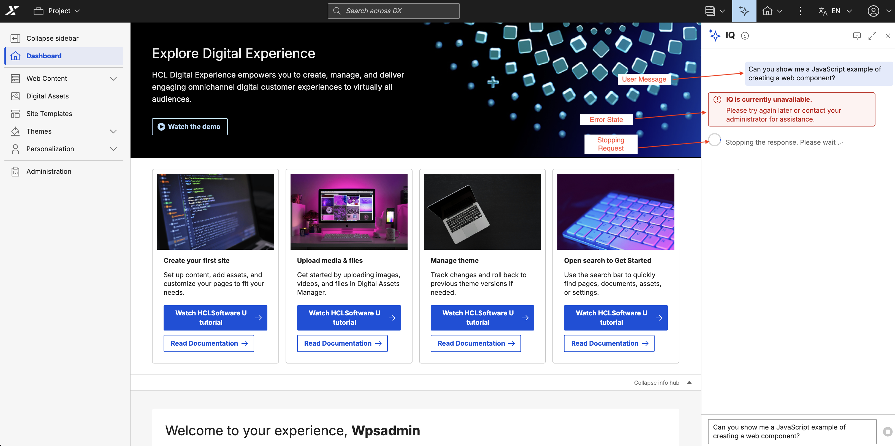
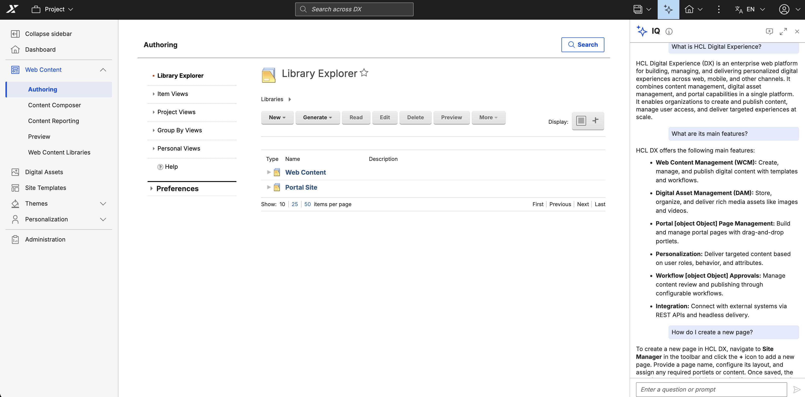
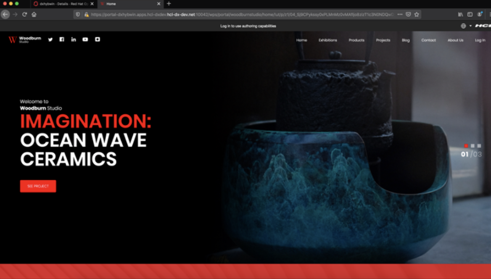

# Using IQ

This section provides a comprehensive guide on how to use IQ, the AI-powered assistant for HCL Digital Experience (DX). Learn how to interact with IQ, manage conversations, and leverage its capabilities to accomplish tasks more efficiently.

## Prerequisites

- IQ must be installed and configured. For installation instructions, refer to [Installing IQ](./installation.md).
- You must be logged in to HCL DX with appropriate permissions.
- Basic familiarity with accessing IQ. Refer to [Accessing IQ](./access.md) for access methods.

---

## Getting Started with IQ

### Opening IQ for the First Time

**Open IQ**

   Navigate to your HCL DX platform and log in with your credentials.
   ```
   https://your-dx-instance.com/wps/portal
   ```
   Depending on the current page, either click the **sparkle icon** in the Toolbar (side panel) or the **Floating Action Button (FAB)** at the bottom corner (compact view). DX automatically determines which is available based on the page layout. IQ opens with an empty chat interface, ready for your first interaction.

   

---

## Basic Interactions

### Sending Your First Message

1. **Type Your Question or Request**

   Click in the input field at the bottom of the IQ interface and type your message. For example:
   ```
   Hello! Can you help me understand what you can do?
   ```
   Press **Enter** on your keyboard or click the **Send** button (paper plane icon) to send your message.

   

2. **View IQ's Response**

   IQ processes your request and displays the response in the chat area. Responses may include:
   - Plain text explanations
   - Formatted content (bold, italic, lists)
   - Code snippets with syntax highlighting
   - Links to relevant resources

   

### Understanding Message States

Messages in IQ go through different states:

- **Sending**: Your message appears immediately after clicking Send
- **Processing**: A loading indicator shows IQ is working on your request
- **Delivered**: IQ's response appears in the chat area
- **Error**: If something goes wrong, an error message is displayed



---

## Working with Conversations

### Continuing a Conversation

IQ maintains context throughout your conversation session. You can ask follow-up questions without repeating context:

**Example Conversation Flow:**

1. **Initial Question**
   ```
   What is HCL Digital Experience?
   ```

2. **Follow-up Question** (IQ remembers the context)
   ```
   What are its main features?
   ```

3. **Another Follow-up** (context is maintained)
   ```
   How do I create a new page?
   ```



### Starting a New Conversation

To start a fresh conversation and clear the current context:

1. **Locate the "Start a new conversation" button**

   Look for the "Start a new conversation" icon in the IQ header (available in both the side panel and compact view).

   

2. **Click the Button**

   A confirmation dialog appears warning you that the current context will be permanently cleared.

   

3. **Click Proceed**

   A new session begins with a fresh context.

   

!!! warning
    Starting a new conversation clears the current session context permanently. Conversation history is **not** persisted in this release — once cleared, the previous conversation cannot be recovered.

## Stopping an Ongoing Request

While IQ is processing your request (indicated by the "Thinking..." loading indicator), you can cancel it by clicking the **Stop** button that appears in the input area. Once stopped:

- IQ halts the response generation.
- A message "You stopped the response." is displayed in the chat area.
- You can send a new message immediately.

---

## Advanced Features

### Working with Rich Content

IQ supports various types of formatted content in its responses:

#### **Markdown Formatting**

IQ responses support standard Markdown formatting:

- **Bold text**: `**important**` → **important**
- **Italic text**: `*emphasis*` → *emphasis*
- **Inline code**: `` `code` `` → `code`
- **Links**: `[HCL DX](https://www.hcl.com)` → [HCL DX](https://www.hcl.com)


#### **Code Blocks**

IQ can display code snippets with syntax highlighting:

**Example Request:**
```
Can you show me a JavaScript example of creating a web component?
```

**IQ Response:**
```javascript
class MyComponent extends HTMLElement {
  constructor() {
    super();
    this.attachShadow({ mode: 'open' });
  }
  
  connectedCallback() {
    this.shadowRoot.innerHTML = '<p>Hello World!</p>';
  }
}

customElements.define('my-component', MyComponent);
```


#### **Lists and Tables**

IQ can format information as lists or tables:

**Bulleted Lists:**
- Item 1
- Item 2
- Item 3

**Numbered Lists:**
1. First step
2. Second step
3. Third step

**Tables:**

| Feature | Description | Status |
|---------|-------------|--------|
| Chat | AI-powered chat | ✅ Available |
| Context | Maintain conversation context | ✅ Available |


### Editing Your Messages

If you want to modify a message you've already sent:

1. **Locate the Message**

   Find the message you want to edit in the conversation history.

2. **Click the Edit Icon**

   Hover over your message to reveal action buttons, then click the "Edit" icon (pencil icon).

   

3. **Modify the Message**

   The message becomes editable in the input field. Make your changes.

   

4. **Save Changes**

   Press **Enter** or click **Send** to save your edited message. IQ will process the edited message and provide a new response.

   

!!! note
    Editing a message may remove subsequent messages and responses in the conversation, as the context changes.

---

## Managing the IQ Interface

### Expanding IQ to Full View

From either the side panel or the compact view, you can expand IQ to a full expanded dialog view for better readability and more interactive space:

1. **Click the Full View Button**

   In the IQ header, click the **Full View** icon.

   

2. **IQ Expands to Full View**

   IQ expands to cover the full viewport in a dialog view.

   

3. **Return to Previous View**

   Click the **Compact View** icon in the header to return to the side panel or compact view.

   

### Closing and Reopening IQ

### **To Close IQ:**

- **Side Panel**: 
  - Click the close (X) button in the header
  - Click outside the panel
  - Press **Escape** key

- **Compact View or Full View**:
  - Click the close (X) button in the header
  - Click outside the dialog
  - Press **Escape** key


#### **To Reopen IQ:**

- Click the sparkle icon (✨) in the Toolbar or the FAB at the bottom corner (whichever is available on the current page)


!!! note
    Closing IQ does not preserve conversation history in this release. If you reopen IQ, the previous conversation may not be available depending on how the session ended.

### Notification Badge

If IQ receives a new message while the interface is closed, you'll see a notification badge on the sparkle icon or FAB:


**To View Unseen Messages:**
1. Click the sparkle icon or FAB to open IQ
2. IQ opens and scrolls to the new message
3. The badge disappears once you've viewed the message

---

## Scrolling and Navigation

### Auto-Scroll Behavior

IQ automatically scrolls to the latest message when:
- You send a new message
- IQ sends a response
- You edit a message


### Manual Scrolling

To review previous messages:
- Use your mouse scroll wheel
- Use touch gestures (on touch devices)
- Use keyboard arrows (after focusing the chat area)


---

## Handling Errors

### Error Messages

If something goes wrong, IQ displays an error message:


Common error messages include:

- **"Connection Error"**: WebSocket connection to IQ backend failed
- **"Unable to connect to AI service"**: LLM provider is unavailable
- **"Request Timeout"**: The request took too long to process
- **"Session Expired"**: Your session has expired, and you need to start a new conversation

### Recovering from Errors

When you encounter an error:

1. **Wait a Moment**: Some errors are temporary and resolve automatically
2. **Retry Your Request**: Click "Retry" button if available, or resend your message
3. **Start a New Conversation**: If errors persist, try starting a new conversation
4. **Refresh the Page**: As a last resort, refresh your browser page and reopen IQ


If errors continue, refer to [Troubleshooting IQ](./troubleshooting.md) or contact your system administrator.

---

## Best Practices for Using IQ

### Ask Clear and Specific Questions

✅ **Good Examples:**
```
How do I create a new content item in Web Content Manager?
```
```
What are the steps to deploy a theme in HCL DX?
```
```
Can you explain the difference between portlets and web applications?
```

❌ **Less Effective:**
```
help
```
```
content
```
```
how to do things
```

### Provide Context When Needed

If IQ's response doesn't match your expectations, provide more context:

**Initial Question:**
```
How do I create a page?
```

**Add Context:**
```
I want to create a new page in Practitioner Studio for the Marketing site. 
The page should include a banner and content area. Can you walk me through the steps?
```

### Use Follow-up Questions

Take advantage of IQ's context awareness:

**First Question:**
```
What is a portlet?
```

**Follow-up:**
```
How do I add one to my page?
```

**Another Follow-up:**
```
Can I configure its settings?
```

### Break Down Complex Requests

For complex tasks, break them into smaller steps:

**Instead of:**
```
How do I set up a complete DX site with themes, portlets, pages, and content?
```

**Try:**
```
What are the main steps to create a new DX site?
```

Then follow up with specific questions about each step.

---

## Keyboard Shortcuts and Accessibility

### Keyboard Navigation

IQ fully supports keyboard navigation:

| Key | Action |
|-----|--------|
| **Tab** | Navigate between interactive elements |
| **Shift + Tab** | Navigate backwards |
| **Enter** | Send message / Activate button |
| **Escape** | Close IQ interface |
| **Ctrl + A** | Select all text in input field |
| **Ctrl + C** | Copy selected text |
| **Ctrl + V** | Paste text |

### Accessibility Features

- **Screen Reader Support**: All interface elements have appropriate ARIA labels
- **Focus Indicators**: Clear visual indication of keyboard focus
- **High Contrast**: Compatible with high-contrast display modes
- **Zoom Support**: Works with browser zoom levels up to 200%

For full keyboard navigation, enable it in your browser settings:

- **Firefox**: Settings > General > Browsing > "Always use the cursor keys to navigate"
- **Safari**: Preferences > Advanced > "Press Tab to highlight each item on a webpage"

---

## Tips and Tricks

### 1. Use IQ for Documentation Lookup
```
Where can I find documentation about setting up LDAP authentication?
```

### 2. Get Step-by-Step Instructions
```
Can you provide step-by-step instructions to configure a virtual portal?
```

### 3. Understand Error Messages
```
I'm seeing error code EJPEJ0037E. What does this mean?
```

### 4. Learn Best Practices
```
What are the best practices for organizing web content in WCM?
```

### 5. Get Code Examples
```
Can you show me an example of a custom portlet configuration?
```

---

## Session Management

### Understanding Sessions

IQ maintains your conversation context within an active session:
- Each time you open IQ, you continue in the current session (as long as the session has not ended).
- Starting a "New Conversation" creates a new session with a fresh context.

!!! warning
    Conversation history is **not persisted** in this initial release. The previous session context cannot be recovered once a new conversation is started, the session ends, or the page is refreshed.

---

## What IQ Can Help You With

IQ is designed to assist with HCL DX-related tasks and questions. Examples include:

### **Product Information**
- Features and capabilities of HCL DX
- Version information and release notes
- Component architecture and relationships

### **How-To Guides**
- Step-by-step instructions for common tasks
- Configuration guidance
- Best practices and recommendations

### **Troubleshooting**
- Understanding error messages
- Diagnosing common issues
- Finding relevant documentation

### **Documentation Lookup**
- Locating specific documentation
- Explaining concepts and terminology
- Providing code examples

!!! note
    IQ's capabilities depend on the configured AI model and available MCP (Model Context Protocol) servers. Your specific IQ deployment may have additional capabilities or limitations.

---

## Limitations While Using IQ

While using IQ, be aware of the following:

- **Response Time**: Complex questions may take longer to process
- **Context Limits**: Very long conversations may lose early context
- **Accuracy**: Always verify critical information with official documentation
- **Scope**: IQ focuses on HCL DX-related assistance
- **Real-Time Data**: IQ may not have access to real-time system data unless configured with specific MCP tools

For a complete list of limitations, refer to [Limitations of IQ](./limitations.md).

---

## Next Steps

Now that you know how to use IQ effectively:

- **[Configuration](./configuration.md)** - Learn about customizing IQ behavior and settings
- **[Limitations](./limitations.md)** - Understand current limitations and constraints
- **[Troubleshooting](./troubleshooting.md)** - Get help resolving issues

For additional assistance, contact HCL Support or refer to the HCL DX documentation portal.
