# Using IQ

This section provides a comprehensive guide on how to use IQ, the AI-powered assistant for HCL Digital Experience (DX). Learn how to interact with IQ, manage conversations, and leverage its capabilities to accomplish tasks more efficiently.

## Prerequisites

- IQ must be installed and configured. For installation instructions, refer to [Installing IQ](./installation.md).
- You must be logged in to HCL DX with appropriate permissions.
- Basic familiarity with accessing IQ. Refer to [Accessing IQ](./access.md) for access methods.

---

## Getting Started with IQ

### Opening IQ for the First Time

1. **Open IQ**

    Navigate to your HCL DX platform and log in with your credentials.

    Depending on the current page, either click the **sparkle icon** in the Toolbar (Panel view) or the **Floating Action Button (FAB)** at the bottom corner (Compact view). IQ opens with an empty chat interface, ready for your first interaction.

    

---

## Basic Interactions

### Sending Your First Message

1. **Type Your Question or Request**

    Click in the input field at the bottom of the IQ interface and type your message. For example:

    ```
    Hello! Can you help me understand what you can do?
    ```

    Press **Enter** on your keyboard or click the **Send** button to send your message.

    

2. **View IQ's Response**

    IQ processes your request and displays the response in the chat area. Responses may include:

    - Plain text explanations
    - Formatted content (bold, italic, lists)
    - Code snippets with syntax highlighting
    - Links to relevant resources

    

### Understanding Message States

Messages in IQ go through different states:

- **Sending**: Your message appears immediately after clicking Send.
- **Processing**: A loading indicator shows IQ is working on your request.
- **Delivered**: IQ's response appears in the chat area.
- **Error**: If something goes wrong, an error message is displayed.


---

## Working with Conversations

### Continuing a Conversation

IQ maintains context throughout your conversation session. You can ask follow-up questions without repeating context:

**Example Conversation Flow:**

1. **Initial Question**

    ```
    What is HCL Digital Experience?
    ```

2. **Follow-up Question** (IQ remembers the context)

    ```
    What are its main features?
    ```

3. **Another Follow-up** (context is maintained)

    ```
    How do I create a new page?
    ```


### Starting a New Conversation

To start a fresh conversation and clear the current context:

1. **Locate the "Start a new conversation" button**

    Look for the **Start a new conversation** icon in the IQ header.

    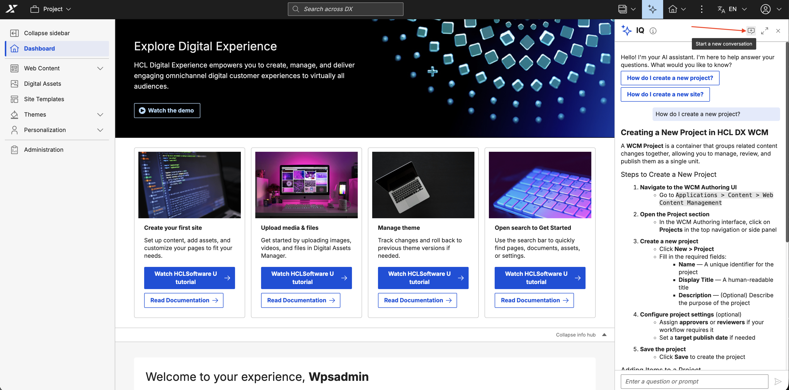

2. **Click the Button**

    A confirmation dialog appears warning you that the current context will be permanently cleared.

    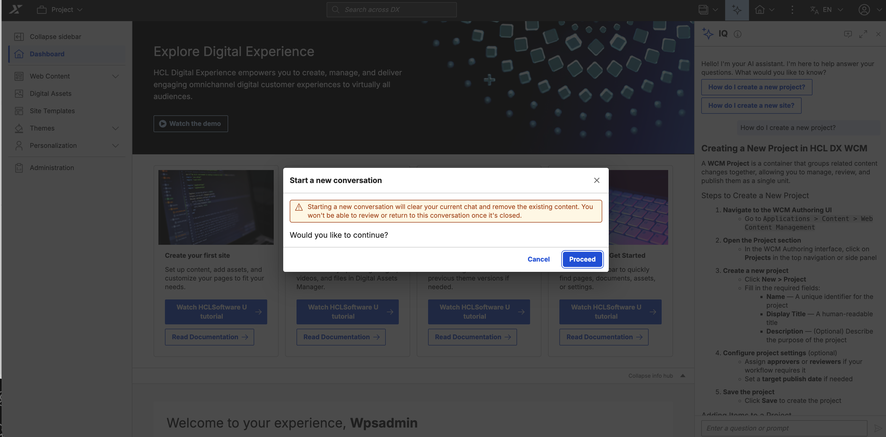

3. **Click Proceed**

    A new session begins with a fresh context.

    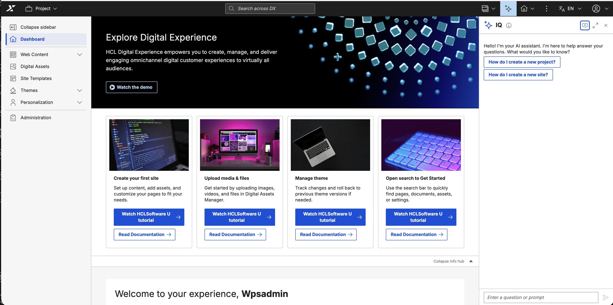

!!! warning
    Starting a new conversation clears the current session context permanently. Conversation history is **not** persisted in this release — once cleared, the previous conversation cannot be recovered.

!!! note
    If you have IQ open in more than one browser tab or window and start a new conversation in one of them, a warning message may briefly appear in the other. This resolves automatically within a few seconds and no action is required.

### Stopping an Ongoing Request


While IQ is processing your request (indicated by the "Thinking..." loading indicator), you can cancel it by clicking the **Stop** button that appears in the input area. Once stopped:

- IQ halts the response generation.
- A message "You stopped the response." is displayed in the chat area.
- The stopped question is retained in the input field, allowing you to edit and resend it if desired.
- You can also send a new message immediately.

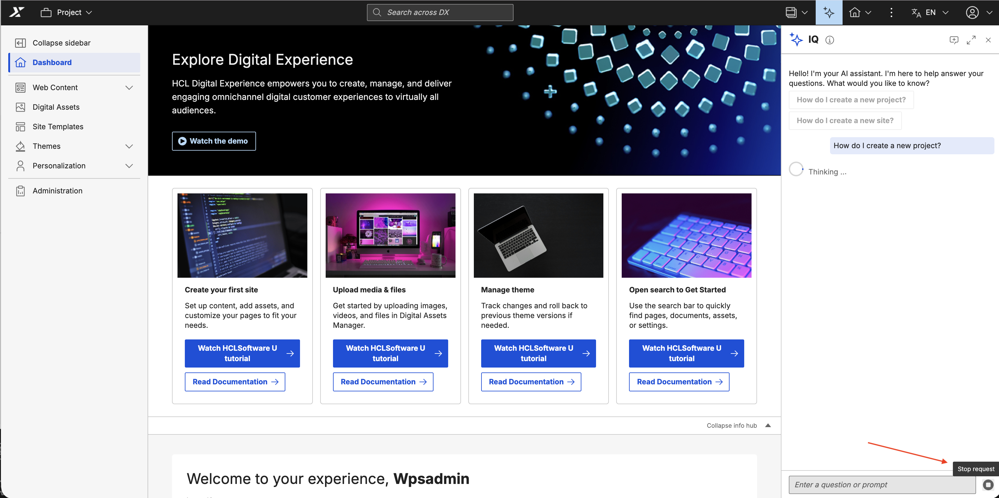

---

## Expanding IQ to Full view

From either the Panel view or the Compact view, you can expand IQ to a Full view for better readability and more interactive space:

1. **Click the Full view Button**

    In the IQ header, click the **Full view** icon.

    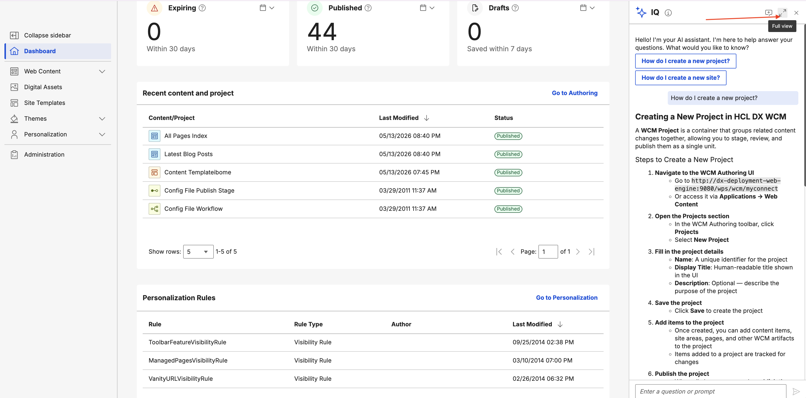

2. **IQ Expands to Full view**

    IQ expands to cover the full viewport in a Full view. Click the collapse icon in the header to return to the Panel view or Compact view.

    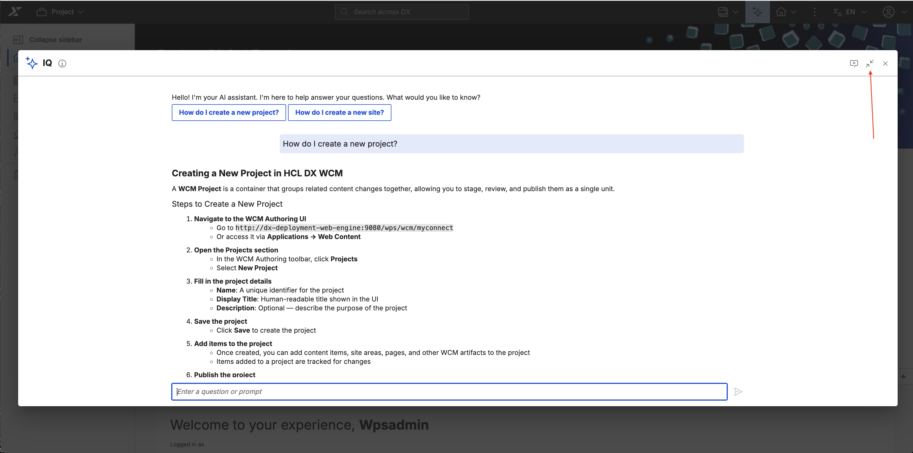

---

## Closing IQ

- **Panel view**: Can be closed by either of the following:
    - Click the **Close (X)** button in the header
    - Click the **Sparkle icon** in the toolbar

    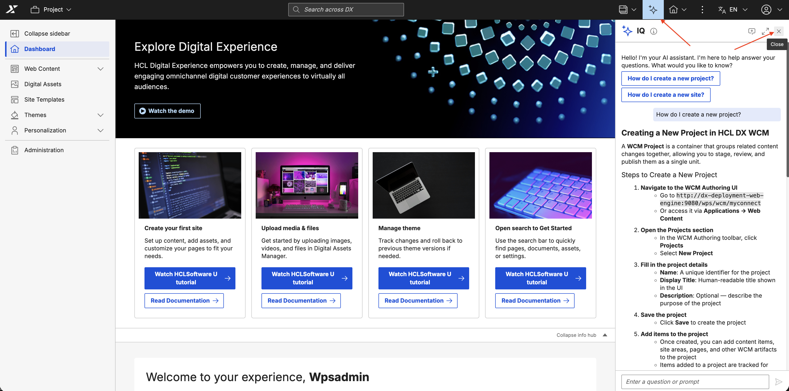

- **Compact view**: Can be closed by either of the following:
    - Click the **Close (X)** button in the header
    - Click the **FAB sparkle icon**

    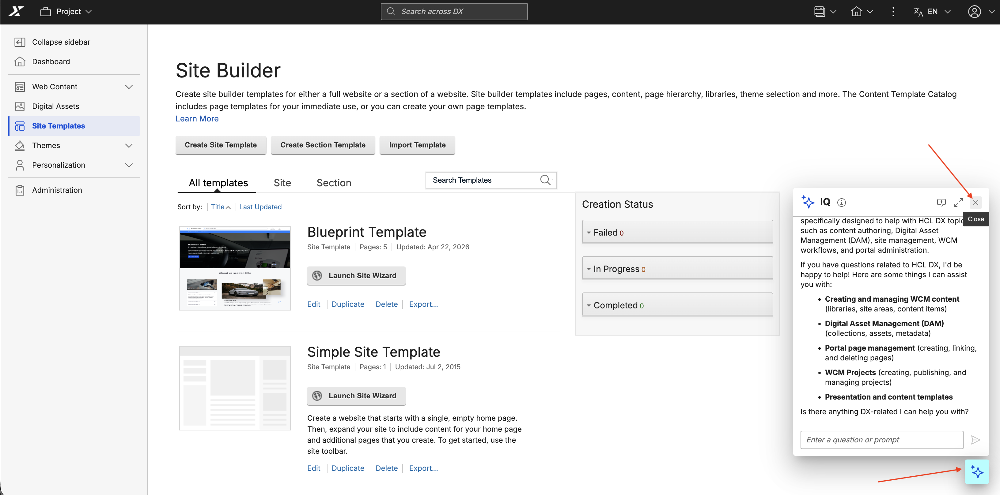

- **Full view**: Can be closed by:
    - Clicking the **Close (X)** button in the header

    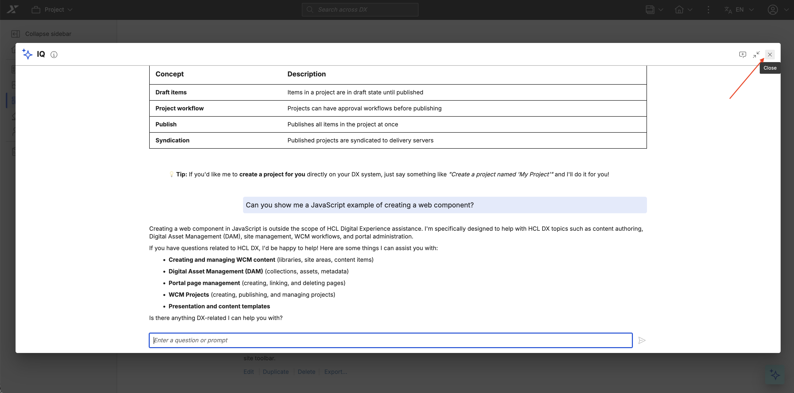

---

## Notification Badge

If IQ receives a new message while the interface is closed, a notification badge appears on the sparkle icon or FAB.

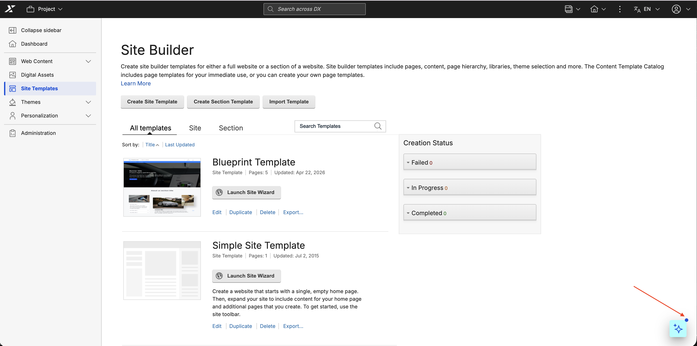

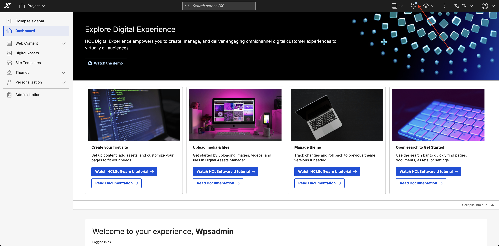

To view unseen messages:

1. Click the sparkle icon or FAB to open IQ.
2. IQ opens and scrolls to the new message.
3. The badge disappears once you have viewed the message.

---

## Error Messages

If something goes wrong, IQ displays an error message in the chat area.


---

## Next Steps

- **[Limitations](./limitations.md)** — Understand current limitations and constraints
- **[Troubleshooting](./troubleshooting.md)** — Get help resolving issues
