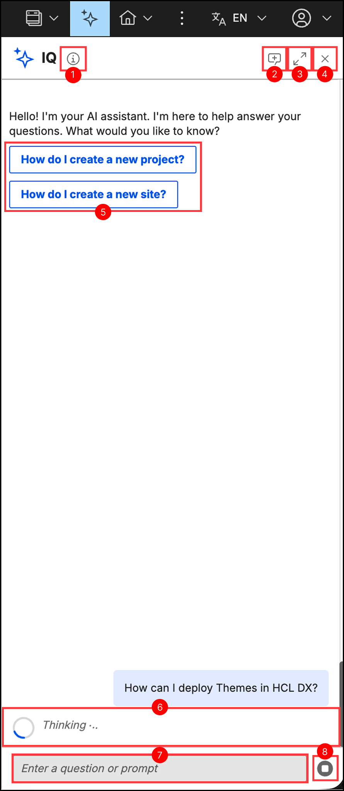
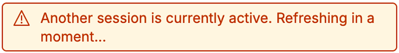

# Using IQ

This section provides a comprehensive guide on how to interact with IQ, manage active conversation sessions, and handle system alerts within HCL Digital Experience (DX).

## Interface components

Regardless of the active display mode, the interface contains the following core components as mapped in this overview:

{: style="width: 500px; display: block; margin: 0 auto;"}

1. **AI disclaimer** icon: Displays a tooltip with information about the assistant, including data privacy reminders and a warning to review AI-generated content before use when hovered.
2. **Start a new conversation** button: Restarts the session and permanently clears the current chat context.
3. **Full view**, **Panel view**, or **Compact view** button: Toggles between the standard view and the full view expanded workspace.
4. **Close** button: Closes the assistant interface.
5. **Quick-chat** prompts: Displays clickable prompt suggestions for common tasks to quickly initiate a conversation.
6. **Status indicators**: Displays the processing state directly above the text input area. For more information about error indicators, refer to [Troubleshooting IQ](./troubleshooting.md).
7. **Text input** field: The area to enter questions.
8. **Send message** or **Stop request** button: Sends the question to the assistant, or cancels the active request while a response is generating.

## Sending requests

To submit a request, select one of the **Quick-chat** prompts to send a pre-configured prompt automatically, or enter a custom prompt in the text input field at the bottom of the interface and select the **Send message** button.

Your message appears in the chat timeline immediately while a "Thinking..." indicator shows that IQ is actively generating your response. Once IQ finishes generating, the indicator clears, and the finalized response populates the chat timeline using formatted rich text, lists, code snippets, or documentation links.

## Managing conversations

**Contextual memory**

IQ retains conversational context across an active session. You can ask consecutive follow-up questions without restating baseline definitions or background details, such as asking "What are its main features?" immediately after a prompt about HCL DX.

**Resetting a session**

To clear the active timeline and reset the memory context, select the **Start a new conversation** button in the header bar, and then select **Proceed**.

!!! warning
    This action permanently deletes the active conversation history. Chat history currently does not persist across sessions, so cleared conversations cannot be recovered.

If IQ is open in multiple windows or tabs, a warning message may briefly display in the secondary instances before resolving automatically.

{: style="width: 400px; display: block; margin: 0 auto;"}

**Stopping a request**

To cancel an active response, select the **Stop request** button inside the text input area. The assistant stops generating content, displaying "Stopping the response. Please wait..." followed by "The response was stopped." Your original prompt remains in the text input field so you can quickly modify and resubmit it.

## Workspace layouts and alerts

**Expanding the view**

To improve readability for dense text or large code blocks, select the **Full view** button in the header to expand the chat workspace. To return to your previously selected layout, select the **Panel view** or **Compact view** button in the header.

**Notification badges**

If IQ finishes generating a response or receives a system update while the chat interface is closed, a notification badge displays on either the toolbar button or the floating icon, depending on your current view. Opening the interface automatically clears the badge and scrolls to the new item.

{ height="100" } &nbsp;&nbsp;&nbsp;&nbsp;&nbsp;&nbsp;&nbsp;&nbsp; { height="100" }
{: style="text-align: center; margin: 24px 0;" }

## What can IQ do?

IQ is purpose-built for HCL Digital Experience. Unlike general-purpose AI assistants, IQ understands DX-specific concepts, APIs, and workflows, and can both answer questions and perform actions directly on your DX system.

!!! note
    The available actions depend on the MCP tools deployed in your environment. The capabilities listed below reflect the default tools included with the standard IQ deployment. For more information, refer to [AI model limitations](../../deployment/install/container/helm_deployment/preparation/optional_tasks/optional_install_dx_iq.md#ai-model-limitations).

### Ask questions

You can ask IQ about any HCL DX topic, including:

- Content authoring and workflows
- Digital Asset Management (DAM)
- Site structure, pages, and navigation
- Components and presentation templates
- Workflows and approvals
- Personalization and targeting
- Syndication and delivery
- Configuration and troubleshooting

IQ responds with concise, implementation-ready guidance tailored to HCL DX.

### Perform actions

IQ can also execute operations directly on your DX system. When you give a direct instruction (for example, "Create a site area called News in the Web Content library"), IQ carries out the action using integrated MCP tools and reports the result.

Supported actions include:

| Category | Actions |
|----------|---------|
| **Libraries** | List all libraries |
| **Site areas** | List, create, and delete site areas |
| **Content** | List, create, update, and delete content items |
| **Content templates** | List, create, and delete content templates |
| **Presentation templates** | Create and delete presentation templates |
| **Pages** | List parent pages, create and delete pages |
| **Projects** | Create, delete, and publish projects; add and remove items from projects |
| **Search** | Search content, collections, and assets |
