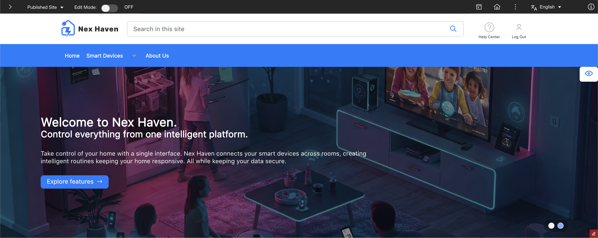

# Nex Haven

Nex Haven, a website for a fictional company of smart home products, demonstrates the [Blueprint](./blueprint.md) design system in action. It showcases the use of [Blueprint page components](https://pages.github.com/HCL-TECH-SOFTWARE/dx-blueprint-storybook/latest/?path=/docs/foundations-page-components--documentation){target="_blank"} and the [Blueprint theme](https://pages.github.com/HCL-TECH-SOFTWARE/dx-blueprint-storybook/latest/?path=/docs/foundations-theme--documentation){target="_blank"}.

Nex Haven is automatically set up as part of a [fresh deployment](../deployment/install/container/helm_deployment/helm_install_commands.md) or an [upgrade](../deployment/install/container/helm_deployment/update_helm_deployment.md) of HCL Digital Experience (DX). It can also be [created using the Site Builder](https://pages.github.com/HCL-TECH-SOFTWARE/dx-blueprint-storybook/latest/?path=/docs/how-to-create-the-sample-site--documentation){target="_blank"} if the Blueprint design system bundle is already installed.

The automatically installed instance of the Nex Haven site will be updated as part of an upgrade. All changes made to it or any other part of the [out-of-the-box Blueprint design system bundle](https://pages.github.com/HCL-TECH-SOFTWARE/dx-blueprint-storybook/latest/?path=/docs/how-to-install-blueprint--documentation#inclusions){target="_blank"} will be lost.
