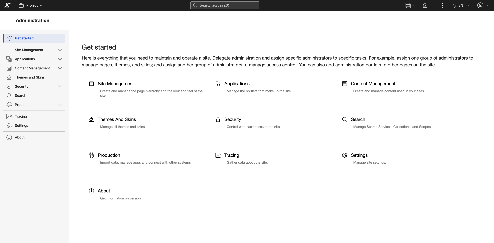

# Administration

Learn how to use the Portal administration portlets that are provided with HCL DX to do various day-to-day administration tasks.

## Site management

Manage the structure and foundation of your portal environment, including pages, virtual portals, and templates.

- **[Manage Pages portlet](../../deployment/manage/portal_admin_tools/portal_user_interface/managing_pages/manage_pages_portlets/index.md)**  
    Learn how to use the Manage Pages portlet to create, edit, activate, order, and delete pages, external web pages, and labels.
- **[Virtual Portal Manager](../../build_sites/virtual_portal/vp_mgr_portlet/index.md)**  
    Learn how to use the Virtual Portal Manager portlet to create, configure, and manage virtual portals, including default content, access rights, and administration settings.
- **[Page templates](../../manage_content/wcm_delivery/deliver_webcontent_on_dx/getting_started/wcm_delivery_webpagetemplate_about.md#web-content-pages-and-templates)**  
    Learn how to use page templates to define the layout, style, and content structure for web content pages.

## Applications

Deploy and administer portlets, web modules, and applications across your DX platform.

- **[Web Modules](../../extend_dx/portlets_development/mng_portlets_apps_widgets/portlet_management/managing_web_modules/index.md)**  
    Learn how to use the Manage Web Modules portlet to install, update, and manage portlets from web services or WAR files, and to view detailed information and access settings for each module.
- **[Applications](../../extend_dx/portlets_development/mng_portlets_apps_widgets/portlet_management/managing_portlet_apps/index.md)**  
    Learn how to use the Manage Applications portlet to enable portlet applications as web services, view their portlets, and edit their properties.
- **[Portlets](../../extend_dx/portlets_development/mng_portlets_apps_widgets/portlet_management/index.md)**  
    Learn how to use Portlet Management tools to install, configure, and manage portlets and web services, including creating, modifying, and controlling access to portlets across your HCL DX environment.

## Content management

Synchronize, syndicate, and organize your web content efficiently using dedicated management tools and extensions.

- **[Syndicators and subscribers](../../manage_content/wcm_delivery/syndication/manage_synd_subs/index.md)**  
    Learn how to use syndication to transfer and synchronize web content between HCL DX environments by configuring, monitoring, and managing syndicators and subscribers.
- **[Feed management](../../manage_content/wcm_authoring/wci/webcontentfeed_mgmt/index.md)**  
    Learn how to use Web Content Feed Management to create, configure, schedule, and manage web content feeds across your environment.
- **[Multi-locale Library Copy application](../../manage_content/wcm_authoring/multi_lingual/mls_extension/wcm_mls_ext_library.md)**  
    Learn how to use the Library Copy portlet extension to create a new locale by duplicating an existing library with a new name and locale.
- **[WCM Support Tools](../../deployment/manage/troubleshooting/wcm_support_tools.md)**  
    Learn how to use the HCL Web Content Manager Support Tools portlet to view, analyze, and troubleshoot Java Content Repository (JCR) nodes and content directly.
- **[Themes and Skins](../../deployment/manage/portal_admin_tools/portal_user_interface/managing_pages/manage_pages_portlets/customizing_pages/admcustom_skins.md)**  
    Learn how to use the Themes and Skins portlet to manage the visual design of your portal by setting default themes and skins, associating them, and adding or removing theme elements to ensure a consistent user experience.

## Security

Secure your portal by managing users, defining resource permissions, and safeguarding credentials for authentication.

- **[Users and Groups](../../deployment/manage/security/people/authorization/controlling_access/index.md)**  
    Learn how to use the Users and Groups portlet to manage user accounts and group memberships, including creating, editing, deleting, and assigning roles and permissions.
- **[Resource Permissions](../../deployment/manage/security/people/authorization/controlling_access/working_with_resource_permission/index.md)**  
    Learn how to use the Resource Permissions portlet to manage access control by assigning roles, setting inheritance, and defining ownership or external security management.
- **[User and Group Permissions](../../deployment/manage/security/people/authorization/controlling_access/user_group_permission/index.md)**  
    Learn how to use the User and Group Permissions portlet to assign roles and manage group memberships.
- **[Credential Vault](../../deployment/manage/security/people/authorization/controlling_access/managing_cred_info/index.md)**  
    Learn how to use the Credential Vault portlet to securely manage and access stored credentials for single sign-on authentication.

## Search

Administer search collections, scopes, and tagging capabilities to enhance content discoverability across your site.

- **[Settings](../../build_sites/search/portal_search/administer_portal_search/index.md)**  
    Learn how to use the Manage Search portlet to configure and administer portal search services, collections, and scopes.
- **[Tag Center](../../manage_content/wcm_authoring/authoring_portlet/content_management_artifacts/tagrate_managing/tag_center/index.md)**  
    Learn how to use the Tag Center to search and browse portal resources by tags.

## Production

Integrate web services, manage virtual applications, and handle configuration imports for your production environment.

- **[Web Services](../../extend_dx/portlets_development/usage/wsrp/configuration/cfg_portal_for_webservices/h_wserv_about.md)**  
    Learn how to use the Web Service Configuration portlet to set up your portal to consume remote portlets through WSRP.
- **[Virtual Application Manager](../../build_sites/virtual_portal/vp_mgr_portlet/index.md)**  
    Learn how to use the Virtual Portal Manager portlet to create, configure, and administer virtual portals on demand.
- **[XML Import](../../build_sites/virtual_portal/vp_mgr_portlet/index.md)**  
    Learn how to use the XML Configuration portlet to import portal configuration files and review the import status.

## Tracing

Monitor and troubleshoot your portal using client-side logging, content reporting, and diagnostic support tools to capture and analyze system behavior.

- **[HCL Content Composer](../../manage_content/wcm_authoring/content_composer/index.md)**  
    Learn how to use HCL Content Composer to create and manage site content.
- **[HCL Content Reporting](../../manage_content/wcm_authoring/content_reporting/index.md)**  
    Learn how to generate reports and update reported items in bulk.
- **[HCL Web Content Manager Support Tools](../../deployment/manage/troubleshooting/wcm_support_tools.md)**  
    Learn how to use the Web Content Manager (WCM) Support Tools portlet to investigate and analyze Java Content Repository (JCR) nodes.
- **[Managing Syndicators and Subscribers](../../manage_content/wcm_delivery/syndication/manage_synd_subs/index.md)**  
    Learn how to transport data between HCL Web Content Manager instances.
- **[Web Content Feed Management](../../manage_content/wcm_authoring/wci/webcontentfeed_mgmt/index.md)**  
    Learn how to create and manage content feeds.

## Settings

Configure essential global properties, unique naming conventions, markup configurations, and client device support for your portal.

- **[Global](../../build_sites/portal_settings/manage_global_setting/index.md)**  
    Learn how to set portal server options, including the default language, home page, Find URL, and behavior for unauthorized portlets.
- **[Custom Unique Names](../../build_sites/portal_settings/manage_custom_unique_names/index.md)**  
    Learn how to configure unique naming conventions for portal resources to ensure consistent identification across environments.
- **[Markups](../../build_sites/portal_settings/manage_markup_language/index.md)**  
    Learn how to use Manage Markups to register markup types that the portal can support.
- **[Clients](../../build_sites/portal_settings/manage_client_devices/index.md)**  
    Learn how to define the types of devices that can access the portal and manage their client-specific settings.

<!--- 
-   **[Manage pages portlets](../admin-system/mp_manage_pages.md)**  
Use Manage Pages to create, edit, activate, order, and delete pages and external web pages and labels.
-   **[Administering virtual portals](../admin-system/advp_adm.md)**  
View information to help you scope your HCL DX to have multiple virtual portals.
-   **[Customizing page templates in the Create Page dialog](../admin-system/epc_custom_page_dialog.md)**  
The hierarchy tree control makes it possible for HCL Digital Experience users to create new child and sibling pages based on predefined page templates.
-   **[Customizing Site Manager](../admin-system/epc_custom_sm.md)**  
You can configure Site Manager by setting portlet preferences for the Site Manager portlet in Manage Portlets.
-   **[Installing a portlet](../admin-system/adctinsp.md)**  
Installing a portlet makes it available to portal users. Adding a portlet to a page makes the portlet accessible to users with the appropriate rights.
-   **[Modifying portlet apps and portlets](../admin-system/portlets_apps_modes.md)**  
You must perform some preparatory tasks before you make your portlets and portlet applications available to your users by putting them on portal pages.
-   **[Portlets](../site/site_portlets.md)**  
Portlets are small applications that are independently developed, deployed, managed, and displayed. After the portlet is deployed, you can use it multiple times on different pages.
-   **[WSRP services](../admin-system/wsrpc.md)**  
By using the Web Services for Remote Portlets \(WSRP\) standard. HCL Digital Experience can provide portlets, applications, and content as WSRP services.
-   **[Updating the Web Application Bridge](../migrate/wab_mig_post.md)**  
After you migrated to the latest version of HCL Digital Experience and successfully tested it, update your migrated Web Application Bridge content.
-   **[Importing pages or page hierarchies by using the XML Import portlet](../admin-system/adxmltsk_portlets_imp.md)**  
You can import an XML configuration file to your HCL Digital Experience portal site by using the XML Import portlet.
-   **[Administration portlets overview](../admin-system/adpltadmlist.md)**  
HCL Digital Experience has administration portlets that assist you with managing resources. Get an overview of the administration portlets and the tasks you can complete with each portlet.
-   **[Users, Groups and Roles](../wcm/wcm_cms_access.md)**  
You need to create a different group for each type of user and then assign those groups different roles within your content management system.
-   **[Setting resource permissions](../admin-system/sec_rpp.md)**  
Assign and control access for different types of resources.
-   **[Setting user and group permissions](../admin-system/sec_ugpp.md)**  
The User and Group Permissions portlet lets you view and modify the roles that users and groups have on resources.
-   **[Credential Vault](../plan/plan_credvault.md)**  
The Credential Vault is a service that stores credentials that allow portlets to log in to applications outside the realm on behalf of the user.
-   **[Command references for Search \| Portal Scripting Interface](../admin-system/search.md)**  
All beans with tree navigation support identical commands for searching, but the available search criteria are different for each bean.
-   **[Tagging and rating](../admin-system/tag_rate_mngadmin.md)**  
Get an overview of the administrative tasks related to tagging and rating.
-   **[Tracing](../trouble/pd_intr_logs.html)**  

-   **[Setting the portal entry page](../admin-system/adloginview.md)**  
Use the Global Settings portlet to specify the page that a user sees when the user logs in to HCL Digital Experience.
-   **[Creating or editing a custom unique name](../admin-system/aduniqnm_t.md)**  
You can create a new custom unique name for a portal resource or update an existing custom unique name.
-   **[Setting supported markups](../dev/ctrlrapit_set_mrkp.md)**  
You can set supported markups on modifiable instances that implement the ModifiableMarkupCapable interface.
-   **[Client identification for external search engines](../admin-system/srrclientid.md)**  
For the portal to recognize external search engines, HCL Digital Experience provides a client that covers several popular search engines. --->
