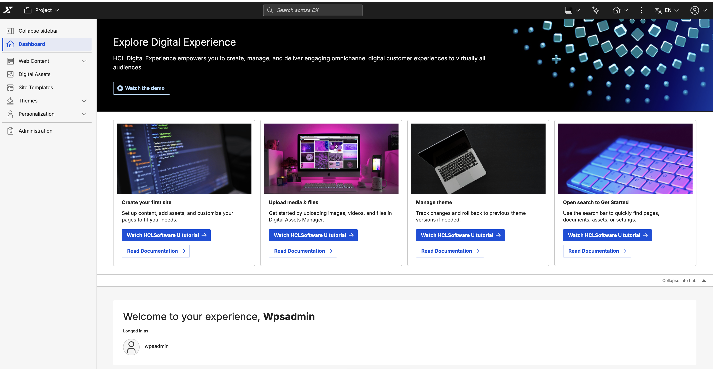
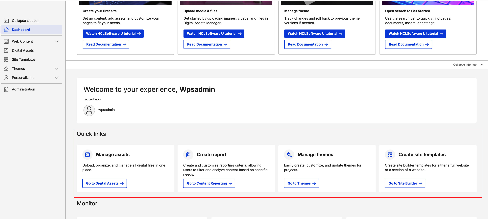
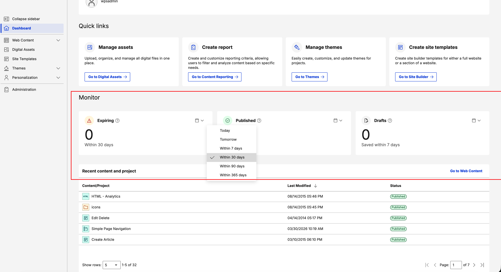
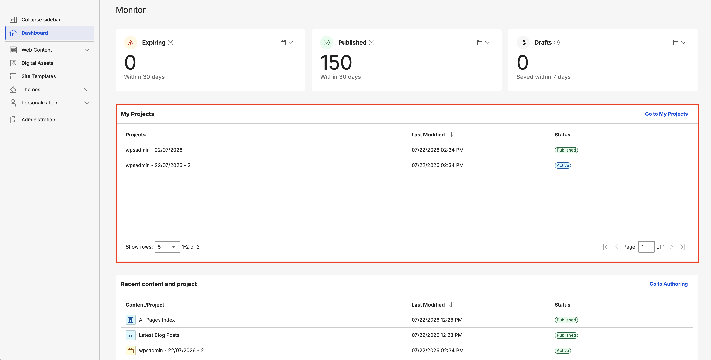
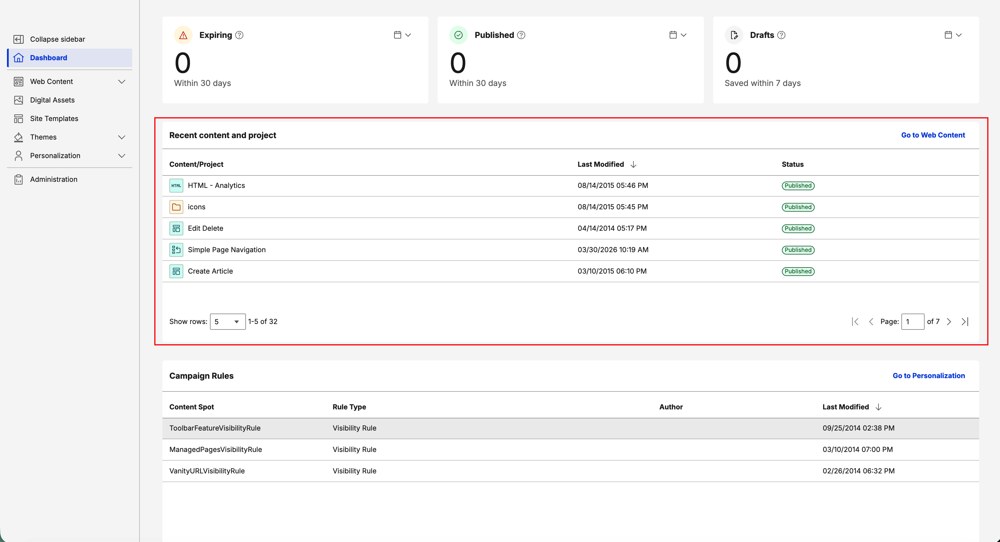
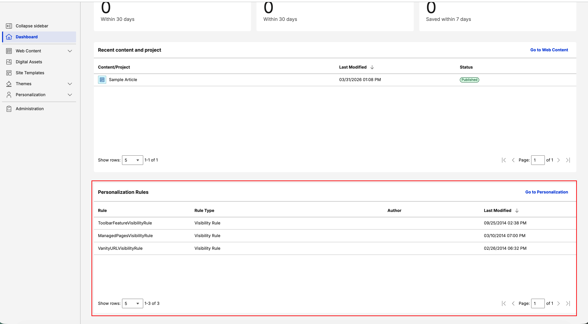
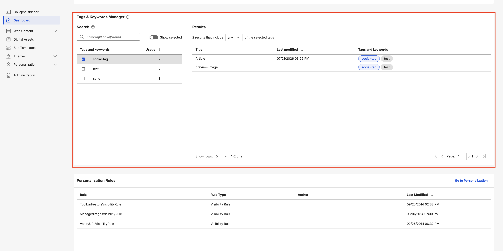

# Dashboard

The Practitioner Studio Dashboard is a modern, React-based dashboard that replaces the Practitioner Studio homepage. It includes widgets, quick links, and an info hub to help you manage content, track status, and personalize user experiences more efficiently.



The dashboard includes the following widgets:

- **Status monitoring:** Shows items that require approval or attention, including expiring content.
- **My Projects:** Displays your projects with status tracking.
- **Recent content items:** Provides quick access to your latest work.
- **Tags & Keywords Manager:** Search and filter content using tags and keywords (requires Search V2).
- **Personalization rules (PZN):** Helps you manage user experiences.

The dashboard also includes an interactive banner that displays dynamic announcements, tips, and tutorials. These can include notifications about new CF releases and links to helpful tutorials.

## Explore Digital Experience info hub

The dashboard includes an Explore Digital Experience info hub that provides quick access to tutorials and documentation.

This section features interactive cards with resources for common tasks, such as:

- **Create your first site:** Set up content, add assets, and customize pages to meet your needs.
- **Upload media and files:** Upload images, videos, and files in Digital Assets Manager.
- **Manage themes:** Create, customize, and manage themes to control the visual appearance and user experience of your DX sites, including layout, styling, and branding.
- **Use search to get started:** Use the search bar to quickly find pages, documents, assets, or settings.

Each card includes the following options:

- **Watch HCLSoftware U tutorial:** View video demonstrations.
- **Read documentation:** Access detailed written guidance.

You can collapse or expand the info hub by using the **Collapse info hub** toggle to maximize your workspace.

## Welcome header

The Practitioner Dashboard includes a personalized welcome header that greets you with "Welcome to your experience," followed by your username.

Below the greeting, the header displays "Logged in as" with your username and profile icon to indicate the active session.

## Quick links

The dashboard provides quick access to common tasks through the following shortcuts:



- **Manage assets:** Upload, organize, and manage digital files in the Digital Assets interface.  
- **Create report:** Create and customize reports to filter and analyze content based on your needs.  
- **Manage themes:** Create, customize, and update themes to maintain consistent branding and design.  
- **Create site templates:** Create templates for a full site or a site section to streamline development.  

## Monitor

Use the **Monitor** section to track real-time content status and activity across three key metrics:



- **Expiring:** Shows the number of content items that will expire within a selected timeframe to help you proactively manage content that requires renewal or updates.
- **Published:** Shows the number of content items published within a selected timeframe to track publishing activity.
- **Drafts:** Shows recently saved draft content within a selected timeframe to help you quickly find and resume in-progress work.

Each metric includes a customizable time filter: **Today**, **Tomorrow**, **Within 7 days**, **Within 30 days**, **Within 90 days**, and **Within 365 days**.

!!! note
    - For **Expiring**, **Within 7 days** includes the current day and the next six days.
    - For **Published** and **Drafts**, **Within 7 days** includes the current day and the previous six days.
    
## My Projects

Use the **My Projects** widget to view and manage your projects.



- The widget displays the following details: **Projects title**, **Last Modified** and **Status**.
- **Go to My Projects:** Select this link in the top-right corner to access the full Web Content Management interface for comprehensive project management.

!!! note
    - Users must have at least Editor level access for WCM REST Service under Virtual Resources to view and manage projects in this widget. For more information, see [Web Content Manager REST service](../../manage_content/wcm_development/wcm_rest/wcm_rest_starting.md).

## Recent content and project

Use the **Recent Content and Project** widget to view your most recently modified content items and projects.



- Select the **eye icon** on a content item to view it directly.  
- Use the **Go to Authoring** link in the top-right corner for quick access to the full [WCM Authoring Portlet](../../manage_content/wcm_authoring/authoring_portlet/).

!!! note
    - This widget shows only the 100 most recent content items.
    - **Recent Content** displays only the content items you modify.

## Personalization rules

Use the **Personalization Rules** widget to monitor the personalization (PZN) rules that customize user experiences on your website.



- The widget displays the following details: **Rule**, **Rule Type**, **Author**, and **Last Modified**.
- **Rule Types** for this widget include **Visibility Rule**, **Profiler**, **Select Action**, and **Binding Rules**.
- Select **Go to Personalization** to open the full Personalization page for complete management and configuration of your rules.


## Tags & Keywords Manager

Use the **Tags & Keywords Manager** widget to Search and filter content by WCM keywords, DAM keywords, and Social tags using a two-pane interface



The widget provides a split-pane layout:

### Search pane (left)

The left pane includes the following features:

- **Tag selection:** Select multiple tags to filter content.
- **Show selected toggle:** Use the **Show selected** toggle button to display only the selected tags in the search pane.
- **Type-ahead search:** Begin typing to find tags quickly with autocomplete suggestions.
- **Recent searches:** Access previously used tag searches for quick filtering.
- **Help tooltips:** Select the help icon for guidance on using the search features.


### Results pane (right)

The right pane displays filtered content with the following options:

- **Tag results:** View content items that match your selected tags.
- **Filter mode toggle:** Switch between **Any** (content matching any selected tag) and **All** (content matching all selected tags) filtering modes.
- **Content details:** View the title, last modified date, and tags and keywords attached to each content item.
- **Navigate to content:** Select the title of a content item to be redirected to the related content source.
- **DAM keyword links:** If DAM is not enabled in a Virtual Portal, DAM keyword links are disabled.

!!! note
    - This widget requires [Search V2](../search_v2/) to be enabled in your HCL DX deployment.
    - The widget displays a subset of the top 100 tags. Use search to find specific items.
    - Newly added or updated tags do not appear immediately in the widget. They become visible only after the Search V2 crawler completes its next indexing cycle. The timing depends on your crawler schedule configuration.
    - WCM keywords are displayed only for published content. 

## Widget configuration parameters

Use the dashboard to customize which widgets appear on your screen. To change these settings:

1. Navigate to **Admin** > **Site Management** > **Pages** > **Content Root** > **Practitioner Studio** > **Dashboard**.  
2. Select the **pencil icon** on the dashboard page.  
3. Select **Edit Shared Settings** to enable or disable widgets using the configuration parameters.

### Configuration parameters

| Parameter name | Type | Default value | Description |
|----------------|------|---------------|-------------|
| `RECENT_CONTENT_WIDGET` | Boolean (checkbox) | `true` | Shows or hides the **Recent Content** widget, which displays recently accessed or modified content items. |
| `RECENT_STATUS_WIDGET` | Boolean (checkbox) | `true` | Shows or hides the **Status Monitor** widget, which displays system health and alerts. |
| `RECENT_PZN_WIDGET` | Boolean (checkbox) | `true` | Shows or hides the **Personalization** widget, which displays recent PZN activities and campaigns. |
| `PROJECTS_WIDGET` | Boolean (checkbox) | `true` | Shows or hides the **My Projects** widget, which displays your projects in a paginated data grid. |
| `TAG_MANAGER_WIDGET` | Boolean (checkbox) | `true` | Shows or hides the **Tags & Keywords Manager** widget. Note: This widget also requires Search V2 to be enabled. |

## Main portal configuration

Use the following ConfigEngine targets to switch between the new React-based dashboard and the classic JSP home page.

**Enable the Practitioner Dashboard (modern React dashboard)**

```bash
ConfigEngine/ConfigEngine.sh enable-practitioner-dashboard -DWasPassword=wpsadmin -DPortalAdminPwd=wpsadmin
```

**Disable the Practitioner Dashboard (classic JSP home page)**

```bash
ConfigEngine/ConfigEngine.sh disable-practitioner-dashboard -DWasPassword=wpsadmin -DPortalAdminPwd=wpsadmin
```

!!! note
    - The Practitioner Dashboard is enabled by default and shows the React-based modern dashboard.  
    - You can disable it during deployment if preferred. When disabled, the classic JSP home page is displayed instead.
    - You cannot disable the dashboard in DX Compose.

## Virtual portal configuration

To support the modern (React-based) Practitioner Studio in new virtual portals, the existing `VirtualPortal.zip` asset includes XML configurations for boththe modern and classic dashboards. You can switch between dashboard versions by modifying the XML file reference in the shared setting, which ensuresexisting virtual portals remain unchanged.

By default, the shared setting uses the modern Practitioner Studio configuration. To use the classic (JSP-based) home page, add the `-preCF235` suffix to the XML file name.

**Default (Modern Practitioner Studio)**

```bash
# XML script to create virtual portal content tree
WebSphere:assetname=VirtualPortal.zip:InitVirtualContentPortalV9.5NoWoodburn.xml
```

**Classic (pre-CF235)**

```bash
# XML script to create virtual portal content tree
WebSphere:assetname=VirtualPortal.zip:InitVirtualContentPortalV9.5NoWoodburn-preCF235.xml
```
