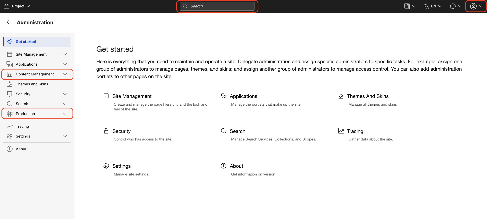

# Practitioner Studio

Practitioner Studio provides a modern user experience for HCL Digital Experience (DX). Please see the following pages to understand how the navigation is organized.

!!! note
    During the update, custom-created authoring pages may no longer contain the referenced portlets, if those specific portlets were part of the rearrangement of pages. To prevent this, simply export the custom authoring page before migration and import it again after the process is complete.

## Enhanced Practitioner Studio and toolbar

Starting from CF230, the Practitioner Studio toolbar and UI have undergone the following changes to enhance the user experience:

- The toolbar now features a centralized search function, making it easier to locate content and tools.
- A dedicated user profile menu has been introduced, providing quick access to profile management, impersonation, and logout options.
- The Administration pages have been reorganized to improve usability. Two new sections have been introduced:
    - **Content Management**: This section provides access to applications used for the general administration of Web Content Management.
    - **Digital Assets** This section introduces HCL Digital Asset Management (DAM), which lets you manage rich media assets in HCL DX sites to create consistent, engaging digital experiences. The feature is available starting with HCL DX 9.5 CF181 and later.
    - **Themes**
    - **Production**: This section includes applications designed to streamline essential administrative tasks for managing the portal.
    - **Site Templates** The Site Template (Site Builder) application lets you create site and section templates in HCL Digital Experience (DX).
    - **Personalization** Personalization recognizes site visitors based on their profiles and behaviors to deliver targeted, region-specific content and a personalized page experience.

## Overview

Practitioner Studio provides a modern and streamlined user experience for HCL DX.

There are several advantages to this new look. The consolidated navigation has a consistent look and feel for most administration tasks so that commonly used tasks are found together. User assistance is easily found and is provided for pages that are in the navigation.

In time, this interface also serves as the launching point for newly developed features.

Enabling Practitioner Studio deactivates the legacy Administration and Applications pages. However, all of these functions are still available.

- **[Administration](../practitioner_studio/administration.md)**  
  Use the Portal administration portlets that are provided with HCL DX to do various day-to-day administration tasks.

- **[HCL Digital Asset Management (DAM)](../../manage_content/digital_assets/index.md)**  
  Learn how to centrally store, manage, and add rich media assets to DX site content for consistent, engaging digital experiences across channels.

- **[Personalization](../practitioner_studio/personalization.md)**  
  Learn how to configure your HCL DX portal site as an administrator.

- **[Site templates](../practitioner_studio/site_templates.md)**  
  Site templates are configured and managed using Site Builder. If you choose not to enable Practitioner Studio, you can still manage site templates manually.
- **[Themes](../practitioner_studio/themes.md)**
Learn how to use the Theme Manager portlet and the Theme Optimization Analyzer in creating and developing theme web content.

- **[Web content](../practitioner_studio/web_content.md)**  
  Learn more about managing libraries, creating, editing, or cleaning up data, and setting up syndication for HCL DX web content management.

## HCLSoftware U learning materials

For an introduction and a demo on how to use Practitioner Studio, go to [Practitioner Studio](https://hclsoftwareu.hcltechsw.com/component/axs/?view=sso_config&id=3&forward=https%3A%2F%2Fhclsoftwareu.hcltechsw.com%2Fcourses%2Flesson%2F%3Fid%3D300){target="_blank"}.

For an introduction and a demo on how to use Practitioner Studio for administration tasks, go to [Practitioner Studio Administration](https://hclsoftwareu.hcltechsw.com/component/axs/?view=sso_config&id=3&forward=https%3A%2F%2Fhclsoftwareu.hcltechsw.com%2Fcourses%2Flesson%2F%3Fid%3D506){target="_blank"}. To try it out yourself, refer to [HCL DX Practitioner Studio Administration Lab](https://hclsoftwareu.hcltechsw.com/images/Lc4sMQCcN5uxXmL13gSlsxClNTU3Mjc3NTc4MTc2/DS_Academy/DX/Administrator/HDX-ADM-100_Practitioner_Studio_Administration_for_Beginners.pdf){target="_blank"}.
