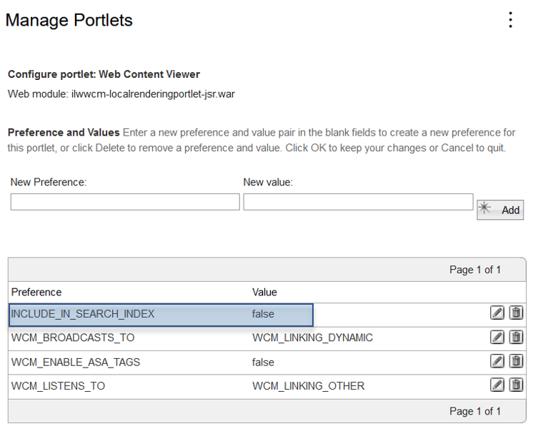

# Configuring search in a portlets

In this section, you can configure the search and filter the portlets by defining a portlet property setting.

The “INCLUDE_IN_SEARCH_INDEX” is a portlet property setting with the following available values:

- `false` - With this value, the portlet is not published in the seedlist.
- `true` - With this value, the portlet is considered for indexing. This is the default value for the INCLUDE_IN_SEARCH_INDEX preference.

!!! note
    - The WCM Web Content Viewer portlet is set to “INCLUDE_IN_SEARCH_INDEX=false". The reason is that in the past not having had this filter option, this had accounted for duplicate result list entries - one from processing the portlet with the default content, the second coming from WCM library which delivered the default content item once again.

    - If the portlet property is neglected (this is the default), that portlet will be indexed by the search engine.

!!! important
    This property is only applicable to portlets and not available for Portal pages. If none of the portlets on a Portal page will get indexed, then that page will not appear in any search result.

For more information, refer to https://www.ibm.com/support/pages/apar/PH00477.
