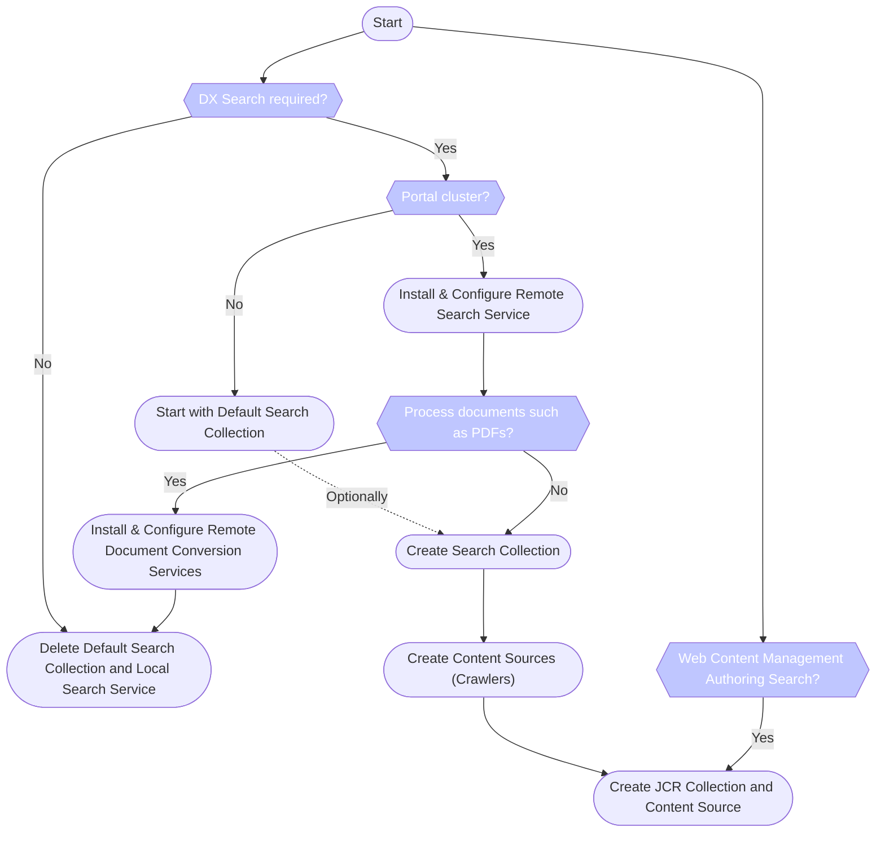

# Search Quickstarter Guide for HCL Digital Experience

Visitors to your website expect a search function. The same is true for an HCL Digital Experience (DX) site - end users expect to see a **Search** box located somewhere at the top of a DX page to find relevant information fast. As an administrator or engineer, which technology should you use to power search? There are many options, including HCL DX's own search service (DX Search), or a third party search technology. This section focuses on what steps must be accomplished to set up and configure DX Search.

Note that this document should be sufficient to get started with DX search, but supplemental resources may be required if you plan to set up DX Remote search.

## Decision tree for setting up DX Search

The following image outlines the steps to set up and configure DX Search based on the environment and search needs.

## Importance of setting up DX Search

Simply speaking: there is an ocean of data and end users expect search functionality on every website that provides the information they need quickly. Search services will index the information on the site and allow your end users to find the right information quickly.

There is a search component available with HCL DX that is free and well integrated with the data generated by HCL DX.

You may already have a license for 3rd party search software which you can use. If so, please consult the third party provider's documentation on support and integration with HCL Digital Experience (HCL DX and Web Content Management) for further details.

If Portal Search is not required, because you have a third part service or no business need for it, you can then remove its configuration and resources. However still note the disclaimer in the following details related to having search available for the content authors and editors.

## Integrating your own search engine

Please note that even if you do not need Portal Search for Portal site visitors, the Portal Search Service is still required if your content authors would like to search in the HCL Web Content Management Authoring Portlet. If you are using WCM Authoring search functionality, then it is OK to delete the 'Portal Default Collection'. However 'JCRCollection1' is still required and, as a result, the out of the box Portal Search Service is also required.

Speaking of the search service: if the Portal is clustered, it is mandatory to install, configure and use a remote search service. Once this has been done, you can move the default JCR search collection by exporting the JCRCollection1 configuration from the local search service as a XML document. Then you can safely delete the JCRCollection1 search collection under the Default Search Service.
Next, create the JCRCollection1 under the remote search service and then import the configuration using the export XML document.

Please also check for more details in the chapter describing the setup for the “JCR crawler”.

## Removing the search collection and search service

## Setting up DX Search
Portal environment: cluster or single node?
Single node Portal
Clustered Portal environment
Is it required to index file attachments (documents of various formats)?
How to then re-create the standard crawlers for the search collection?
What crawlers do I need and of which type?
Setting up the WCM crawler
Setting up the JCR crawler required for WCM Authoring search
Setting up the Portal site crawler
Using the web crawler (content source type 'Web site')
Tweaking Portal Search
Changing the appearance of search results in the Search Center
Applying filters to resources provided through Seedlists
Improving the quality of search results
Remove language filtering from Search Center
Faceted search
Search by date and date ranges
Glossary
Reference materials
