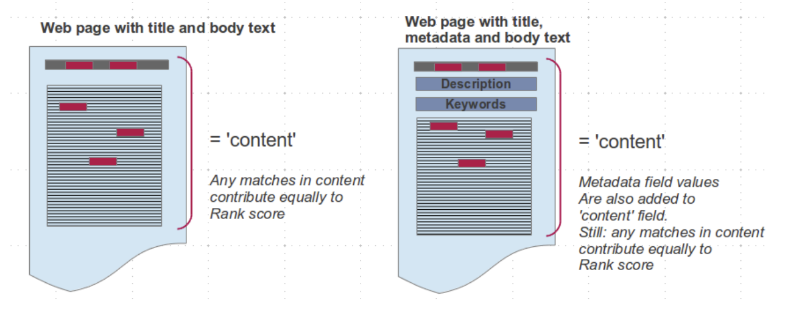
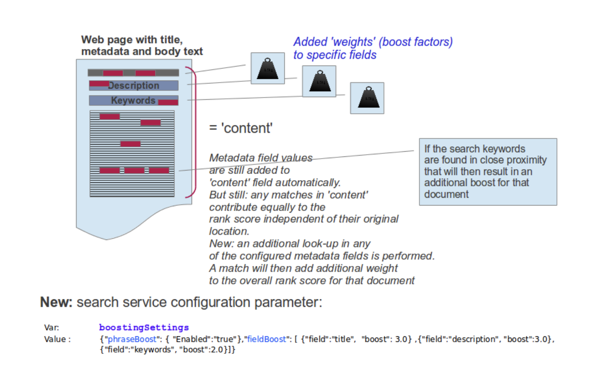

# Applying boost factors to specific fields (meta data)

What the relevancy calculation does not account for is the structural information of the content and the informative weight of keywords stored in individual meta data fields. For example if a search term appears in the title of a document, its contribution to the relevance score should be higher than an occurrence of that search term somewhere in a sentence in the body text of that document.

Values from meta data fields like 'title', 'description' or 'keywords' are automatically added to the generic 'content' field in the search index. When you perform a simple search without specifically pointing at a certain field, the search algorithm will contain hits in any of the above mentioned default meta data fields. However the information as to where the actual occurrence of a search term is, is not taken into account.

A feature is introduced (with HCL DX V8.0.0.1 CF209) which allows administrators to define which meta data fields to additionally focus on and how that field will contribute to relevance calculation for a qualifying document.

In order for this to be enabled, the following search service configuration parameter is available.

Name: boostingSettings

Value: {"phraseBoost": {"Enabled":"true"}, "fieldBoost": [{"field":"title", "boost": 3.0} ,

{"field":"description", "boost":3.0}, {"field":"keywords", "boost":2.0}]}

phraseboost: not mandatory, could add value – which is language dependent

fieldboost: sample provided for default/commonly found meta data fields

Can also include other meta data fields (with string-based values) “boost” should be specified in a range between 1.0 to 10.0, and be used with care
(suggested to stay in the range between 1.0 and 3.0).

Example:
A user searches for the terms “Editing content in web content management”.

A qualifying document contains the terms 'edit' and 'content' in its title. In addition, all the terms appear in the 'description' field as well as the phrases 'editing content' and 'web content management' in the body text.

This document will then have a very high relevance score due to terms boosted due to their occurrences in 'title' and 'description' as well as the occurrences of the respective phrases in the body of the document.

About phraseboost and language dependency: if the "phrase" were a name, like 'John Smith' then an exact match on that phrase would get boosted. However some languages also represent that same name as "Smith, John" which then again not be counted as a match given the order of the terms is reversed (and thus not a phrase).                                                                                                                                                                                                                                                                                                                                                                                                                                                                                                                                                                                                                                                                                                                                                                                                                                                      