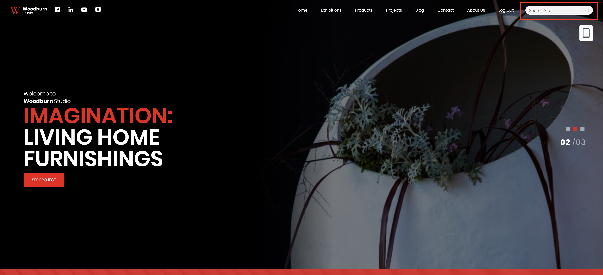
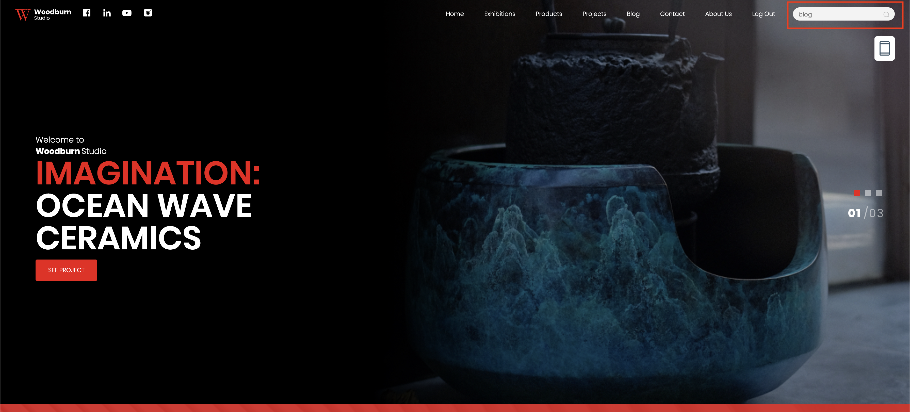
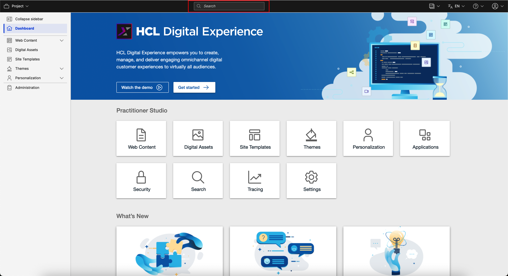
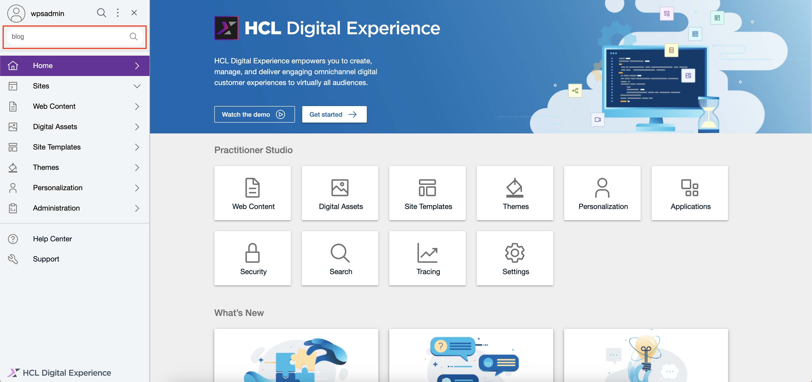

# Accessing the End-user Search with OpenSearch

This section provides steps on how to access the HCL End-user Search with OpenSearch page and portlet.

## Prerequisite

Starting from HCL Digital Experience 9.5 CF224, End-user Search with OpenSearch is available to be enabled. For instructions on installing End-user Search with OpenSearch manually on supported environments, see the [Installing HCL Digital Experience 9.5 End-user Search with OpenSearch](../installation/index.md) topic.

After configuring the image in your HCL Digital Experience 9.5 CF224 deployment, you can access End-user Search with OpenSearch from the Practitioner Studio interface.

!!! note
    You must be authenticated to use the Search page. The search results will vary based on your current user role.

## Accessing End-user Search with OpenSearch

Follow the instructions below to access HCL Digital Experience 9.5 End-user Search with OpenSearch from the Practitioner Studio.

1.  Log in to your HCL Digital Experience 9.5 platform, and select **Search** from the Practitioner Studio navigator.

    

2.  View the HCL Digital Experience 9.5 End-user Search with OpenSearch user interface.

    

## The HCL End-user Search UI

The HCL End-user Search UI has the following components:

-   **Main Header** - This section contains the title of the page.
-   **Search Input** - This section displays the fields the user can interact with to change the result set. There are three fields: the query text field, the search scope select dropdown, the search attribute select dropdown, and the button to trigger the search.
-   **Search Output** - This section displays the search results. Each result in the list has its own title, description, and detailed context when available depending on your content source. The title also functions as a link you can click to open the result item in a new browser tab.
-   **Pagination** - This section lists the pages available for navigation within the search results.

## Other ways of Accessing the HCL End-user Search UI

You can also access the HCL End-user Search UI through two additional methods. Once redirected, you can utilize the search results or initiate a new search. For more information, refer to the [Usage of HCL End-user Search with OpenSearch](../usage/index.md) topic.

### Via Woodburn landing page search bar

1. Find the search bar on the upper right side of the Woodburn landing page once you are logged in.

    

2. Type the search term in the search bar and hit `Enter` on your keyboard.
    
    

### Via Practitioner Studio SideNav search bar

1. Click the search icon located on the upper left side of Practitioner Studio when the Side Navigation is open.

    

2. Type the search term in the search bar and hit `Enter` on your keyboard.
    
    
