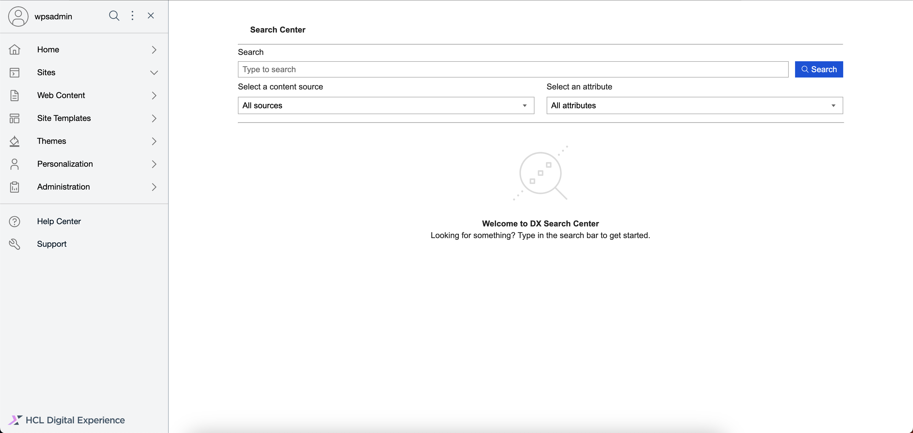

# Accessing the Enduser Search with Opensearch

This section provides steps on how to access the HCL Enduser Search with Opensearch page and portlet.

## Prerequisite

Starting from HCL Digital Experience 9.5 CF224, Enduser Search with Opensearch is installed and deployed by default as part of the CF update process. However, for CF224, Enduser Search with Opensearch must be installed and configured. For instructions on installing Enduser Search with Opensearch manually on supported environments, see the [Installing HCL Digital Experience 9.5 Enduser Search with Opensearch](../installation/index.md) topic.

After image configuration in your HCL Digital Experience 9.5 CF224 deployment, Enduser Search with Opensearch is accessible from the Practitioner Studio interface.

!!! note
    You must be authenticated to use the Search page. The search results you will get will vary based on your current user role.

## Accessing Enduser Search with Opensearch

Refer to the following instructions to access HCL Digital Experience 9.5 Enduser Search with Opensearch from the Practitioner Studio.

1.  Log in to your HCL Digital Experience 9.5 platform, and select **Search** from the Practitioner Studio navigator.

    

2.  View the HCL Digital Experience 9.5 Enduser Search with Opensearch user interface.

    

## The HCL Enduser Search UI

The HCL Enduser Search UI has the following components:

-   **Main Header** - This section contains the title of the page.
-   **Search Input** - This section displays the fields the user can interact with to change the result set. There are 3 fields: the query textfield, the search scope select with dropdown, the search attribute select with dropdown, and lastly the button to trigger the search.
-   **Search Output** - This section displays the search results. Each result in the list has its own title, description, and detailed context when available depending on your data source. The title also functions as a link you can click to open the result item in a new browser tab.
-   **Pagination** - This section displays the pages you can navigate in the search results.
