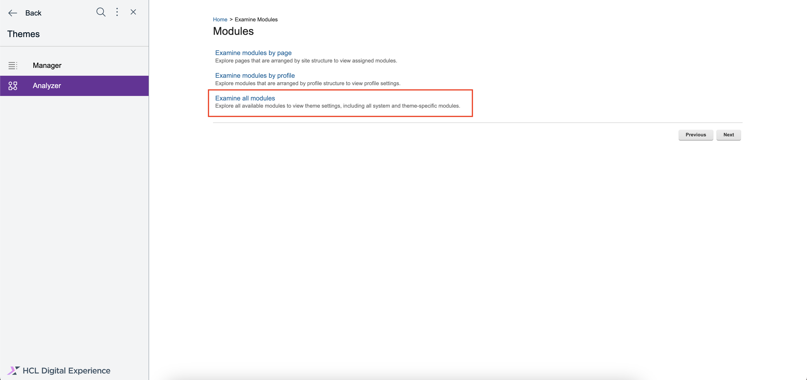

# End-User Search Powered by OpenSearch

This guide explains how to use the HCL End-user Search UI. Follow along to learn about its components, styling options, and extendable features.

The default search component, shown in the image below, is responsive and can be imported and used anywhere within an application.


## Overview of the search functionality

The search component is designed to be: 

1. **User-friendly:** Offers intuitive search interactions.
2. **Customizable:** Allows user-defined styling and extensions.
3. **Extendable:** Can be integrated anywhere in your application.


## Web Components: Features and Benefits
Web components provide the following benefits:

1. **Encapsulation:** Styles and functionality are isolated from the rest of your application using Shadow DOM.
2. **Reusability:** Build once and reuse across different parts of your application.
3. **Customizability:** Use attributes, properties, and part selectors to customize components without altering their core code.

## Components Overview

AC (Atomic Components)
Atomic Components are the smallest possible building blocks of the search functionality, such as buttons, input fields, and chips. These components are built using Web Components standards like Shadow DOM for encapsulation and reusability.

- **dx-ac-base-element:** This class creates a foundational element for developing custom web components. It supports internationalization and localization, and uses the Shadow DOM to encapsulate its internal structure, ensuring high reusability.        
- **dx-button:** A customisable button component with internationalisation support, conditional icon and text rendering, and isolated styling using Shadow DOM and CSS parts.                 
- **dx-input-select:** This is a flexible, accessible, and customizable select component for a web application, handling a variety of user interactions and scenarios.          
- **dx-list:** This component wraps an unordered list (`<ul>`) and uses a slot to insert content (e.g., list items) into the component. The `part="unordered-list"` attribute allows external styling of the `<ul>`.                     
- **dx-switch:** A fully accessible and customizable custom component that separates behavior (toggle state and events) from appearance (CSS styling via dynamic part attribute). Currently, this component is not in use.
- **dx-anchor:** A versatile anchor component that supports pagination and custom actions, ideal for navigation menus and paginated lists.               
- **dx-chip:** This component is ideal for use in UIs where you need to display a "chip" or "tag" with a numerical count, such as notification counters, tag lists, or pill-style labels, with built-in localization support.                  
- **dx-input-textfield:** This component is well-suited for creating rich input fields with enhanced user experience, such as search bars, forms, or any situation where text input with optional icons and labels is required.         
- **dx-search-center-layout:** This is a customizable web component that provides a structured layout for a search interface. It includes slots for injecting content like a header, search input, and search output.
- **dx-toggle-button:** The component supports customizable icons for each button and adjusts its style based on the selection and the outlined setting. It is designed to be flexible and accessible, with separate styles for the selected and unselected states, and allows for easy integration into other UI components.
- **dx-avatar:** The component ensures flexibility by allowing customization of the avatar's appearance, and it uses placeholder assets if specific URLs are not provided. The renderAvatarContent method dynamically decides what to render based on the variant. As of now it is not in use in our OpenSearch component.                
- **dx-header:** The component also supports localization, making it adaptable to multiple languages. Overall, the DxHeader offers a flexible and responsive header solution with various customization options for different user interfaces.               
- **dx-list-item:**  The component is designed to be flexible and reusable in various list-based UI components, with the ability to mark items as selected and apply different styles accordingly. The list item also supports a slot element, allowing content to be inserted into the item when the component is used.         
- **dx-svg-icon:** This component is useful for displaying scalable vector icons with customizable colors and sizes, ideal for use in dynamic UIs where the icon appearance might need to change based on context or state.


FCC (Functional Composite Components)
Functional Composite Components combine Atomic Components to deliver higher-level functionality, such as displaying search results or managing pagination.

- **dx-circular-progress:** This component is a customizable circular progress spinner that uses SVG graphics and CSS animations to display a loading state. It supports various styling options like size, stroke width, and color, and can be integrated into any web app to visually indicate progress.             
- **dx-search-input-query:** It provides a rich set of properties for customization, including the ability to disable the input and define placeholder and label text. The component also checks the URL for existing query parameters on load, making it ideal for dynamic search-driven applications.             
- **dx-search-output-item-attribute:** This component is a flexible and reusable element designed to display specific attributes of search results. By consuming the outputContext, it dynamically renders different types of information, such as links, document types, and descriptions, based on the attribute specified. This allows it to be integrated into larger search result display systems with different content sources and attributes. 
- **dx-fcc-base-element:** This is a base class in the FCC framework that integrates BroadcastChannel for component communication and ensures no shadow DOM is used. It also handles cleanup of resources when components are disconnected.               
- **dx-search-input-scope:** This component is a well-structured LitElement-based component designed to manage and display a list of content sources for a search input. It fetches data from an external service, allows users to select a content source, and updates the search scope dynamically. It can be used as part of a larger search interface to provide filtering options based on available content sources.             
- **dx-search-output-pagination:** This component is a well-structured, flexible pagination component designed for search results. It supports multiple pagination types, including infinite scroll and numbered pagination, and is capable of handling different languages and locales. The use of debouncing for scroll events and clean separation of concerns makes it both efficient and maintainable.      
- **dx-search-input-button:** A customizable search button component that uses BroadcastChannel to trigger search actions on click. It supports properties to disable the button and change its text. Debouncing is used to optimize search requests, making it a reusable UI element for web applications.         
- **dx-search-input-type:** A dynamic dropdown component for selecting document types in a search interface. It fetches searchable fields from a backend service, updates the selected document type, and communicates changes via searchChannel to update search parameters. Built with LitElement for efficient rendering and reactivity.           
- **dx-search-output:** A search result display component that integrates with backend search services. It manages various search states (loading, results, no results, error) and updates the UI dynamically based on search parameters. Ideal for applications needing real-time search with pagination, filtering, and error handling.

## Styling the search components

### Default styling

Each component comes with default styles. For example

```scss
/* for dx-search-center-layout */
dx-search-center-layout::part(main) {
  display: flex;
}
/* for dx-input-textfield */
dx-input-textfield::part(div) {
  width: 100%;
  position: relative;
}
/* for dx-button */
dx-button::part(button) {
  @include button;
}
/* for dx-circular-progress */
@keyframes rotateCircularProgress {
  100% {
   transform: rotate(360deg);
  }
}
/* for dx-header */
dx-header::part(div) {
  width: 100%;
  position: relative;
}
/* for dx-chip */
dx-chip::part(chip-div) {
  background-color: $BLACK8P;
  border-radius: 4px;
  display:inline-flex;
  padding:8px 8px 8px 8px;
  align-items: center;
  height: 16px;
}
/* for dx-avatar */
dx-avatar::part(avatar-div) {
  height: 32px;
  width: 32px;
  border: 1px solid $avatar-border-color;
  box-sizing: border-box;
  display: flex;
  justify-content: center;
  align-items: center;
}
// for the input select fields
dx-search-center-layout .search-input-div {
  display: flex;
  flex-direction: row;
  justify-content: space-between;

  dx-search-input-scope,
  dx-search-input-type {
    display: flex;
    align-self: center;
    max-width: 49%;
    width: 49%;
  }
}
// for the input query field and button
dx-search-center-layout div.search-input-div {
  display: flex;
  flex-direction: row;
  justify-content: space-between;

  dx-search-input-query {
    display: flex;
    align-self: center;
    width: calc(100% - 125px);
    max-width: calc(100% - 125px);
  }
```


### Customizing Styles

You can override styles by targeting the component's class names:

!!! note
    The `part` attribute is used to name parts of a shadow tree, which can then be styled from outside the shadow DOM using the `::part()` pseudo-element. This allows you to apply CSS styles to shadow tree elements from the parent DOM.

```css
/* for dx-button */
dx-button::part(button-start-icon) {
  color: #FBCD00;    /* change the color as per your requirements and also other things can be changed */
  height: 16px;
  margin-right: 4px;
  width: 16px;
}
/* for dx-input-textfield */
dx-input-textfield::part(label) {
  @include font-default;
  width: 100%;
  margin-bottom: 16px;
  display: red;
  color: #AFC002;
}

```
Other components can be overridden in a similar manner.

# Theme modules

## Overview
The search components are provided via **theme modules**, allowing users to create custom stylesheets for all components. This flexibility is ideal for adapting the search functionality to match your application's look and feel. 

!!! important
    For an in-depth look at how themes and skins work in DX, refer to  [Developing themes and skins](../../../build_sites/themes_skins/index.md).

## Default Theme Modules

We provide default theme modules (CSS and JS files) that can be used as-is or extended by customers. These are the steps to get the provided theme modules for the HCL End-user Search UI on your own DX deployment instance.

1.  Log in to your HCL Digital Experience 9.5 platform, and select **Themes** from the Practitioner Studio navigator home cards or side nav.

    

2. Go to Theme **Analyzer** view and click **Examine modules**.
    
    

3. Click **Examine all modules**.

    

4. Click on **Practitioner Studio Theme**.

    

5. Expand the system modules and scroll down to find `dx_search_css` and `dx_search_js`.

    

6. Click on `dx_search_css` and on the right side, you will find the module information, scroll down to find **Contributions** and under it **Location**.

    

7. Click on the Location URL to view the css file.

    

8. Right click on the Location URL to download it. Save as `default.css` for now.

    

9. Click on `dx_search_js` and on the right side, you will find the module information, scroll down to find **Contributions** and under it **Location**.

    

10. Click on the Location URL to view the js file

    

11. Right click on the Location URL to download it. Save as `index.js` for now.

    

12. Open the `default.css` file you have downloaded in a code editor such as Visual Studio Code. On your keyboard, hold down Cmd + Shift + P (on Mac) or Ctrl + Shift + P (on Windows) to open the Command Palette. Find and click `Format Document`.

    

13. View the resulting `default.css` file in a prettyfied format that is easy to read and inspect so you can plan the style overrides you like to make later. See [Styling the search components](#styling-the-search-components)

    


## Using the theme modules

To use the theme modules (CSS and JS files) on your new or existing theme pages, these are the steps.

1. Download the default theme CSS `dx_search_css` from the provided location as `default.css`.

2. Update the styles in the file as needed. It is also possible to create your own css file e.g. `custom-theme.css` where you can put your overrides using the `default.css` as a guide for base styles.

3. Link the default and custom css files in this order in your application's html head.

```html 
  <link rel="stylesheet" href="/path/to/default.css"> 
  <link rel="stylesheet" href="/path/to/custom-theme.css"> 
```

4. Download the default theme CSS `dx_search_js` from the provided location as `index.js`.

4. Add the script to your application's html head.

```html 
  <script type="module" src="/path/to/index.js"></script>
```

## Example of Customization

Suppose you want to change the background color of the dx-search-center-layout component. In your custom CSS file:

```css
  dx-search-center-layout::part(main) {
    background-color: #f0f0f0;
  }
```

## Communication between Components using Broadcast Channel API
The Broadcast Channel API enables seamless communication between different FCC components, even when they are placed in separate areas of your application (e.g., themes, JSPs, portlets, WCM). This functionality is already present in the provided JS theme module.

Why did we use Broadcast Channel API?

1. **Real-Time Synchronization:** Keeps components in sync, such as updating search results when a new query is entered.
2. **Decoupled Design:** FCC components can work independently and communicate without direct references.
3. **Flexibility:** FCC components can be distributed across different sections of the application, ensuring modularity.
