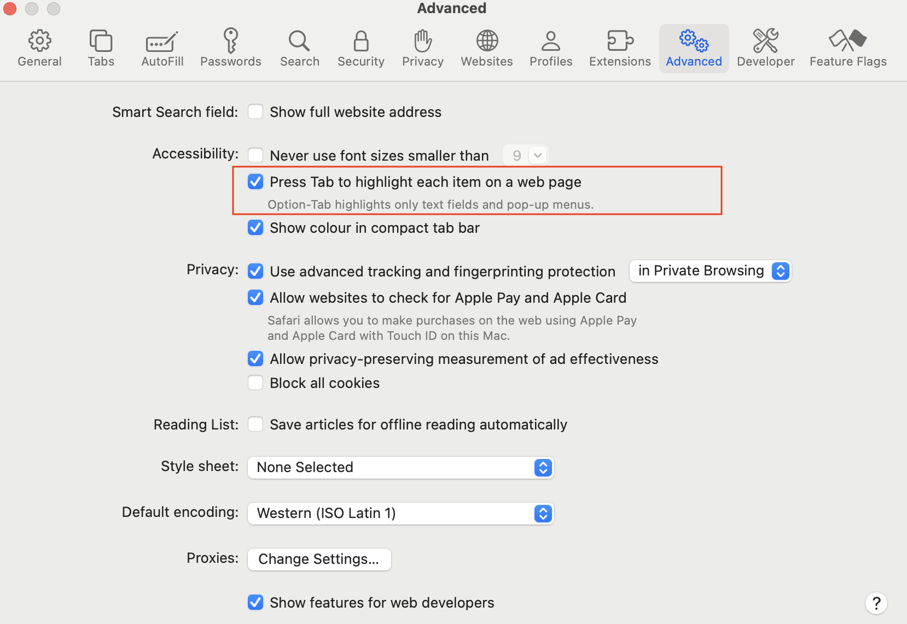

# Enduser Search with Opensearch limitations

Take note of the following limitations when using HCL Enduser Search with Opensearch:

## Pagination

- The number of results shown per page is currently fixed at 50.

## Localization

- The Search user interface supports only English at the moment.

## Accessibility

- To ensure full accessibility on the Search page, the user's browser-specific settings for keyboard navigation must be enabled.
- A sample browser setting interface you may find on your browser is shown below.

    