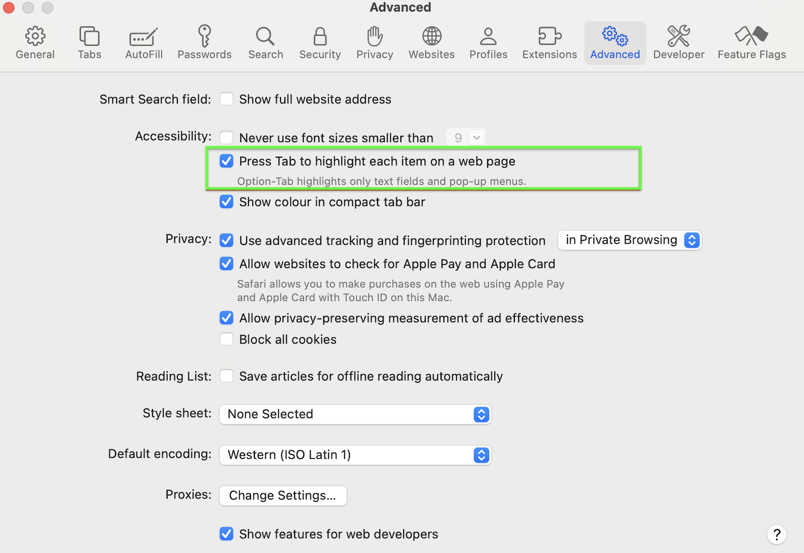

# Enduser Search with Opensearch limitations

Take note of the following limitations when using HCL Enduser Search with Opensearch:

## Pagination

- The number of results shown per page is currently fixed at 50.

## Searchable Fields

- Only common fields such a title, description, type, and tags may be specifically searched for now. If you wish to search beyond these attributes, search using **All attributes** may be used since this will look at all attributes inside the document objects.

## Localization

- The Search user interface supports only English at the moment.

## Accessibility

- To ensure full accessibility on the Search page, the user's browser-specific settings for keyboard navigation must be enabled.
- Sample browser setting interfaces you may find on your browsers such as Safari and Firefox are shown below.

    

    