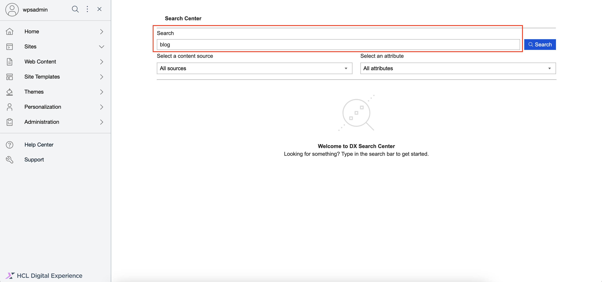
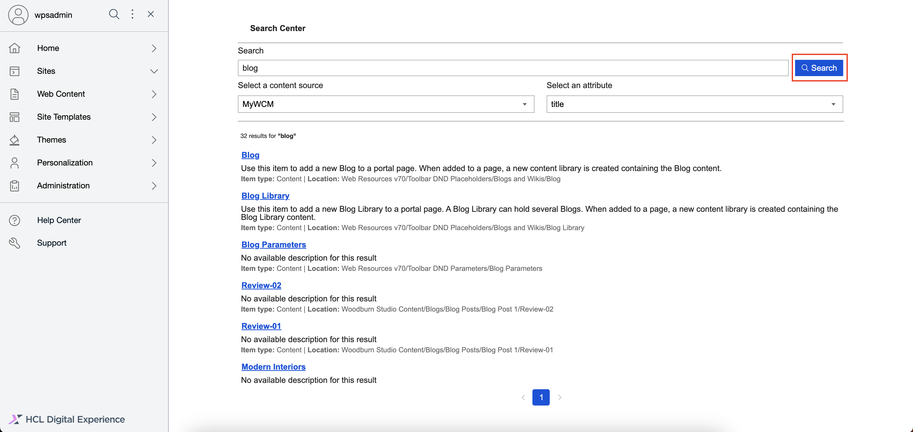
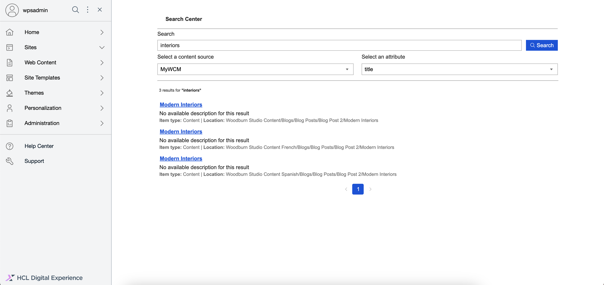

# Using HCL Enduser Search with Opensearch

Create and export reports on content items using HCL Enduser Search with Opensearch. Users can also update the reported content items in bulk.

# Generating a search results set

This section details how to generate a search results set in HCL Enduser Search with Opensearch.

## Prerequisites

- Beginning with HCL Digital Experience 9.5 release update CF224, Enduser Search with Opensearch is available to be enabled. For instructions on installing Enduser Search with Opensearch manually on supported environments, see the [Installing HCL Digital Experience 9.5 Enduser Search with Opensearch](../installation/index.md) topic.

- To acess the HCL Enduser Search UI, see the [Accessing HCL Digital Experience 9.5 Enduser Search with Opensearch](../access/index.md) topic.

## Generating a search results set

A search results set is a list of items that matches the search term that the enduser enters in the Search input box. It may be limited further when the enduser specifies the scope of the result (i.e. the data source to search) as well as the specific attribute to search (e.g. title, description, type, or tags).

1.  Log in to your HCL Digital Experience 9.5 platform, and select **Search** from the Practitioner Studio navigator.

    

2.  In the Enduser Search user interface, go to the **Search** input box and type a term you need to search e.g "blog".

    

3.  Click on the blue **Search** button to start the search.

    

4.  View the results list. Above the results, you can find a description of the total count of results found for the search term e.g. "32 results for **blog**".

    

5.  To limit the results set, click on the **Select a content source** field to open the dropdown options of content sources. Choose one option e.g. "MyWCM".

    

6.  To further limit the results set, click on the **Select an attribute** field to open the dropdown options of attributes. Choose one option e.g. "title".

    

7.  Click on the blue **Search** button to start another search.

    

8.  View the new results list. Above the results, you can find a description of the total count of results found for the search term e.g. "8 results for **blog**".

    

9.  Go back to the **Search** input box and type a new term you need to search e.g "interiors" and click the blue **Search** button again to start the search. View the new results list. Above the results, you can find a description of the total count of results found for the search term e.g. "3 results for **interiors**".

    

10.  Click on the blue link title of one of the result items to open that item in a new tab.

    
    
### Other actions available

- When the search term yields no results, the following message will be displayed in the output area.
    
    