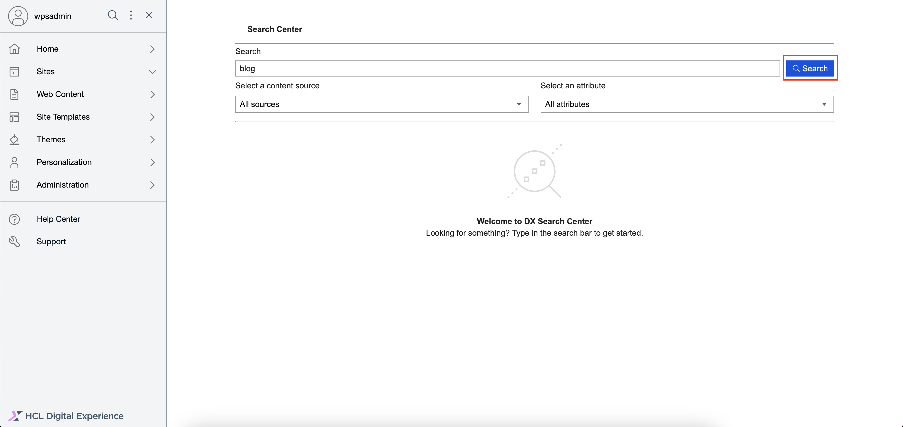
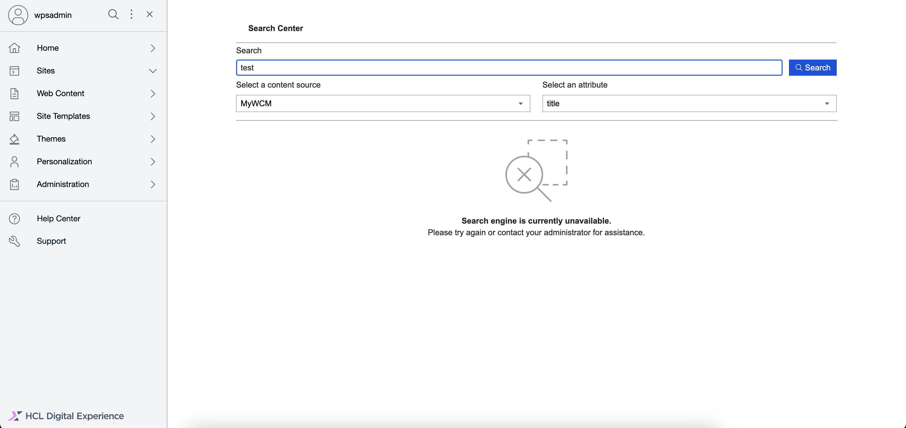

# Using HCL End-user Search with OpenSearch

Generate search results from different content sources (from WCM or Portal) using HCL End-user Search with OpenSearch. This section details how to generate a set of search results in HCL End-user Search with OpenSearch.

## Prerequisites

- Starting from HCL Digital Experience (DX) 9.5 CF224, you can enable End-user Search with OpenSearch. For instructions on how to manually install End-user Search with OpenSearch on supported environments, refer to [Installing HCL Digital Experience 9.5 End-user Search with OpenSearch](../installation/index.md).

- For instructions on how to access the HCL End-user Search UI, refer to [Accessing HCL DX 9.5 End-user Search with OpenSearch](../access/index.md).

## Generating a set of search results

A set of search results set is generated to match the search terms that you enter in the Search input field. You can get more specific results if you define the content source to search from and specify the attributes to search for, such as the title, description, type, or tags.

1.  Log in to your HCL DX 9.5 platform then select **Search** from the Practitioner Studio navigator.

    

2.  In the End-user Search user interface, enter your search terms on the **Search** field, then click **Search**. In the example below, the term "blog" is searched.

    

3.  View the search results generated. Above the list of results, you can see the total number of results found for the search term. In the example below, the term "blog" generated 32 search results.

    

4.  Specify the search results further by selecting a content source and attribute, then click **Search** again.
    1. Click the **Select a content source** dropdown and select a content source, such as "MyWCM".
    2. Click the **Select an attribute** dropdown and select an attribute, such as "title".

5.  View the search results generated again. By selecting a content source and attribute, searching for the term "blog" generated eight, more specific search results.

    

9.  Go back to the **Search** input box and type a new search term you need to search e.g "interiors" and click the blue **Search** button again to start the search. View the new results list. Above the results, you can find a description of the total count of results found for the search term e.g. "3 results for **interiors**"

    

6.  Click a search result link to open that item in a new tab.

    

## Other search result scenarios

- If the search term yields no results, the following message is displayed.
    
    

- If the search engine is down or unavailable, the following message is displayed.
    
    