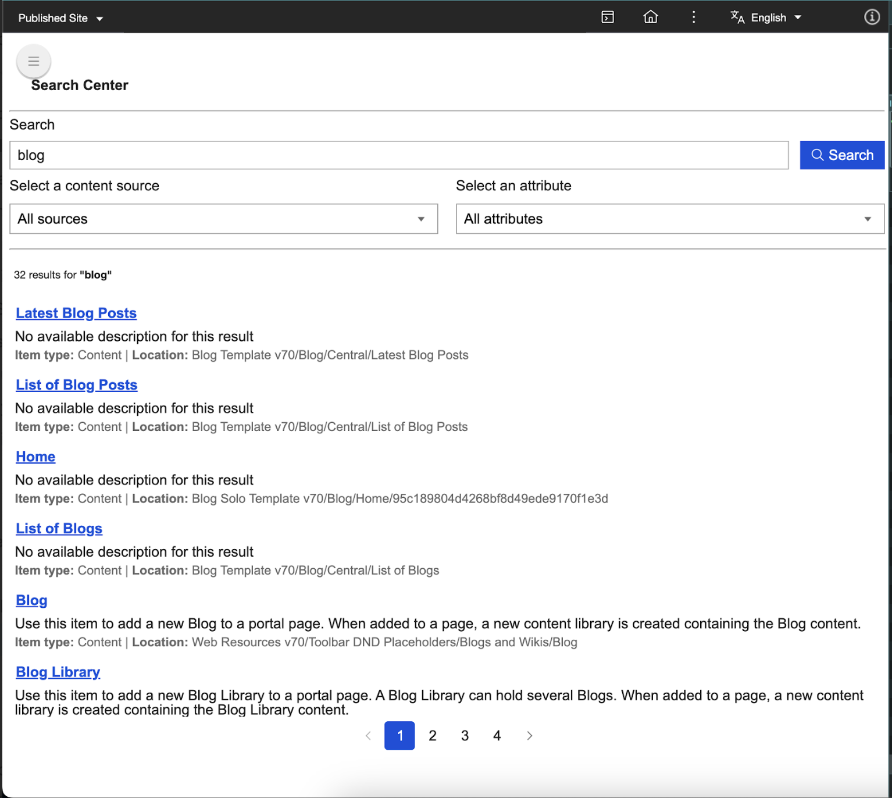
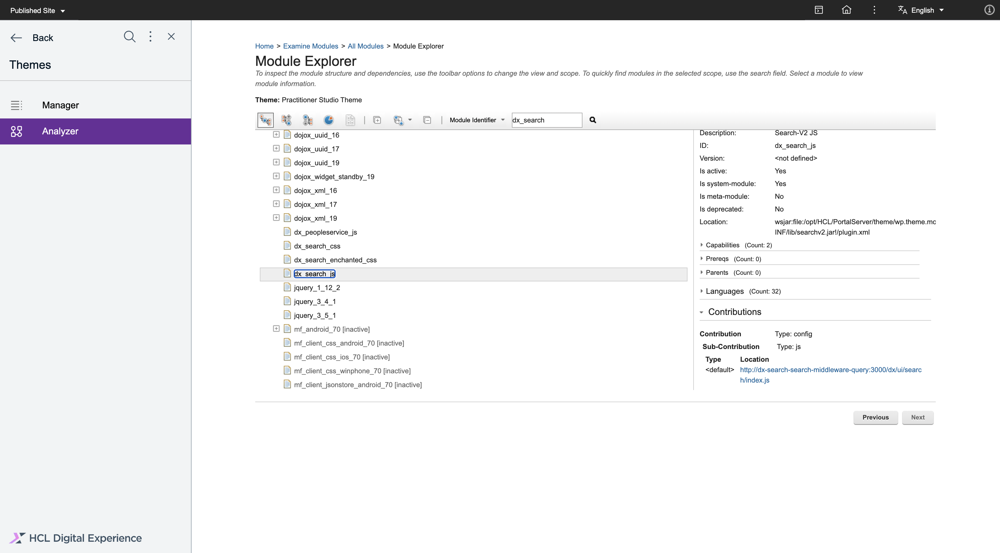

# Components of Search V2

The Search V2 UI is composed of web components called search components. This guide explains how to use the Search V2 UI search components. Follow along to learn about the different types of search components, their styling options, and extendable features.

The default search component for Search V2 is designed to be user-friendly, customizable, and extendable. It offers intuitive search interactions, allows user-defined styling and extensions, and can be integrated anywhere in your application. See an example of the search component below.

## Search component features and benefits

Search V2 components provide the following benefits:

1. **Encapsulation:** Styles and functionality are isolated from the rest of your application using Shadow DOM.
2. **Reusability:** Build once and reuse across different parts of your application.
3. **Customizability:** Use attributes, properties, and part selectors to customize components without altering their core code.

## Search components overview

Search V2 components has two distinct types: Atomic Components (AC) and Functional Composite Components (FCC).

### Atomic Components

Atomic Components (AC) are the smallest possible building blocks of the search functionality. These components include buttons, input fields, and chips, and are built using Web Components standards such as Shadow DOM for encapsulation and reusability. Refer to the table below each component for the list of compatible properties associated with them. 

- **dx-ac-base-element:** This class is a base class for all AC (Atomic component) web components, built using LitElement. It provides foundational features such as unique ID assignment, localization support, and configurable shadow DOM encapsulation. This class is intended to be extended by other AC components to ensure consistent behavior and structure across the library.

    | **Properties** | **type** | **Description** | **Default** |
    | ------------ | ------------- | ------------ | --------------|
    | **id** | String | A unique identifier for the component instance. This property is automatically assigned using a UUID generator when the component is instantiated. | Generated UUID value |
    | **localization** | Map<string,string> | Optional map for localization strings, used for dynamic message retrieval and replacement. | undefined | 

- **dx-accordion:** is a customizable web component that provides an expandable/collapsible accordion UI element. It supports optional checkboxes, secondary text, and can be configured for left-to-right (LTR) or right-to-left (RTL) layouts. The component is accessible, keyboard-navigable, and supports both outlined and no-outline visual styles. It is suitable for displaying grouped content sections that users can expand or collapse as needed.

    | **Properties** | **type** | **Description** | **Default** |
    | ------------ | ------------- | ------------ | --------------|
    | **showCheckbox** | Boolean | Displays a checkbox in the accordion header if set to true. | false |
    | **disabled** | Boolean | Disables the accordion interaction when set to true. | false |
    | **showSecondaryText** | Boolean | Shows secondary text below the main label if set to true. | false |
    | **type** | `outlined` or `no-outline` | Visual style of the accordion: outlined or no outline. | `outlined` |

- **dx-alert:** The `dx-alert` is a customizable alert component built with Lit, designed to display important messages to users with different severity levels and visual styles. It supports various alert types such as info, error, warning, and success, and can be styled as contained or outlined. The component also allows setting a custom width and message.

    | **Properties** | **type** | **Description** | **Default** |
    | ------------ | ------------- | ------------ | --------------|
    | **message** | String | The message text to display inside the alert. | '' |
    | **width** | Number | The width of the alert in pixels. | 240 |
    | **variant** | String | The visual style of the alert. Supported values: `contained`, `outlined` | `contained` |
    | **severity** | String | The severity level of the alert. Supported values: `info`, `error`, `warning`, `success` | `info` |

- **dx-button:** This customizable button component comes with internationalization support, conditional icon and text rendering, and isolated styling using Shadow DOM and CSS parts.

    | **Properties** | **type** | **Description** | **Default** |
    | -------------- | ---------| -----------------------------------------------------------------------|--------------|
    | **id**   | String  | Unique identifier for the button element.        | Auto-generated (UUID) |
    | **disabled**   | Boolean  | Indicates whether the button is disabled.        | false |
    | **imgurl**     | String   | The URL of the image to be displayed as the icon of a button.                 | undefined |
    | **buttontext** | String   | Displays text on a button.                                                | undefined |
    | **endicon**    | Boolean  | Determines whether the image is displayed as an end icon instead of a start icon.           | false |
    | **focused**    | Boolean  | Indicates whether the button currently has focus. This property is managed internally. | false |
    | **variant**    | String  | Specifies the button's visual style. Possible values are `contained`, `text`, and `outlined`.| 'contained' |
    | **withPadding**    | Boolean  | Indicates whether the button should have padding. | false |
    | **inverseColor**    | Boolean  | Uses the inverse color scheme for the button. | false |
    | **size**    | `small` or `medium`  | Size of the button (affects icon size and padding). | `small` |
    | **localization**    | Map<string, string> or undefined  | Localization map for button text and attributes. | undefined |

    The following CSS part attributes are responsible for determining the appropriate CSS for the `dx-button` component and its elements based on the component's state and properties.

    | **Part** | **Description**|
    | -------------- | ---------|
    | **button** | Represents the main button element. It is the default part for the button and is styled based on the button's state (such as `disabled` and `focused`) and `variant` (such as `contained`, `outlined`, or `text`). |
    | **button-disabled** | Represents the button in a disabled state when the `disabled` property is set to `true`. |
    | **button-outlined** | Represents the button with an outlined style when the `variant` property is set to `outlined`. |
    | **button-outlined-focused** | Represents the `outlined` button in a focused state when the `focused` property is set to `true` and the `variant` property is set to `outlined`. |
    | **button-outlined-disabled** | Represents the `outlined` button in a disabled state when the `disabled` property is set to `true` and the `variant` property is set to `outlined`. |
    | **button-start-icon** | Represents the start icon of the button when the `starticon` property is set to `true`. |
    | **button-start-icon-with-padding** | Represents the start icon of the button with padding when the button does not have text (`buttontext` is set to `""`) but has the `withPadding` property set to `true`. |
    | **button-end-icon** | Represents the end icon of the button when the `endicon` property is set to `true`. |
    | **button-start-icon-no-margin** | Represents the start icon of the button without margin when the button does not have text (`buttontext` is set to `""`) and the `withPadding` property is set to `false`. |
    | **button-start-icon-rtl-margin** | Represents the start icon of the button with right-to-left (RTL) margin when the text direction is set to `RTL`. |
    | **button-text** | Represents the text content of the button when the button has text (`buttontext` is not an empty string). |
    | **button-contained** | Represents the button with a contained style when the `variant` property is set to `contained`. |
    | **button-contained-disabled** | Represents the contained button in a disabled state when the `disabled` property is set to `true` and the `variant` property is set to `contained`. |
    | **button-contained-focused** | Represents the contained button in a focused state when the `focused` property is set to `true` and the `variant` property is set to `contained`. |
    | **button-enchanted-text** | Represents the button with an enchanted text style when the `variant` property is set to `text`. |
    | **button-enchanted-text-disabled** | Represents the enchanted text button in a disabled state when the `disabled` property is set to `true` and the `variant` property is set to `text`. |
    | **button-enchanted-text-focused** | Represents the enchanted text button in a focused state when the `focused` property is set to `true` and the `variant` property is set to `text`. |
    | **button-enchanted-outlined** | Represents the button with an enchanted outlined style when the `variant` property is set to `outlined`. |
    | **button-enchanted-outlined-disabled** | Represents the enchanted outlined button in a disabled state when the `disabled` property is set to `true` and the `variant` property is set to `outlined`. |
    | **button-enchanted-outlined-focused** | Represents the enchanted outlined button in a focused state when the `focused` property is set to `true` and the `variant` property is set to `outlined`. |

- **dx-input-select:** This flexible, accessible, and customizable component can handle a variety of user interactions and scenarios.

    | **Properties** | **type** | **Description** | **Default** |
    | -------------- | ---------| -----------------------------------------------------------------------|--------------|
    | **label**   | String | The label displayed for the dropdown. Defaults to a context-based message if not provided. | '' |
    | **disabled**   | Boolean | Indicates whether the `dx-input-select` component is disabled. | false |
    | **selectedValue**     | String | The currently selected value. | undefined |
    | **selectedId** | String | The id of the currently selected option. | undefined |
    | **options**    | String, String\[], OptionData\[] | List of options to display in the dropdown. The options can be a JSON string, an array of strings, or an array of objects with id and name properties. | [] |
    | **field**    | DxSearchInputFieldType, String | The type of the input field used to determine default labels or handle specific behaviors. You can use `DxSearchInputFieldType` strings such as `contentSource` or `documentObjectType` or leave it blank. | '' |
    | **toggleDropDown**    | Boolean | Indicates whether the dropdown is open or closed. | false |
    | **listItems**    | HTMLElement[], undefined | A list of HTMLElement items in the dropdown. | undefined |
    | **currentFocusedItem**    | HTMLElement, undefined | The item currently focused in the dropdown. | undefined |
    | **hiddenLabel**    | Boolean | Hides the label when set to true. | false |
    | **hiddenIcon**    | Boolean | Hides the dropdown icon when set to true. | false |
    | **showRemoveLabel**    | Boolean | Shows a "remove" label for clearing the selection. | false |
    | **alwaysShowPlaceholder**    | Boolean | If true, always shows the placeholder even when a value is selected. | false |
    | **placeholder**    | String or undefined | Placeholder text shown when no value is selected. | undefined |

    The following CSS part attributes are responsible for determining the appropriate CSS for the `dx-input-select` component and its elements based on the component's state and properties.

    | **Part** | **Description**|
    | -------------- | ---------|
    | **div** | Represents the outermost container `
` of the `dx-input-select` component. This part can be styled to control the overall layout and appearance of the component. |
    | **label** | Represents the `<label>` element of the `dx-input-select` component. This part can be styled to control the appearance of the label text displayed above or beside the dropdown. |
    | **BUTTON_PARTS** | Represents the parts of the `<dx-button>` element used in the component. The `exportparts` attribute allows the button's internal parts to be styled externally and ensures all button parts are exported for external styling. |
    | **unordered-list** | Represents the `<dx-list>` element that contains the dropdown options. This part can be styled to control the appearance of the dropdown list. |
    | **LIST_ITEM_PARTS** | Represents the parts of each `<dx-list-item>` element within the dropdown list. The `exportparts` attribute allows the list item's internal parts to be styled externally and ensures all list item parts are exported for external styling.|

- **dx-list:** This component wraps an unordered list (`<ul>`) and uses a slot to insert content such as list items into the component. The `part="unordered-list"` attribute allows external styling of the `<ul>`.

    | **Properties** | **type** | **Description** | **Default** |
    | -------------- | ---------| ---------------------------------------|--------------|
    | **role** |	String	| Specifies the ARIA role for the `<ul>` element. It is used for accessibility purposes. | '' |

    The following CSS part attribute is responsible for determining the appropriate CSS for the `dx-list` component and its elements based on the component's state and properties.

    | **Part** | **Description**|
    | -------------- | ---------|
    | **unordered-list** | Represents the `<ul>` element rendered by the `dx-list` component. It is the main container for the list items. |

- **dx-switch:** This fully accessible and customizable custom component separates behavior (toggle state and events) from appearance (CSS styling through the dynamic part attribute). This component is currently not in use.

    | **Properties** | **type** | **Description** | **Default** |
    | -------------- | ---------| -----------------------------------------------------------------------|--------------|
    | **isChecked**   | Boolean | Indicates whether the switch is toggled on (true) or off (false). | false |
    | **isDisabled**   | Boolean | Indicates whether the switch is disabled. | false |

    The following CSS part attributes are responsible for determining the appropriate CSS for the `dx-switch` component and its elements based on the component's state and properties.

    | **Part** | **Description**|
    | -------------- | ---------|
    | **switch-label** | Represents the label element of the switch component. It is the container for the input and slider elements. |
    | **switch-label-disabled** | Represents the label element of the switch component if the `isDisabled` property is set to `true`.|
    | **switch-input** | Represents the input element of the switch, which is a checkbox. It handles the toggle functionality of the switch. |
    | **switch-slider** | Represents the slider element of the switch, which visually indicates whether the switch is on or off. |
    | **switch-slider-checked** |  Represents the slider element of the switch if the `isChecked` property is set to `true`. |
    | **switch-slider-disabled** |  Represents the slider element of the switch if the `isDisabled` property is set to `true` but the `isChecked` property is set to `false`. |
    | **switch-slider-checked-disabled** |  Represents the slider element of the switch if the `isDisabled` and `isChecked` properties are set to `true`. |

- **dx-anchor:** The `dx-anchor` component is a customizable web component that renders an anchor tag with extended features for use in advanced UI scenarios, such as pagination, navigation, and result listings. It supports dynamic attributes, event handling for custom click actions, and can display either text or an image as its content. The component is designed to be accessible and easily integrated into larger web applications.

    | **Properties** | **type** | **Description** | **Default** |
    | -------------- | ---------| -----------------------------------------------------------------------|--------------|
    | **url** |	String |	The URL to which the anchor should navigate.|	'' |
    |**weight** |	Number |	A numeric value for custom logic or styling (e.g., for ordering). |	0 |
    |**anchorTitle** |	String |	The title attribute for the anchor, shown as a tooltip on hover.|	'' |
    |**name** |	String	| The display text for the anchor.|	'' |
    |**rel**	 | String	| Specifies the relationship between the current document and the linked document. Sample values include `noopener` or `nofollow`.|	'' |
    |**disabled** |	Boolean	| Indicates if the anchor element is disabled.|	false |
    |**selected**	| Boolean	| Indicates if the anchor is currently selected and is typically used in scenarios such as pagination. |	false |
    |**value**	| Number	| Represents a custom numeric value associated with the anchor. Ensure to use case-specific values.|	0 |
    |**mode**	| String	| Specifies the mode of the anchor, controlling its behavior and styling. You can use the mode values `pagination` or `result-title`, or leave it blank.|	'' |
    |**imgurl**	| String	| Specifies the URL of an image to be displayed inside the anchor if no text label is provided.	|'' |
    |**target**	| String	| Specifies where to open the linked document. Sample values include `_blank` or `_self`.| undefined |

    The following CSS part attributes are responsible for determining the appropriate CSS for the `dx-anchor` component and its elements based on the component's state and properties.

    | **Part** | **Description**|
    | -------------- | ---------|
    | **result-title** | Used when the anchor tag represents a result title. It applies specific styles or behaviors for result titles in the UI. |
    | **pagination-index-disabled** | Used when the anchor tag is part of a pagination component and the `disabled` property is set to `true`. It applies styles or behaviors indicating that the pagination link is not clickable. |
    | **pagination-index-selected** | Used when the anchor tag is part of a pagination component and the `selected` property is set to `true`. It applies styles or behaviors indicating that the pagination link is currently active or selected. |
    | **pagination-index-default** | Used when the anchor tag is part of a pagination component and is in its default state (`disabled` and `selected` are both set to `false`). It applies the default styles or behaviors for pagination links. |

- **dx-chip:** This component allows you to display a "chip" or "tag" with a numerical count, such as notification counters, tag lists, or pill-style labels. It also comes with built-in localization support.

    | **Properties** | **type** | **Description** | **Default** |
    | -------------- | ---------| -----------------------------------------------------------------------|--------------|
    | **name** |	String |	Specifies the name or label of the chip.|	'' |
    | **count** |	Number |	Represents a numeric count associated with the chip.|	0 |
    | **showChipCount** |	Boolean |	Determines whether `count` should be displayed alongside the chip name.|	false |
    | **showChipCount** |	Boolean |	Determines whether `count` should be displayed alongside the chip name.|	false |
    | **clearIcon** |	Boolean |	Whether to display a clear (remove) icon slot at the end of the chip.|	false |
    | **disabled** |	Boolean |	Disables the chip, making it non-interactive and visually distinct.|	false |

    The following CSS part attributes are responsible for determining the appropriate CSS for the `dx-chip` component and its elements based on the component's state and properties.

    | **Part** | **Description**|
    | -------------- | ---------|
    | **chip-div** | Represents the main container `
` for the `dx-chip `component. It serves as the root element for styling and interaction. |
    | **chip-name** | Represents the `` element that displays the name of the chip. It is used to style the text content of the chip's name. |
    | **chip-count** | Represents the `` element that displays the count of the chip when the locale is left-to-right (LTR). It is used to style the count value in LTR layouts. |
    | **chip-count-rtl** | Represents the `` element that displays the count of the chip when the locale is right-to-left (RTL). It is used to style the count value in RTL layouts. |

- **dx-input-textfield:** This component allows you to create rich input fields with enhanced user experience such as search bars or forms. You can also use it for fields where text input with optional icons and labels is required.

    | **Properties** | **type** | **Description** | **Default** |
    | -------------- | ---------| -----------------------------------------------------------------------|--------------|
    | **value** |	String |	The current value of the textfield. |	'' |
    |**type** |	String | Specifies the input type. Sample values include `text`, `password`, or `email`. |	'text' |
    |**label** |	String, undefined |	The label displayed above the textfield. |	undefined |
    |**placeholder** |	String	| The placeholder text displayed inside the textfield.|	'' |
    |**disabled** |	Boolean	| Indicates whether the textfield is disabled. |	false |
    |**clearIconUrl**| String | URL or name of the icon used for clearing the input. |	'' |
    |**actionIconUrl**	| String | URL or name of the icon used for the action (e.g., search).|	undefined |
    |**field**	| DxSearchInputFieldType, String	| A field identifier for the input that is useful in custom events or associating the input with specific data. You can use the `DxSearchInputFieldType` string `queryString` or provide your own field name. |	'' |
    |**hassearchedbefore**	| Boolean	| Indicates if a search has been performed before.|	false |
    |**tempValueHolder**	| String	| Temporarily holds the value of the input field to restore it under certain conditions, such as when the user clears the field but does not confirm the change.|	'' |

    The following CSS part attributes are responsible for determining the appropriate CSS for the `dx-input-textfield` component and its elements based on the component's state and properties.

    | **Part** | **Description**|
    | -------------- | ---------|
    | **div** | Represents the outermost container of the textfield component. |
    | **label** | Represents the label element for the input field. It is used when the `label` property is provided. |
    | **icon-start** | Represents the starting icon of the input field. It is used when the `iconStartUrl` property is provided. |
    | **icon-start-with-label** | Represents the starting icon of the input field when a label is also present. It is applied in addition to the `icon-start` part. |
    | **input** | Represents the input field. It is the default part for the input element. |
    | **input-disabled** | Represents the input field when the `disabled` property is set to `true`. It is applied in addition to the `input` part. |
    | **input-icon-start** | Represents the input field when there is a starting icon (`iconStartUrl` is provided). It is applied in addition to the `input` part. |
    | **input-icon-end** | Represents the input field when there is an ending icon (`iconEndUrl` is provided). It is applied in addition to the `input` part. |
    | **input-icon-both** | Represents the input field when both starting and ending icons are present (`iconStartUrl` and `iconEndUrl` are provided). It is applied in addition to the `input` part. |
    | **icon-end** | Represents the ending icon of the input field. It is used when the `iconEndUrl` property is provided. |
    | **icon-end-with-label** | Represents the ending icon of the input field when a label is also present. It is applied in addition to the `icon-end` part. |

- **dx-item-type-avatar:** This component is a custom web component that displays a predefined avatar representing a specific item type. It supports both icon-based and image-based avatars, automatically selecting the appropriate icon and color based on the provided item type.

    | **Properties** | **type** | **Description** | **Default** |
    | -------------- | ---------| -----------------------------------------------------------------------|--------------|
    | **itemType** |	String | The type of item to display. Determines which icon and color are shown. |	'' |
    | **imageUrl** |	String | The URL of the image to display as the avatar. If provided and itemType is IMAGE, shows image. | '' |

    The following CSS part attributes are responsible for determining the appropriate CSS for the `dx-input-textfield` component and its elements based on the component's state and properties.

    | **Part** | **Description**|
    | -------------- | ---------|
    | **ITEM_TYPE_AVATAR_EXPORT_PARTS** | These are the part names exported from the internal dx-avatar component, allowing you to style or access sub-elements of the avatar from outside the shadow DOM. Typical parts may include: icon, image, background, label, etc. |

- **dx-search-center-layout:** This customizable web component provides a structured layout for a search interface. It includes slots for adding content, such as a header, search input, and search output.

    The following CSS part attributes are responsible for determining the appropriate CSS for the `dx-search-center-layout` component and its elements based on the component's state and properties.

    | **Part** | **Description**|
    | -------------- | ---------|
    | **header-container** | Represents the container for the header section of the layout. |
    | **header** | Represents the header content itself, which is populated through the `dx-header` slot. |
    | **pagination-container** | Represents the container for the pagination section. |
    | **pagination** | Represents the pagination content, which is populated through the `dx-pagination` slot. |
    | **main** | Represents the main content area of the layout. |
    | **search-input-container** | Represents the container for the search input section, which is populated through the `search-input-container` slot. |
    | **hr-part** | Represents the horizontal rule (divider) between the search input and the search results. |
    | **search-result-container** | Represents the container for the search results section. |
    | **SEARCH_OUTPUT_CONTAINER** | (Dynamic) Container for search results when tag cloud is visible. |
    | **SEARCH_OUTPUT_CONTAINER_NO_TAGS** | (Dynamic) Container for search results when tag cloud is hidden. |
  
- **dx-toggle-button:** This component supports customizable icons for each button and adjusts its style based on the selection and outlined setting. It includes separate styles for selected and unselected buttons and allows easy integration into other UI components.

    | **Properties** | **type** | **Description** | **Default** |
    | -------------- | ---------| -----------------------------------------------------------------------|--------------|
    |**disabled** |	Boolean	| Determines if the button is disabled. |	false |
    |**outlined** |	Boolean	| Indicates whether the button should be rendered with an outlined style. |	false |
    |**selectedValue** |	String |	The currently selected value of the toggle button. |	'' |
    |**iconUrls** |	String\[] |	Array of URLs for the icons displayed on the buttons. |	[] |
    |**values** |	String\[] |	Array of values corresponding to each button's selection state. |	[] |
    |**singleButton** |	Boolean | If true, renders as a single toggle button; otherwise, renders two buttons. | false |
    |**toggleOn** |	Boolean |	Indicates if the single toggle button is in the "on" state.	 | false |
    |**showBadge** |	Boolean | If true, displays a badge on the single toggle button.	 | false |
    |**singleButtonTitle** | String | Title attribute for the single toggle button (for accessibility). | '' |
    |**singleButtonAria** | String | Aria-label for the single toggle button (for accessibility). | '' |
    |**icon** | TemplateResult | Icon template for the single toggle button. | undefined |

    The following CSS part attributes are responsible for determining the appropriate CSS for the `dx-toggle-button` component and its elements based on the component's state and properties.

    | **Part** | **Description**|
    | -------------- | ---------|
    | **toggle-button-div** | Represents the outer container `
` of the toggle button component. |
    | **toggle-button-div-outlined** | Represents the outer container `
` of the toggle button component if the `outlined` property is set to `true`. |
    | **first-button** | Represents the first `<button>` element in the toggle button. |
    | **toggle-button-selected** | Represents the first or second `<button>` element in the toggle button if the `selectedValue` matches the first value in the `values` array. |
    | **toggle-button** | Represents the first or second `<button>` element in the toggle button if the `selectedValue` does not match the first value in the `values` array. |
    | **second-button** |Represents the second `<button>` element in the toggle button. |
    | **toggle-button-icon** | Represents the `` elements inside the buttons, which display the icons for the toggle button options. This part remains constant and does not change. |
    | **badge-dot** | The badge element shown when showBadge is true in single button mode. |
    | **toggle-single-button** | The single toggle button element (when singleButton is true). |
    | **toggle-on-single-button** | Applied to the single button when it is in the "on" state (toggleOn is true). |
    | **toggle-off-single-button** | Applied to the single button when it is in the "off" state (toggleOn is false). |
  
- **dx-snackbar:** This component is a custom web component designed to display brief messages to users, typically as feedback for actions or system events. It supports different message types (info, warning, error, success, and progress) and can display an icon or a progress indicator accordingly. The component is built using the Lit library and is highly customizable, supporting slots for action buttons and theming via CSS parts.

    | **Properties** | **type** | **Description** | **Default** |
    | -------------- | ---------| -----------------------------------------------------------------------|--------------|
    |**message** |	String	| The message text or HTML content to display in the snackbar. |	'' |
    |**type** |	String	| The type of snackbar to display. Determines the icon or progress indicator shown. Possible values: `info`, `warning`, `error`, `success`, `progress` |	`info` |

    The following CSS part attributes are responsible for determining the appropriate CSS for the `dx-snackbar` component and its elements based on the component's state and properties.

    | **Part** | **Description**|
    | -------------- | ---------|
    | **snackbar-container** | The main container for the snackbar. |
    | **snackbar-icon-container** | The container that holds the icon or progress indicator. |
    | **snackbar-icon** | Represents the first `<button>` element in the snackbar. |
    | **snackbar-progress** | The container for the progress indicator (shown when type is SNACKBAR_PROGRESS). |
    | **snackbar-message** | The element displaying the snackbar message text or HTML. |
    | **snackbar-button-container** | The container for the action buttons section. |
    | **snackbar-buttons** | The slot container for custom action buttons (slot="snackbar-buttons"). |
  
- **dx-tooltip:** This component is a highly configurable web component for displaying tooltips in web applications. It provides flexible positioning, sizing, and content options, supporting both single-line and multi-line tooltips. The component is accessible, responsive to viewport changes, and can be customized for right-to-left (RTL) layouts. It automatically manages visibility, placement, and sizing based on the target element and viewport constraints.

    | **Properties** | **type** | **Description** | **Default** |
    | -------------- | ---------| -----------------------------------------------------------------------|--------------|
    |**show** |	Boolean	| Controls the visibility of the tooltip. |	false |
    |**tooltiptext** |	String or undefined	| The text content to display inside the tooltip. |	`undefined` |
    |**tooltipSize** |	String	| Size variant of the tooltip (e.g., small, large). |	`tooltip-small` |
    |**tooltipType** |	String	| Type of tooltip: single-line or multi-line. |	`tooltip-single-line` |
    |**placement** | String	| Preferred placement of the tooltip (e.g., top, bottom, left, right). |	`tooltip-bottom` |
    |**gap** | Number	| Gap in pixels between the tooltip and the target element. | 4 |
    |**multiLineMaxWidth** | Number	| Maximum width for multi-line tooltips (in pixels). | 300 |
    |**viewportPadding** | Number	| Padding from the viewport edge (in pixels). | 4 |
    |**minimumWidth** | Number	| Minimum width of the tooltip (in pixels). | 0 |
    |**isRTL** | Boolean	| Enables right-to-left layout support. | false |
    |**componentId** | String	| Unique identifier for the tooltip instance. | Auto-generated (UUID) |
    |**effectivePlacement** | String | Actual placement used after viewport/target checks. | undefined |
    |**effectiveType** | String | Actual type (single/multi-line) after sizing logic. | undefined |
    |**softMargin** | Number | Margin used for placement calculations. | 8 |
    |**isTargetVisible** | Boolean | Whether the target element is visible in the viewport. | true |
    |**rafId** | Number or null | RequestAnimationFrame ID for position updates. | null |

    The following CSS part attributes are responsible for determining the appropriate CSS for the `dx-tooltip` component and its elements based on the component's state and properties.

    | **Part** | **Description**|
    | -------------- | ---------|
    | **tooltip-root** | Represents the root element of the tooltip component, useful for styling the overall tooltip container. |
    | **tooltip-text** | Represents the element containing the tooltip text. This part is combined with the effective type, size, and placement for more granular styling (e.g., single-line, multi-line, small, large, top, bottom, etc.). |
    | **tooltip-target** | Represents the element that the tooltip is attached to or triggered by (the target for hover/focus events). |

- **dx-avatar:** The dx-avatar web component is used to display user avatars in various forms, such as images, icons, or text initials. It supports different shapes (rounded or circular), color themes, and content types (image, icon, icon template, or text). This component is highly customizable and can be used to represent users, entities, or any object requiring a visual identifier in your application.

    | **Properties** | **type** | **Description** | **Default** |
    | -------------- | ---------| -----------------------------------------------------------------------|--------------|
    |**variant** |	String	| Defines the avatar's visual variant. Sample values include `avatar-letter`, `avatar-icon`, or `avatar-img`. |	undefined |
    |**imgUrl** |	String	| The URL of the image to be displayed as the avatar when the `variant` is set to `avatar-img`.|	undefined |
    | **iconUrl** |	String |	The URL of the icon to be displayed as the avatar when the `variant` is set to `avatar-icon`. |	undefined |
    | **color** |	String |	Color theme for the avatar. |	undefined |
    |**avatarText** |	String |	The text to be displayed in the avatar when the `variant` is set to `avatar-letter`.  |	undefined |
    |**type** |	String |	Determines the shape of the avatar. Possible values are `avatar-rounded` or `avatar-circular`.  |	undefined |

    The following CSS part attributes are responsible for determining the appropriate CSS for the `dx-avatar` component and its elements based on the component's state and properties.

    | **Part** | **Description**|
    | -------------- | ---------|
    | **avatar-div** | Represents the part attribute for the outer div element when the `type` property is set to `avatar-rounded`. It is used to style the container of the rounded avatar. |
    | **avatar-div-circular** | Represents the part attribute for the outer div element when the `type` property is  set to `avatar-circular`. It is used to style the container of the circular avatar. |
    | **avatar-image-circular** | Represents the part attribute for an image element when the `variant` property is set to `avatar-img` and the `type` property is set to `avatar-circular`. It is used to style the circular avatar displaying an image. |
    | **avatar-image-rounded** | Represents the part attribute for an image element when the `variant` property is set to `avatar-img` and the `type` property is set to `avatar-rounded`. It is used to style the rounded avatar displaying an image. |
    | **avatar-icon-circular** | Represents the part attribute for an image element when the `variant` property is set to `avatar-icon` and the `type` property is set to `avatar-circular`. It is used to style the circular avatar displaying an icon. |
    | **avatar-icon-rounded** | Represents the part attribute for an image element when the `variant` property is set to `avatar-icon` and the `type` property is set to `avatar-rounded`. It is used to style the rounded avatar displaying an icon. |
    | **avatar-span-circular** | Represents the part attribute for a span element when the `variant` property is set to `avatar-letter` and the `type` property is set to `avatar-circular`. It is used to style the circular avatar displaying text. |
    | **avatar-span-rounded** | Represents the part attribute for a span element when the `variant` property is set to `avatar-letter` and the `type` property is set to `avatar-rounded`. It is used to style the rounded avatar displaying text. |

- **dx-header:** This component offers a flexible and responsive header solution with various customization options and localization support.  

    | **Properties** | **type** | **Description** | **Default** |
    | -------------- | ---------| -----------------------------------------------------------------------|--------------|
    |**color** |	String	| Sets the color for the header's text and other elements. |	'rgba(0, 0, 0, .32)' |
    |**headerTitle** |	String	| The title displayed in the header.|	'' |
    | **showBackIcon** |	Boolean |	Determines whether the back icon is shown. |	false |
    |**isSideNavOpen** |	Boolean |	Indicates whether the side navigation is open. |	false |
    |**disabled** |	Boolean |	Determines whether certain components in the header are disabled. |	false |
    |**variant** |	String |	The predetermined structure and styling of the header according to its use case. You can use the value `header-endUser`. |	undefined |

    The following CSS part attributes are responsible for determining the appropriate CSS for the `dx-header` component and its elements based on the component's state and properties.

    | **Part** | **Description**|
    | -------------- | ---------|
    | **header** | Represents the main container of the header component. |
    | **sub-header-start** | Represents the left side of the header, typically used for navigation or back buttons. |
    | **header-spacing-start-hamburger** | Represents the spacing or container for the hamburger menu when the side navigation is open. |
    | **header-spacing-start** | Represents the spacing or container for the left side of the header when the side navigation is closed. |
    | **h6** | Represents the container for the title or heading of the header. |
    | **sub-header-end** | Represents the right side of the header, typically used for actions such as search, filters, or badges. |
    | **header-spacing-end** | Represents the spacing or container for the right side of the header. |
    | **input** | Represents the input text field used in the header, typically for search functionality. |
    | **badge_dot** | Represents the badge element, often used to display notifications or indicators. |
    | **hr-part** | Represents the horizontal rule (divider) at the bottom of the header. |

- **dx-list-item:**  This component allows you to mark items as selected and apply different styles accordingly. It also includes a slot element, allowing you to insert content into the item when the component is used.

    | **Properties** | **type** | **Description** | **Default** |
    | -------------- | ---------| -----------------------------------------------------------------------|--------------|
    |**key** |	String	| A unique key for the list item that is typically used to identify it within a list. |	'' |
    |**isSelected** |	Boolean	| Used to track whether the list item is selected.|	false |
    |**role** |	String	| Specifies the ARIA role for the list item, such as `menuitem`.|	'' |

    The following CSS part attributes are responsible for determining the appropriate CSS for the `dx-list-item` component and its elements based on the component's state and properties.

    | **Part** | **Description**|
    | -------------- | ---------|
    | **menu-item** |  This part is applied when the `role` property of the list item is set to `menuitem`. It represents a menu item in a list. |
    | **list-item-selected** |  This part is applied when the `isSelected` property is set to `true`. It indicates that the list item is currently selected. |
    | **list-item** |  This part is applied when the `role` property of the list item is set to `menuitem`. It represents a menu item in a list. |

- **dx-svg-icon:** This component allows you to display scalable vector icons with customizable colors and sizes. You can use this component for dynamic UIs where the icon might need to change based on context or state.

    | **Properties** | **type** | **Description** | **Default** |
    | -------------- | ---------| -----------------------------------------------------------------------|--------------|
    |**color** | String	| The color of the SVG icon. If `useCurrentColor` is set to `false`, this color will be applied directly to the SVG's fill.|	'' |
    |**size** |	String	| The size of the icon. Used for both width and height. |	'' |
    | **useCurrentColor** |	Boolean |	Determines whether the icon will inherit the color of the parent element's color property (using CSS currentColor). |	false |
    |**icon** |	TemplateResult |	The SVG icon content passed as a template to render the icon. |	undefined |

- **dx-authoring-item-type-avatar:** This component allows you to display an avatar image based on the `itemType` property that determines the type of item for which the avatar is rendered.

    | **Properties** | **type** | **Description** | **Default** |
    | -------------- | ---------| -----------------------------------------------------------------------|--------------|
    |**itemType** | String	| Determines the type of item for which the avatar is rendered.|	'' |

- **dx-badge:** This component displays a badge, typically used to show a small piece of information such as a count, label, or status. It supports both left-to-right (LTR) and right-to-left (RTL) layouts, automatically adjusting its styling based on the current localization direction.

    | **Properties** | **type** | **Description** | **Default** |
    | -------------- | ---------| -----------------------------------------------------------------------|--------------|
    |**badge** | String	| Holds the text content to be displayed inside the badge.|	'' |

    The following CSS part attributes are responsible for determining the appropriate CSS for the `dx-badge` component and its elements based on the component's state and properties.

    | **Part** | **Description**|
    | -------------- | ---------|
    | **badge_text** |Represents the badge text when the text direction is left-to-right (LTR). |
    | **badge_text-rtl** |Represents the badge text when the text direction is right-to-left (RTL). |

- **dx-breadcrumbs-item:** The `dx-breadcrumbs-item` is a web component representing a single item in a breadcrumb navigation trail. It is designed to display a navigational link, optionally with an icon, and supports customization for disabled states and accessibility. The component is built using the Lit library and is intended to be used as part of a breadcrumb navigation system, helping users understand and navigate the hierarchy of a website or application.

    | **Properties** | **type** | **Description** | **Default** |
    | -------------- | ---------| -----------------------------------------------------------------------|--------------|
    |**path** | PathType Object	| The breadcrumb item data, including title, link, icon, iconName, and state.|	undefined |
    |**partProp** | String	| Custom part attribute for styling or identification.	|	undefined |
    |**key** | String	| Unique key for the breadcrumb item, useful for list rendering.	|	'' |

    The following CSS part attributes are responsible for determining the appropriate CSS for the `dx-badge` component and its elements based on the component's state and properties.

    | **Part** | **Description**|
    | -------------- | ---------|
    | **breadcrumbs-item** | Applied to the `<li>` element representing a breadcrumb item. |
    | **disabled** | Added to the `<li>` element when the breadcrumb item is disabled. |
    | **breadcrumbs-item-last** | Used for the last breadcrumb item. |
    | **breadcrumbs-icon** | Applied to the icon element within the breadcrumb item. |
    | **breadcrumbs-item-last-icon** | Used for the icon in the last breadcrumb item. |
    | **breadcrumbs-link** | Applied to the `<a>` link for a breadcrumb item. |
    | **breadcrumbs-link-last** | Used for the link in the last breadcrumb item. |
    | **breadcrumbs-content** | Applied to the `
` wrapping the icon and text. |
    | **breadcrumbs-text** | Applied to the `` containing the breadcrumb title. |

- **dx-breadcrumbs:** The `dx-breadcrumbs` is a web component that displays a navigational breadcrumb trail, helping users understand and navigate the hierarchy of a website or application. It renders a list of breadcrumb items, each representing a navigation step. The component supports both left-to-right and right-to-left layouts, and allows custom click handling for breadcrumb navigation.

    | **Properties** | **type** | **Description** | **Default** |
    | -------------- | ---------| -----------------------------------------------------------------------|--------------|
    |**paths** | Array<PathType>    | Array of breadcrumb path objects to display. Each object defines a breadcrumb item (see below for PathType).|	[] |
    |**handleBreadcrumbClick** | Optional callback function invoked when a breadcrumb item is clicked (except disabled items).	|	undefined |
    |**exportParts** | String	| Comma-separated list of part names for styling with ::part. Used internally for style encapsulation.	|	Computed from enum |

    PathType Interface (for path property) used in `dx-breadcrumbs` and `dx-breadcrumbs-item`: 

    | **Properties** | **type** | **Description** | **Default** |
    | -------------- | ---------| -----------------------------------------------------------------------|--------------|
    |**title** | String	| The display text for the breadcrumb item.|	undefined |
    |**parentId** | String	| Optional parent identifier for hierarchical data.	|	undefined |
    |**link** | String	| URL or route for navigation.	|	undefined |
    |**icon** | TemplateResult	| Custom icon template to render.	|	undefined |
    |**iconName** | String	| Predefined icon name (e.g., 'HOME', 'INFORMATION').	|	undefined |
    |**disabled** | Boolean	| If true, disables the breadcrumb item.	|	undefined |

    The following CSS part attributes are responsible for determining the appropriate CSS for the `dx-breadcrumbs` component and its elements based on the component's state and properties.

    | **Part** | **Description**|
    | -------------- | ---------|
    | **breadcrumbs-container** | The main container for the breadcrumbs navigation. |
    | **breadcrumbs-list** | The list element that holds all breadcrumb items. |
    | **breadcrumbs-separator** | The separator element (e.g., chevron icon) between breadcrumb items. |
    | **breadcrumbs-item-last** | The last breadcrumb item in the list, typically styled differently to indicate the current page. |

- **dx-data-grid:** This component is designed to provide a highly customizable and interactive data grid for displaying tabular data. Its features include sorting, selection, tooltips, and keyboard navigation.

    | **Properties** | **type** | **Description** | **Default** |
    | -------------- | ---------| -----------------------------------------------------------------------|--------------|
    |**isLoading** | String	|  Indicates whether the data grid is in a loading state. |	'false' |
    |**colDef** | String	|  Represents the column definitions for the data grid. |	'' |
    |**hasMiddlewareError** | String	|  Indicates if there is a middleware error. |	'false' |
    |**hasContentSourceAvailable** | String	|  Indicates if content sources are available. |	'false' |
    |**checkboxSelection** | String	|  Indicates if checkbox selection is enabled. |	'false' |
    |**useCase** | String	|  Represents the use case for the data grid, such as authoring. |	'' |
    |**tableHover** | String	|  Indicates if table hover effects are enabled. |	'false' |
    |**invalidColDef** | Boolean	|  Indicates if the column definition (`colDef`) is invalid. |	false |
    |**onHover** | Boolean	|  Indicates if a header is being hovered over. |	true |
    |**onRowHover** | Boolean	|  Indicates if a row is being hovered over. |	false |
    |**enchantedOutputContext** | EnchantedOutputContextType |  Context object for enchanted output, consumed from `enchantedOutputContext`. | undefined |
    |**currentHoverField** | String |   Indicates the field currently being hovered over in the header. |	'' |
    |**currentHoverRow** | Number |  Indicates the index of the row currently being hovered over. |	NaN |
    |**selectAll** | Boolean | Indicates whether the "Select All" checkbox is checked. |  false |
    |**programmaticClick** | Boolean |  Indicates if a programmatic click is being handled. It is used to avoid triggering hover events. |  false |

    The following CSS part attributes are responsible for determining the appropriate CSS for the `dx-data-grid` component and its elements based on the component's state and properties.

    | **Part** | **Description**|
    | -------------- | ---------|
    | **table-row-header-container** |Represents the container for the table header row. |
    | **table-select-all-checkbox** |Represents the checkbox for selecting all rows in the header row. |
    | **table-header-container** |Represents the container for each table header cell. |
    | **table-header-container-child** |Represents the child container inside a table header cell. |
    | **table-header-text-parent** |Represents the parent container for the header text. |
    | **table-header-text** |Represents the text content of the table header. |
    | **table-sort-button-container** |Represents the container for the sort buttons in the header. |
    | **table-header-icon-button** |Represents the sort icon button in the header. |
    | **table-header-asc-sort-button-hidden** |Represents the hidden state of the ascending sort button. |
    | **table-header-desc-sort-button-hidden** |Represents the hidden state of the descending sort button. |
    | **table-header-sort-button** |Represents the visible state of the sort button. |
    | **table-column-separator** |Represents the separator between table columns. |
    | **table-column-separator-hr** |Represents the horizontal rule (divider) used as a column separator. |
    | **table-body-container** |Represents the container for the table body. |
    | **table-loading-text** |Represents the loading text displayed when data is being loaded. |
    | **table-result-label** |Represents the label for the result message, such as "No results found." |
    | **table--result-description** |Represents the description for the result message. |
    | **table-row-body-container** |Represents the container for each row in the table body. |
    | **table-select-checkbox-container** |Represents the container for the checkbox in each row. |
    | **table-select-checkbox** |Represents the checkbox for selecting a specific row. |
    | **table-cell-container** |Represents the container for each table cell. |
    | **table-cell-text** |Represents the text content of a table cell. |
    | **table-cell-icon-button** |Represents the icon button inside a table cell. |
    | **table-action-icon-button** |Represents the action button for a row, such as an edit button for modifying an item or an overflow menu for displaying additional actions in a menu list. |
    | **table-header-menu-item** |Represents a menu item in the overflow menu. |
    | **table-container** |Represents the main container for the entire table. |
    | **table-column-authoring-{index}** |Represents the authoring-specific styling for a column. |
    | **table-column-authoring-{index}-div** |Represents the authoring-specific container for a column. |
    | **table-column-authoring-{index}-div-0** |Represents the first child container in the authoring column. |
    | **table-column-authoring-{index}-div-1** |Represents the second child container in the authoring column. |
    | **table-column-authoring-{index}-div-2** |Represents the third child container in the authoring column. |
    | **table-column-authoring-{index}-div-3** |Represents the fourth child container in the authoring column. |
    | **table-column-authoring-{index}-div-4** |Represents the fifth child container in the authoring column. |

- **dx-data-grid-generic:** This component is a highly flexible and customizable web component for rendering data grids in web applications. It supports dynamic columns, sorting, selection, action menus, and integration with middleware data sources. The component is designed for enterprise use cases, providing accessibility, keyboard navigation, and advanced features like row actions, tooltips, and avatar rendering. It is built using Lit and can be easily integrated into modern web applications.

    | **Properties** | **type** | **Description** | **Default** |
    | -------------- | ---------| -----------------------------------------------------------------------|--------------|
    | **data** | DxDataGridContextType	|  Data context for the grid, including items, pagination, sorting, and selection. | {} |
    | **columns** | DxDataGridColDef[]	|  Array of column definitions specifying field, header, actions, and rendering options. |	[] |
    |**isLoading** | String	|  Indicates if the grid is in a loading state. |	`false` |
    |**hasMiddlewareError** | String	|  Indicates if there is a middleware error. |	`false` |
    |**hasContentSourceAvailable** | String	|  Indicates if a content source is available. |	`false` |
    |**useCase** | String	|  Custom use case identifier for grid behavior. |	'' |
    |**specialFields** | String[]	|  List of special fields for custom rendering or logic. |	[] |
    |**isRowClickable** | Boolean	|  Enables row click events for selection or navigation. |	false |
    |**tableHover** | String	|  Enables table hover effect. |	`false` |
    |**checkboxSelection** | String	|  Enables row selection via checkboxes when set to 'true'. |	`false` |

    The following CSS part attributes are responsible for determining the appropriate CSS for the `dx-data-grid-generic` component and its elements based on the component's state and properties.

    | **Part** | **Description**|
    | --- | --- |
    | **table-container** | The main container for the data grid table. |
    | **table-row-header-container** | The `<tr>` element for the table header row. |
    | **table-row-body-container** | A table row in the body. |
    | **table-row-body-container-selected** | A selected table row. |
    | **table-row-body-container-hovered** | A hovered table row. |
    | **table-select-all-checkbox** | The header cell containing the select-all checkbox. |
    | **table-header-container** | The main container for each table header cell. |
    | **table-header-container-child** | Child container inside a table header cell. |
    | **table-header-text-parent** | Parent container for the header text. |
    | **table-header-text** | The actual header text span. |
    | **table-sort-button-container** | Container for the sort buttons in the header. |
    | **table-header-icon-button** | The sort icon button in the header. |
    | **table-header-asc-sort-button** | Sort button for ascending order. |
    | **table-header-desc-sort-button** | Sort button for descending order. |
    | **table-header-asc-sort-button-hidden** | Hidden state for ascending sort button. |
    | **table-header-desc-sort-button-hidden** | Hidden state for descending sort button. |
    | **table-header-sort-button** | Active sort button. |
    | **table-column-separator** | Container for the column separator line. |
    | **table-column-separator-hr** | The horizontal rule element for the column separator. |
    | **table-body-container** | The main container for the table body (rows and loading/empty/error states). |
    | **table-select-checkbox-container** | Container for the row selection checkbox. |
    | **table-select-checkbox** | The row selection checkbox itself. |
    | **table-cell-container** | Container for a table cell. |
    | **table-cell-text** | The main text span in a table cell. |
    | **table-cell-link** | The link element in a table cell (if the cell is a link). |
    | **table-action-buttons-container** | Container for action buttons in a row. |
    | **table-action-icon-button** | An action icon button in a row. |
    | **table-action-icon-button-menu** | An action icon button that opens a menu. |
    | **table-action-icon-button-hidden** | Hidden state for an action icon button. |
    | **table-cell-icon-button** | An icon button inside a table cell. |
    | **table-cell-text-action** | A text action button inside a table cell. |
    | **table-header-menu-item** | A menu item in the table header. |
    | **table-result-label** | Label for empty or error states in the table body. |
    | **table-result-description** | Description for empty or error states in the table body. |
    | **table-loading-text** | Text shown when the table is loading. |
    | **table-column-authoring-{index}** | Authoring-specific column part, with {index} replaced by the column index. |
    | **table-column-authoring-{index}-div** | Authoring-specific column div, with {index} replaced by the column index. |
    | **table-column-authoring-{index}-div-0/1/2/3/4** | Nested divs for authoring columns, for layout and styling, with {index} replaced by the column index |
    | **table-column-picker-{index}** | Picker-specific column part, with {index} replaced by the column index. |
    | **table-column-authoring-div-{index}** | Authoring mode cell content wrapper, index-specific. |

- **dx-dialog:** This component is designed to represent a reusable dialog or modal element with customizable content, title, and actions.

    | **Properties** | **type** | **Description** | **Default** |
    | -------------- | ---------| -----------------------------------------------------------------------|--------------|
    |**open** | Boolean	| Determines whether the dialog is visible or hidden. This property is reflected to the DOM, so any changes to it are also reflected in the corresponding HTML attribute.|	false |
    |**dialogTitle** | String	| The title text displayed in the dialog header (if not overridden by slot).|	A localized string for the generic label |
    |**size** | String	| Sets the dialog size. Accepts values from DialogSizes enum (XL, SM).|	'xl' |
    |**overrideTitle** | Boolean	| Determines whether the default title is overridden by custom content provided through a slot.|	false |

    The following CSS part attributes are responsible for determining the appropriate CSS for the `dx-dialog` component and its elements based on the component's state and properties.

    | **Part** | **Description**|
    | -------------- | ---------|
    | **dialog-root** |Represents the root container of the dialog component. It wraps the entire dialog structure. |
    | **backdrop** |Represents the backdrop layer behind the dialog. It is used to block interaction with the rest of the page and provides a visual overlay. |
    | **container** |Represents the container that holds the dialog content. It ensures proper layout and positioning of the dialog. |
    | **paper** |Represents the main dialog paper or card-like structure that contains the title, content, and actions. |
    | **title** |Represents the title section of the dialog. This part is conditionally applied based on the `overrideTitle` property. |
    | **title-root** |Represents the root container for the title text. It is used when `overrideTitle` property is set to `false`. |
    | **title-text** |Represents the text element of the dialog title. It displays the title string. |
    | **icon-root** |Represents the container for the close icon. It is used to position and style the close button. |
    | **icon-close** |Represents the close icon. It is used to trigger the dialog close action. |
    | **content** |Represents the content section of the dialog. It wraps the main content of the dialog. |
    | **content-root** |Represents the root container for the dialog content. It ensures proper layout and styling of the content. |
    | **action** |Represents the action section of the dialog. It contains the buttons or actions available in the dialog. |

- **dx-header-layout:** This component serves as a layout template for a header section in a web application, allowing developers to define and organize content into specific slots. These slots include `header-start`, `header-start-label`, `header-middle`, and `header-end`.

    The following CSS part attributes are responsible for determining the appropriate CSS for the `dx-header-layout` component and its elements based on the component's state and properties.

    | **Part** | **Description**|
    | -------------- | ---------|
    | **main-header** |Represents the main container for the header layout. It acts as the root wrapper for all header sections. |
    | **header-start-container** |Represents the container for the start section of the header. This section is typically used for elements such as logos or navigation menus. |
    | **header-start** |Represents the specific slot within the start section of the header. This slot allows users to insert custom content into the start section. |
    | **header-start-container-label** |Represents the container for the label associated with the start section of the header. This is likely used for additional descriptive content. |
    | **header-start-label** |Represents the specific slot for the label in the start section. This slot allows users to insert custom label content. |
    | **header-middle-container** |Represents the container for the middle section of the header. This section is typically used for elements such as search bars or titles. |
    | **header-middle** |Represents the specific slot within the middle section of the header. This slot allows users to insert custom content into the middle section. |
    | **header-end-container** |Represents the container for the end section of the header. This section is typically used for elements such as user profile icons or action buttons. |
    | **header-end** |Represents the specific slot within the end section of the header. This slot allows users to insert custom content into the end section. |

- **dx-icon-button:** This component is designed to render a `dx-button` button that can display an icon or image. Its padding and size can be customized. You need to add an `aria-label` to this component to prevent the screen reader from reading its `alt` text.

    | **Properties** | **type** | **Description** | **Default** |
    | -------------- | ---------| -----------------------------------------------------------------------|--------------|
    |**size** | String	| Specifies the size of the icon button.|	'small' |
    |**withPadding** | Boolean	| Determines whether the button should have padding.|	false |
    |**imgurl** | String	| Specifies the URL of the image to be used in the button.|	'' |
    |**icon** | TemplateResult	| Lit template for rendering a custom icon.|	undefined |
    |**disabled** | Boolean	| Disables the button if set to true.|	false |
    |**inverseColor** | Boolean	| Applies an inverse color scheme if true.| false |

    The following CSS part attribute is responsible for determining the appropriate CSS for the `dx-icon-button` component and its elements based on the component's state and properties.

    | **Part** | **Description**|
    | -------------- | ---------|
    | **BUTTON_PARTS** | Exposes the internal parts of the `dx-button` component so they can be styled externally. It accepts a comma-separated list of part names. |

- **dx-datepicker:** The `dx-datepicker` is a custom web component built with LitElement, designed to provide a highly accessible, localized, and feature-rich date picker input for web applications. It supports keyboard navigation, localization, custom date formats, and accessibility features such as ARIA labels. The component allows users to select dates via an input field or an interactive calendar popup, with support for year selection, validation, and custom helper text. It is suitable for use in forms and complex UI scenarios where robust date input is required.

    | **Properties** | **type** | **Description** | **Default** |
    | -------------- | ---------| -----------------------------------------------------------------------|--------------|
    | **name** | String	| Name of the datepicker, used for form submission.|	'datepicker' |
    | **label** | String	| Label for the datepicker, displayed above the input.	|	'Label' |
    | **showInputAction** | Boolean	| Toggle to show or hide an action next to the input label.	|   false |
    | **helperIconTooltip** | String	| Tooltip text for the helper icon next to the label.	|   'Label helper tooltip' |
    | **requiredField** | Boolean	| Shows or hides the required field asterisk next to the label.	|   false |
    | **open** | Boolean	| If true, opens the datepicker calendar on page load.	|   false |
    | **hideHelperText** | Boolean	| Hides the helper text below the input.		|   false |
    | **showRemoveLabel** | Boolean	| Shows or hides a "remove" label action.		|   false |
    | **value** | Number	| The current value of the datepicker (as a Unix timestamp in ms).	|   0 |
    | **disabled** | Boolean	| Disables the datepicker input and actions.	|   false |
    | **field** | String	| Additional field identifier, used in events.	|   '' |

    The following CSS part attributes are responsible for determining the appropriate CSS for the `dx-datepicker` component and its elements based on the component's state and properties.

    | **Part** | **Description**|
    | -------------- | ---------|
    | **datepicker-root** |The root container of the datepicker component. |
    | **datepicker-div-label-and-action** |Wrapper for the label and any action elements (like remove label or input action). |
    | **datepicker-div-label** |Container for the label and required asterisk. |
    | **datepicker-label-text** |The main label text for the datepicker. |
    | **datepicker-label-text-disabled** |The label text when the input is disabled. |
    | **datepicker-label-text-invalid** |The label text when the input is invalid. |
    | **datepicker-label-required** |The asterisk indicating a required field. |
    | **datepicker-remove-label** |The "remove" label/button for removing the field. |
    | **datepicker-remove-label-disabled** |The "remove" label/button when disabled. |
    | **datepicker-div-form** |Wrapper for the input and calendar icon. |
    | **datepicker-div-input** |Container for the input field. |
    | **datepicker-div-input-invalid** |Input container when the value is invalid. |
    | **datepicker-div-input-disabled** |Input container when disabled. |
    | **datepicker-input** |The input field for date entry. |
    | **datepicker-input-rtl** |The input field in right-to-left layout. |
    | **datepicker-div-icon** |Container for the calendar icon button. |
    | **datepicker-div-calendar-button** |The button to open/close the calendar. |
    | **datepicker-invalid-text** |The error message text for invalid input. |
    | **datepicker-invalid-text-rtl** |The error message text in RTL layout. |
    | **datepicker-help-text** |The helper text below the input. |
    | **datepicker-help-text-rtl** |The helper text in RTL layout. |
    | **datepicker-calendar** |The calendar popup container. |
    | **datepicker-calendar-header** |The header of the calendar (month/year and navigation). |
    | **datepicker-calendar-div-year** |Container for the year and year selection button. |
    | **datepicker-calendar-div-year-span** |The span showing the current month and year. |
    | **datepicker-calendar-year-view-button** |The button to toggle year selection view. |
    | **datepicker-calendar-year-view-button-rtl** |The year view button in RTL layout. |
    | **datepicker-calendar-div-month** |Container for month navigation buttons. |
    | **datepicker-calendar-month-prev** |Button to go to the previous month. |
    | **datepicker-calendar-month-prev-rtl** |Previous month button in RTL layout. |
    | **datepicker-calendar-month-next** |Button to go to the next month. |
    | **datepicker-calendar-month-next-rtl** |Next month button in RTL layout. |
    | **datepicker-calendar-days** |Row containing the day-of-week labels. |
    | **datepicker-calendar-day-label** |Each day-of-week label. |
    | **datepicker-calendar-dates** |Container for all date buttons. |
    | **datepicker-calendar-date-span** |Wrapper for each date button. |
    | **datepicker-calendar-dates-button** |The button for each date. |
    | **datepicker-calendar-dates-button-selected** |The selected date button. |
    | **datepicker-calendar-dates-today-span** |The indicator for today's date. |
    | **datepicker-calendar-dates-today-span-rtl** |Today's date indicator in RTL layout. |
    | **datepicker-calendar-dates-empty-div** |Empty div for calendar grid alignment. |
    | **datepicker-calendar-year-selection** |Container for the year selection view. |
    | **datepicker-calendar-year-selection-years** |Container for the list of year buttons. |
    | **datepicker-calendar-year-selection-year-div** |Wrapper for each year button. |
    | **datepicker-calendar-year-selection-year-button** |Button for each year. |
    | **datepicker-calendar-year-selection-year-button-selected** |Selected year button. |
    | **datepicker-calendar-footer** |Footer of the calendar (contains "Today" button). |
    | **datepicker-calendar-footer-button** |The "Today" button in the calendar footer. |

- **dx-menu:** This component is designed to represent a dropdown menu that can be anchored to a target element and toggled open or closed.

    | **Properties** | **type** | **Description** | **Default** |
    | -------------- | ---------| -----------------------------------------------------------------------|--------------|
    |**open** | Boolean	| Indicates whether the menu is open or closed.|	false |
    |**menuDelay** | Number	| Specifies the delay (in milliseconds) before the menu opens or closes.|	false |
    |**componentId** | String	| A unique identifier for the component generated using UUID.|	300 |
    |**openMenu** | Boolean	| Tracks the current state of the menu (open or closed).|	false |

    The following CSS part attributes are responsible for determining the appropriate CSS for the `dx-menu` component and its elements based on the component's state and properties.

    | **Part** | **Description**|
    | -------------- | ---------|
    | **menu-root** | Represents the root container of the menu. It is the main wrapper for the menu content. |
    | **backdrop** | Represents the backdrop element behind the menu. It is used to detect clicks outside the menu to trigger the menu to close. |
    | **paper-root** | Represents the container for the menu content. It holds the actual menu items and is styled to appear as the menu. |
    | **LIST_PARTS** | Represents the parts of the `dx-list` component used inside the menu. These parts are exported through the `dx-list` component to allow for the styling of the list and its items. |
    | **BUTTON_PARTS** | Represents the parts of the `dx-button` element that triggers the menu. These parts are exported through the target anchor to allow for the styling of the trigger element. |

- **dx-menu-item:** This component is designed to represent a single menu item in a menu list and enables interaction and accessibility.

    | **Properties** | **type** | **Description** | **Default** |
    | -------------- | ---------| -----------------------------------------------------------------------|--------------|
    |**text** | String	| Represents the text content of the menu item.|	'' |
    |**value** | String	| Represents the value associated with the menu item.|	'' |
    |**menuObject** | Object | An object containing additional data for the menu item.|	{} |

    The following CSS part attributes are responsible for determining the appropriate CSS for the `dx-menu-item` component and its elements based on the component's state and properties.

    | **Part** | **Description**|
    | -------------- | ---------|
    | **text-root** | This part is applied to the root container of the text within the menu item. It is used to wrap the text and handle mouse events like `mouseenter` for tooltips. |
    | **text** | This part is applied to the actual text content of the menu item. It represents the visible text displayed to the user. |
    | **LIST_ITEM_PARTS**  (Exported through the `exportparts` attribute) | This is a collection of parts exported from the `dx-list-item` component. These parts are made available for external styling and customization. |

- **dx-multiple-select-chip:** This component defines the properties for a multiple select chip component. This component is designed to allow users to select multiple options from a dropdown list, with each selection displayed as a chip. It supports features such as disabling the component, showing avatars, displaying the count of selected chips, handling empty options, and more. The component is highly configurable through its properties, making it suitable for various use cases where multi-selection is required in a user interface.

    | **Properties** | **type** | **Description** | **Default** |
    | -------------- | ---------| -----------------------------------------------------------------------|--------------|
    |**disabled** | Boolean	| Disables the input and all interactions.|	false |
    |**showHelperText** | Boolean | Shows helper text below the input.|	false |
    |**helperText** | String | Helper text to display below the input.|	'' |
    |**name** | String | Name attribute for the input.|	'multiple-select' |
    |**selectedValues** | OptionData[] | Array of selected option objects.| [] |
    |**options** | OptionData[] | Array of available option objects.| [] |
    |**field** | String | Field type or identifier.| '' |
    |**showRemoveLabel** | Boolean | Shows a "remove" label for the field.| false |
    |**emptyOptions** | Boolean | Allows adding new values not in the options list.| false |
    |**clearIcon** | Boolean | Shows a clear icon on each chip.| true |
    |**error** | Boolean | Marks the input as having an error.| false |
    |**customWidth** | String | undefined | Custom width for the component (e.g., '300px').| undefined |
    |**placeholder** | String | undefined | Placeholder text for the input.| Localized default |
    |**label** | String | undefined | Label for the input.| Localized default |
    |**toggleDropDown** | Boolean | Whether the dropdown is open.| false |
    |**listItems** | HTMLElement[] | List of dropdown item elements.| undefined |
    |**currentFocusedItem** | HTMLElement[] | Currently focused dropdown item.| undefined |
    |**inputValue** | String | Current value in the input field.| '' |
    |**onInputHover** | Boolean | Whether the input is being hovered.| false |
    |**isInputFocused** | Boolean | Whether the input is focused.| false |
    |**isClearAllIconFocused** | Boolean | Whether the clear-all icon is focused.| false |

    The following CSS part attributes are responsible for determining the appropriate CSS for the `dx-multiple-select-chip` component and its elements based on the component's state and properties.

    | **Part** | **Description**|
    | -------------- | ---------|
    | **top-container-div** | The main container for the entire multi-select component. |
    | **multiple-select-div-label-and-remove** | Container for the label and (optionally) the remove label button. |
    | **label** | The main label for the multi-select input. |
    | **multiple-select-label-disabled** | Applied to the label when the component is disabled. |
    | **label-focus** | Applied to the label when the input is focused. |
    | **multiple-select-remove-label** | The "remove" label/button for the component. |
    | **multiple-select-remove-label-disabled** | Applied to the remove label when disabled. |
    | **input-container** | The container for the input field and chips. |
    | **input-container-disabled** | Applied to the input container when disabled. |
    | **chip-and-input-container** | Container for the chips and the input field. |
    | **input-field** | The actual input field for typing/selecting options. |
    | **input-text** | The input text field part. |
    | **multiple-select-input-default** | Applied to the input when it has a value. |
    | **clear-and-icon-container** | Container for the clear-all icon and dropdown toggle button. |
    | **Clear** | The clear-all button/icon. |
    | **clear-all-icon** | The visible clear-all icon part. |
    | **clear-all-icon-hidden** | The hidden state for the clear-all icon. |
    | **list-item-content** | Container for the content inside each list item. |
    | **checkmark** | The checkmark icon for selected options. |
    | **checkmark-placeholder** | Placeholder for the checkmark when not selected. |
    | **list-items** | The text/content of each list item. |
    | **no-list-item** | The list item shown when there are no options. |
    | **list-item-no-content** | The content inside the "no options" list item. |
    | **helper-text** | The helper text shown below the input. |
    | **CHIP_PARTS** | Exported to the dx-chip for styling its internal parts. |
    | **BUTTON_PARTS** | Exported to the dropdown toggle button for styling. |
    | **ICON_BUTTON_EXPORT_PARTS** | Exported to the clear-all icon button for styling. |
    | **LIST_PARTS.UNORDERED_LIST** | Exported to the list container for styling the dropdown list. |

- **dx-panel:** This component is a customizable side panel web component built with Lit, designed for use in modern web applications. It provides a modal-like sliding panel that can be positioned on the left or right of the viewport. The panel supports a header with a title, an accessible ARIA label, a close button, and slots for custom content. It is ideal for displaying additional information, forms, or navigation without navigating away from the main view.

    | **Properties** | **type** | **Description** | **Default** |
    | -------------- | ---------| -----------------------------------------------------------------------|--------------|
    |**open** | Boolean	| Controls the visibility of the panel. When true, the panel is shown.|	false |
    |**position** | String | Sets the panel's position.| left |
    |**headerTitle** | String | The title text displayed in the panel header.|	'' |
    |**ariaLabel** | String | ARIA label for accessibility, describes the panel for screen readers.| '' |

    The following CSS part attributes are responsible for determining the appropriate CSS for the `dx-panel` component and its elements based on the component's state and properties.

    | **Part** | **Description**|
    | -------------- | ---------|
    | **panel-container** | The main container of the panel, representing the dialog surface. |
    | **panel-header** | The header section of the panel, containing the title, center slot, and close button. |
    | **panel-title** | The area within the header that displays the panel's title text. |
    | **panel-close-button** | The close button in the header, allowing users to dismiss the panel. |
    | **panel-content** | The main content area of the panel, where slotted content is rendered. |

- **dx-theme-inspector:** This component is a web component designed to visually inspect and display the color palette and theme variables used in an application. It renders tables showing all available color shades, theme properties, and their values for both light and dark modes. This component is useful for developers and designers to verify and document the color and theme configuration in a UI system.

    | **Properties** | **type** | **Description** | **Default** |
    | -------------- | ---------| -----------------------------------------------------------------------|--------------|
    |**_themePropertiesDelimiter** | String | Delimiter used to split theme property keys for parsing theme variables.|	'ZZZ' |
    |**_themePrefix** | String | Prefix used to identify theme-related keys in the theme object.| 'theme' |
    |**_shadeKeys** | Number[] | List of numeric shade keys for standard color palettes.|	[100, 150, 200, 300, 400, 500, 600, 700, 800, 900, 1000, 1000_80, 1100] |
    |**_colorKeys** | String[] | List of color names to display in the palette table.| ['GREY', 'BLACK', 'BLUE', 'GREEN', 'HCLSOFTWAREBLUE', ...] |
    |**_blackKeys** | String[] | List of shade keys for the BLACK color palette.| ['100P', '87P', '60P', '55P', ...] |
    |**_whiteKeys** | String[] | List of shade keys for the WHITE color palette.| ['100P', '93P', '80P', '70P', ...] |
    |**_hclSoftwareBlueKeys** | String[] | List of shade keys for the HCLSOFTWAREBLUE color palette.| ['01', '02', '03', '04', ...] |
    |**_theme** | ThemeType | The theme object containing all color and theme variables.| undefined |

- **dx-table-pagination:** This component is a web component provides a customizable and accessible pagination control for data tables. It allows users to navigate through large datasets by selecting the number of rows per page and moving between pages using navigation buttons. The component supports both left-to-right (LTR) and right-to-left (RTL) layouts, and emits events when the page or row size changes, enabling seamless integration with data-driven applications.

    | **Properties** | **type** | **Description** | **Default** |
    | -------------- | ---------| -----------------------------------------------------------------------|--------------|
    |**disabled** | Boolean	| Disables the pagination controls when set to true.|	false |
    |**currentPage** | Number | The current active page (1-based index).| left |
    |**totalCount** | Number | The total number of items in the dataset.| '' |
    |**rowSize** | Number | The number of rows to display per page.| '' |
    |**options** | String[] | The selectable options for rows per page.| '' |
    |**pagesCount** | Number | The total number of pages, calculated from totalCount and rowSize.| '' |
    |**currentPageState** | Number | Internal state for the current page.| '' |
    |**rowSizeState** | Number | Internal state for the selected row size.| '' |
    |**rowMessage** | String | The message describing the current page range (e.g., "1-10 of 100").| '' |
    |**hasPreviousPage** | Boolean | Indicates if there is a previous page available.| true |
    |**hasNextPage** | Boolean | Indicates if there is a next page available.| true |
    |**isRTL** | Boolean | Indicates if the layout is right-to-left.| true |

    The following CSS part attributes are responsible for determining the appropriate CSS for the `dx-table-pagination` component and its elements based on the component's state and properties.

    | **Part** | **Description**|
    | -------------- | ---------|
    | **container** | The main container for the pagination component. |
    | **rows-section** | The section containing the row size selector and row description. |
    | **rows-description** | The span displaying the current rows description (e.g., "1-10 of 100"). |
    | **pages-section** | The section containing the page navigation controls. |
    | **pages-nav-button** | Applied to each navigation button (first, previous, next, last page). |
    | **pages-description** | The span displaying the current page and total pages (e.g., "1 / 10"). |

- **dx-preview:** This component is web component provides a modal preview interface for digital assets such as images and videos. It supports navigation between multiple items, zoom controls for images, rendition selection, download and select actions, and error handling for unsupported file types. The component is highly configurable and emits custom events for integration with parent applications.

    | **Properties** | **type** | **Description** | **Default** |
    | -------------- | ---------| -----------------------------------------------------------------------|--------------|
    |**open** | Boolean	| Whether the preview modal is open.|	false |
    |**items** | PreviewItem[] | Array of items to preview. Each item contains id, title, type, renditions, and fileExtension.|	[] |
    |**customHeaderTitle** | String | null | Custom title for the preview header. If not set, uses the current item's title.| null |
    |**component** | TemplateResult | String | Custom content to render instead of the default preview.| '' |
    |**isPreviousButtonDisabled** | Boolean	| Disables the previous navigation button if true.| undefined |
    |**isNextButtonDisabled** | Boolean	| Disables the next navigation button if true.| undefined |
    |**renditionLabel** | String	| Label for the rendition select dropdown.| '' |
    |**selectButtonTitle** | String	| Text for the select button.| '' |
    |**initialItemIndex** | Number	| index of the item to show initially. | 0 |
    |**currentItemIndex** | Number	| Index of the currently displayed item. | 0 |
    |**zoomPercentage** | Number	| Current zoom percentage for image preview. | 100 |
    |**zoomOutDisable** | Boolean	| Whether the zoom out button is disabled. | false |
    |**zoomInDisable** | Boolean	| Whether the zoom in button is disabled. | false |
    |**zoomToFitPercentage** | Number	| Calculated zoom percentage to fit the image in the container. | false |
    |**selectedRenditionId** | String | null	| ID of the currently selected rendition. | null |
    |**currentDisplaySource** | String | null	| Source URL of the currently displayed asset (image/video). | null |
    |**isLoading** | Boolean | Whether the preview is loading. | true |
    |**hasError** | Boolean | Whether there is an error displaying the preview. | false |

    The following CSS part attributes are responsible for determining the appropriate CSS for the `dx-preview` component and its elements based on the component's state and properties.

    | **Part** | **Description**|
    | -------------- | ---------|
    | **preview-backdrop** | The backdrop overlay for the preview modal. |
    | **preview-container** | The main container for the preview dialog. |
    | **preview-header** | The header section of the preview dialog. |
    | **preview-header-start-actions** | Container for the left-side header actions (e.g., back button). |
    | **preview-header-title** | Displays the title of the current item or custom header. |
    | **preview-header-middle-actions** | Middle section of the header, used for rendition selection (if applicable). |
    | **preview-header-rendition-label** | Label for the rendition select dropdown. |
    | **preview-header-rendition-input-select** | The rendition select dropdown itself. |
    | **preview-header-end-actions** | Container for right-side header actions (e.g., download, select button). |
    | **preview-header-select-button** | The "Select" button in the header. |
    | **preview-header-divider** | Divider line below the header. |
    | **preview-item-container** | The main area where the previewed item (image/video/unsupported) is shown. |
    | **preview-item-previous-button-container** | Container for the previous navigation button. |
    | **preview-item-previous-button** | The previous navigation button itself. |
    | **preview-item-next-button-container** | Container for the next navigation button. |
    | **preview-item-next-button** | The next navigation button itself. |
    | **preview-item-content** | Container for the main content (image, video, or unsupported message). |
    | **preview-item-image** | The image element for image previews. |
    | **preview-item-video-container** | Container for video previews. |
    | **preview-item-video** | The video element for video previews. |
    | **preview-item-unsupported-container** | Container for unsupported file type message. |
    | **preview-item-unsupported-message-container** | Container for unsupported message text. |
    | **preview-item-unsupported-message-title** | title for unsupported file type. |
    | **preview-item-unsupported-message-description** | Description for unsupported file type. |
    | **preview-zoom-container** | Container for zoom controls (shown for images). |
    | **preview-zoom-controls** | The zoom control button group. |
    | **ICON_BUTTON_EXPORT_PARTS** | All button-related parts for icon buttons. |
    | **PREVIEW_NAV_BUTTONS_EXPORT_PARTS** | Parts for navigation buttons. |
    | **PREVIEW_ZOOM_BUTTONS_EXPORT_PARTS** | Parts for zoom in/out buttons.|
    | **PREVIEW_ZOOM_PERCENT_BUTTON_EXPORT_PARTS** | Parts for the zoom percentage button.|
    | **PREVIEW_RENDITION_SELECT_EXPORT_PARTS** | Parts for the rendition select dropdown.|
    | **ITEM_TYPE_AVATAR_EXPORT_PARTS** | Parts for the item type avatar.|
    | **TOOLTIP_EXPORT_PARTS** | Parts for tooltips.|

### Functional Composite Components

Functional Composite Components (FCC) combine ACs to deliver higher-level functionality, such as displaying search results or managing pagination. Refer to the table below each component for the list of compatible properties associated with them. 

- **dx-circular-progress:** This component is a customizable radial progress bar that uses SVG graphics and CSS animations to display a loading state. It supports various styling options such as size, stroke width, and color, and can be integrated into any web application to visually indicate progress. 

    | **Properties** | **type** | **Description** | **Default** |
    | -------------- | ---------| -----------------------------------------------------------------------|--------------|
    | **size** |	Number	| The diameter of the circular progress element. |	100 |
    | **strokewidth** |	Number	| The width of the circle's stroke. |	4 |
    | **trailcolor** |	String |	The color of the inactive portion (trail) of the circle. |	#D6D6D6 |
    | **valuecolor** |	String |	The color of the active portion of the circle. |	#0550DC |

- **dx-search-input-query:** This component allows you to customize a set of properties related to search input such as disabling the input and defining placeholder and label text. It also checks the URL for existing query parameters on load, making it ideal for dynamic search-driven applications.

    | **Properties** | **type** | **Description** | **Default** |
    | -------------- | ---------| -----------------------------------------------------------------------|--------------|
    |**field** |	String	| The field name for the search input. |	'' |
    |**queryString** |	String	| The query string value for the search input. |	'' |
    | **disabled** |	Boolean |	Indicates whether the input field is disabled. |	false |
    |**label** |	String |	The label for the input field. |	'' |
    |**placeholder** |	String |	The placeholder text for the input field. |	'' |

- **dx-search-output-item-attribute:** This component is a flexible and reusable element that you can use to display specific attributes of search results. By consuming the `outputContext`, it dynamically renders different types of information, such as links, document types, and descriptions based on the attribute specified. This allows the component to be integrated into larger search result display systems with different content sources and attributes.

    | **Properties** | **type** | **Description** | **Default** |
    | -------------- | ---------| -----------------------------------------------------------------------|--------------|
    |**attribute** |	String	| The attribute to fetch from the search result item. |	'' |
    |**index** |	String	|The index of the search item in the result list. |	'' |
    | **outputContext** |	OutputContextType |	Consumed from context and contains the search result data. This property is internally managed by the component and should not be used. |	undefined |

- **dx-fcc-base-element:** This is a base class in the FCC framework that integrates the Broadcast Channel API for component communication and ensures no shadow DOM is used. It also cleans up resources when components are disconnected.

- **dx-search-input-scope:** This LitElement-based component allows you to manage and display a list of content sources for a search input. It fetches data from an external service, allows you to select a content source, and updates the search scope dynamically. You can use it as part of a larger search interface to provide filtering options based on available content sources.   

    | **Properties** | **type** | **Description** | **Default** |
    | -------------- | ---------| -----------------------------------------------------------------------|--------------|
    |**field** |	String	| The field associated with the input. |	'' |
    |**contentSources** |	DxSearchGetContentSource\[]	| List of content sources fetched from the service. This property is internally managed by the component and should not be used. To be converted to internal state in the next release. |	[] |
    | **scope** |	String\[] |	The current selected scope or content source. This property is internally managed by the component and should not be used. To be converted to internal state in the next release.|	\['All Sources'] |
    |**disabled** |	Boolean |	Indicates whether the input is disabled. |	false |
    |**label** |	String |	The label for the input field. |	'' |
    |**placeholder** |	String |	The placeholder text for the input field. |	'' |

- **dx-search-output-pagination:** This flexible pagination component supports multiple pagination types, including infinite scroll and numbered pagination, and can handle different languages and locales. It also allows debouncing scroll events and a clean separation of concerns, making it efficient and maintainable.

    | **Properties** | **type** | **Description** | **Default** |
    | -------------- | ---------| -----------------------------------------------------------------------|--------------|
    |**outputConfig** |	Object	| Contains the search configuration, including the current page, page size, total number of items, and a function to load a new page (`loadPage`). It is injected from the `outputContext`. This property is internally managed by the component and should not be used. |	{} |
    |**type** |	SEARCH_PAGINATION_TYPE_ENUM	| Defines the type of pagination. Sample values include `numbered-pagination`, `show-more-button`, or `infinite-scroll`.|''|

- **dx-search-input-button:** This customizable search button component uses the Broadcast Channel to trigger search actions on click. It supports properties to disable the button and change its text. Debouncing is also used to optimize search requests, making it a reusable UI element for web applications.

    | **Properties** | **type** | **Description** | **Default** |
    | -------------- | ---------| -----------------------------------------------------------------------|--------------|
    | **disabled** |	Boolean |	Indicates whether the button is disabled. |	false |
    |**buttontext** |	String |	Custom text to display on the button. Reverts to default localized text if not provided. |	'' |

- **dx-search-input-type:** This dynamic dropdown component allows you to select document types in a search interface. Built with LitElement for efficient rendering and reactivity, it fetches searchable fields from a backend service, updates the selected document type, and communicates changes using `searchChannel` to update search parameters.

    | **Properties** | **type** | **Description** | **Default** |
    | -------------- | ---------| -----------------------------------------------------------------------|--------------|
    |**field** |	String	| The field name for the search input. |	'' |
    |**documentObjectType** |	String	| The selected document object type. |	'' |
    | **disabled** |	Boolean |	Indicates whether the search input is disabled. |	false |
    |**label** |	String |	The label text for the search input. |	'' |
    |**placeholder** |	String |	The placeholder text for the search input. |	'' |
    |**options** | OptionData\[] | The list of options for the input select dropdown. This property is internally managed by the component and should not be used. |	[] |

- **dx-search-output:** This search result display component integrates with backend search services. It manages various search states such as loading, results, no results, or error, and updates the UI dynamically based on search parameters. It is designed for applications that require real-time search with pagination, filtering, and error handling.

    | **Properties** | **type** | **Description** | **Default** |
    | -------------- | ---------| -----------------------------------------------------------------------|--------------|
    |**templateItemId** |	String	| The ID of the template element used to render individual search results. |	'' |
    |**templatePaginationId** |	String	| The ID of the pagination template element used for paginated search results. |	'' |
    | **searchValue** |	String |	The current search query or keyword entered by the user. |	'' |
    |**documentObjectType** |	String |	The attribute in the document object being searched. |	'' |
    |**scope** |	String\[] |	A list of content source IDs that limit the search query. |	[] |
    |**searchResults** |	DxSearchResults	| Contains the search results, including hit count, individual hits, and scores. |	{ hits: { total: { value: NaN, relation: 'eq' }, max_score: 0, hits: [] } } |
    |**isLoading** |	Boolean	| A flag that indicates whether search results are being loaded. |	false |

## Theme modules

Search components are provided using theme modules, allowing users to create custom stylesheets for all components. This flexibility is ideal for adapting the search functionality to match your application's design. For more information about themes and skins in DX, refer to  [Developing themes and skins](../../build_sites/themes_skins/index.md).

## Getting the default theme modules

You can use the default theme modules (CSS and JS files) provided to you as-is, or customize it to suit your needs. Follow these steps to get the provided theme modules for the Search V2 UI on your own DX deployment instance.

1.  Log in to your HCL DX 9.5 platform then select **Themes** from the Practitioner Studio homepage or side navigation panel.

    

2. In the side navigation panel, go to **Analyzer** then click **Examine modules**.
    
    

3. Click **Examine all modules**.

    

4. Double-click the **Practitioner Studio Theme** module.

    

5. Expand the **System Modules** folder then locate and click the `dx_search_css` file.

    

6. On the right-side panel that appears, scroll down and click **Contributions**.

    

7. Click the **Location** URL to view the CSS file.

    

8. Right click on the **Location** URL then click **Save Link As...** and name the file `default.css`.

    

9. Go back to the **System Modules** folder then locate and click the `dx_search_js` file.

    

10. On the right-side panel, scroll down and click **Contributions** again.

    

11. Click the **Location** URL to view the JS file.

    

12. Right click on the **Location** URL then click **Save Link As...** and name the file `index.js`.

    

13. Open the `default.css`file in a code editor such as Visual Studio Code then open the **Command Palette**. You can open the **Command Palette** by pressing Cmd + Shift + P for Mac, or Ctrl + Shift + P for Windows.

14. In the **Command Palette**, enter `> Format Document` to format the CSS file in a more structured view. This allows you to read and inspect the code more easily so you can override the styles to your liking. For more information, refer to [Styling the search components](./customizations.md#styling-search-components).

    

    See the sample view of the formatted `default.css` file.

    

## Communication between components using the Broadcast Channel API

Search V2 utilizes the Broadcast Channel API for its components. The Broadcast Channel API provides real-time synchronization, updating search search results when a new query is entered. It has a decoupled design that allows FCC components to work independently and communicate without direct references.

This API also enables seamless communication between different FCC components, even when they are placed in separate areas of your application such as themes, JSPs, portlets, or WCM. This functionality is already present in the provided JS theme module.

# Localization Strategy for AC Web Components

This document outlines the localization (i18n) strategy used in the AC web components library, with examples from the `dx-input-textfield` component.

## 1. Lit Localization Integration
AC components leverage the `@localized()` decorator from the `@lit/localize` package. This integration enables seamless language switching and translation support for all web components built with Lit.

## 2. Custom Localization Helpers
The library includes a `localization.ts` utility that provides:
- `getCurrentDirection()`: Detects the text direction (left-to-right or right-to-left) based on the current locale or document settings.
- `isLTR()`: Checks if the current direction is left-to-right.
- `getCurrentLocale()`: Retrieves the active locale from the nearest DOM element with a `lang` attribute, or falls back to a default.
- `setCurrentDirection(locale)`: Updates the document's `dir` attribute to match the locale's directionality.

## 3. Dynamic UI Text
Component UI strings, such as placeholders and labels, are set dynamically. For example, a method like `this.getMessage('input.textfield.placeholder.type.to.search')` is used to fetch the correct translation for the current language. The `getMessage` method is already defined in the base Lit element `dx-ac-base-element` from which we extend all atomic components.

## 4. Locale Awareness via DOM
Components automatically detect the user's language context by checking the `lang` attribute on the nearest parent DOM element. This ensures that each component displays text in the appropriate language and direction.
