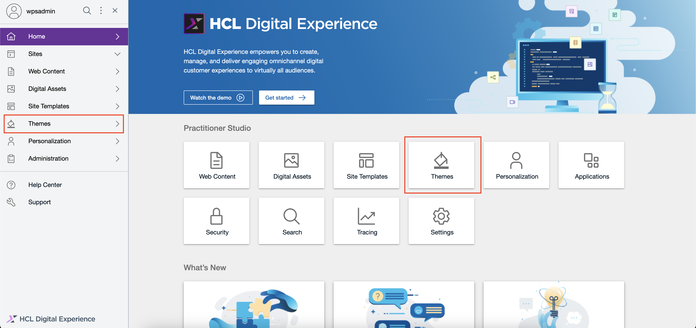
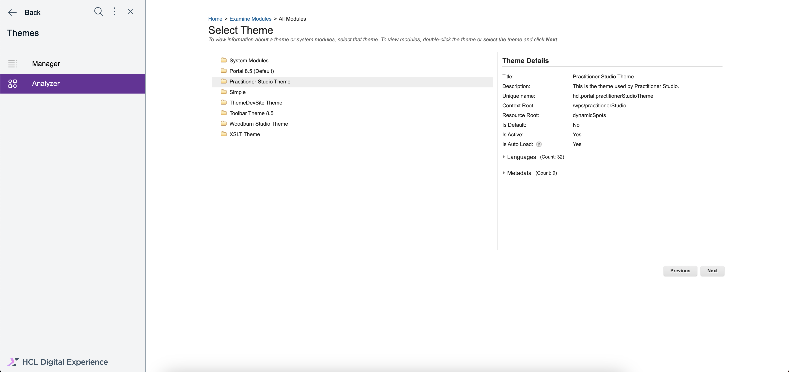

# Components of Search V2

The Search V2 UI is composed of web components called search components. This guide explains how to use the Search V2 UI search components. Follow along to learn about the different types of search components, their styling options, and extendable features.

The default search component for Search V2 is designed to be user-friendly, customizable, and extendable. It offers intuitive search interactions, allows user-defined styling and extensions, and can be integrated anywhere in your application. See an example of the search component below.

## Search component features and benefits

Search V2 components provide the following benefits:

1. **Encapsulation:** Styles and functionality are isolated from the rest of your application using Shadow Document Object Model (DOM).
2. **Reusability:** Build once and reuse across different parts of your application.
3. **Customizability:** Use attributes, properties, and part selectors to customize components without altering their core code.

## Search components overview

Search V2 components has two distinct types:

- [Atomic Components (ACs)](./atomic_components.md)
- [Functional Composite Components (FCCs)](./functional_composite_components.md)

## Theme modules

Search components are provided using theme modules, allowing users to create custom stylesheets for all components. This flexibility is ideal for adapting the search functionality to match your application's design. For more information about themes and skins in DX, refer to  [Developing themes and skins](../../../build_sites/themes_skins/index.md).

## Getting the default theme modules

You can use the default theme modules (CSS and JS files) provided to you as-is, or customize it to suit your needs. Follow these steps to get the provided theme modules for the Search V2 UI on your own DX deployment instance.

1. Log in to your HCL DX 9.5 platform then select **Themes** from the Practitioner Studio homepage or side navigation panel.

    

2. In the side navigation panel, go to **Analyzer** then click **Examine modules**.

    

3. Click **Examine all modules**.

    

4. Double-click the **Practitioner Studio Theme** module.

    

5. Expand the **System Modules** folder then locate and click the `dx_search_css` file.

    

6. On the right-side panel that appears, scroll down and click **Contributions**.

    

7. Click the **Location** URL to view the CSS file.

    

8. Right click on the **Location** URL then click **Save Link As...** and name the file `default.css`.

    

9. Go back to the **System Modules** folder then locate and click the `dx_search_js` file.

    

10. On the right-side panel, scroll down and click **Contributions** again.

    

11. Click the **Location** URL to view the JS file.

    

12. Right click on the **Location** URL then click **Save Link As...** and name the file `index.js`.

    

13. Open the `default.css`file in a code editor such as Visual Studio Code then open the **Command Palette**. You can open the **Command Palette** by pressing Cmd + Shift + P for Mac, or Ctrl + Shift + P for Windows.

14. In the **Command Palette**, enter `> Format Document` to format the CSS file in a more structured view. This allows you to read and inspect the code more easily so you can override the styles to your liking. For more information, refer to [Styling the search components](../customizations.md#styling-search-components).

    

    See the sample view of the formatted `default.css` file.

    

## Communication between components using the Broadcast Channel API

Search V2 utilizes the Broadcast Channel API for its components. The Broadcast Channel API provides real-time synchronization, updating search search results when a new query is entered. It has a decoupled design that allows FCC components to work independently and communicate without direct references.

This API also enables seamless communication between different FCC components, even when they are placed in separate areas of your application such as themes, JSPs, portlets, or WCM. This functionality is already present in the provided JS theme module.

## Localization strategy for AC web components

This document outlines the localization (i18n) strategy used in the AC web components library, with examples from the `dx-input-textfield` component.

### Lit localization integration

AC components leverage the `@localized()` decorator from the `@lit/localize` package. This integration enables seamless language switching and translation support for all web components built with Lit.

### Custom localization helpers

The library includes a `localization.ts` utility that provides:

- `getCurrentDirection()`: Detects the text direction (left-to-right or right-to-left) based on the current locale or document settings.
- `isLTR()`: Checks if the current direction is left-to-right.
- `getCurrentLocale()`: Retrieves the active locale from the nearest DOM element with a `lang` attribute, or falls back to a default.
- `setCurrentDirection(locale)`: Updates the document's `dir` attribute to match the locale's directionality.

### Dynamic UI text

Component UI strings, such as placeholders and labels, are set dynamically. For example, a method like `this.getMessage('input.textfield.placeholder.type.to.search')` is used to fetch the correct translation for the current language. The `getMessage` method is already defined in the base Lit element `dx-ac-base-element` from which we extend all atomic components.

### Locale awareness through DOM

Components automatically detect the user's language context by checking the `lang` attribute on the nearest parent DOM element. This ensures that each component displays text in the appropriate language and direction.
