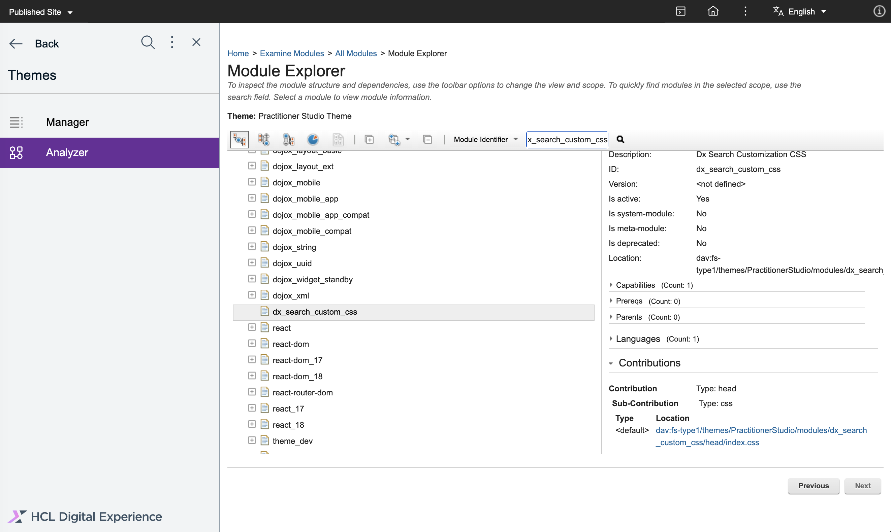

# Customizations for Search V2

This topic provides information on the possible style customizations for Search V2. There are two options:

- [Provide a custom CSS theme module with some styling overrides.](#providing-a-custom-css-theme-module-with-some-stylings-overrides)
- [Provide a custom CSS theme module with all search stylings and some styling adjustments.](#providing-a-custom-css-theme-module-with-all-search-stylings-and-some-styling-adjustments)

## Providing a custom CSS theme module with some stylings overrides

1. Create a new module under Practitioner Studio.
    1. Connect to the Core theme section using WebDav. There are two options:
        - Open the theme resources from your Digital Experience (DX) system using WebDace to adjust some resources. For more information, see [Using WebDAV file store](../../manage_content/wcm_delivery/webdav/administer_webdav/mash_webdav_store.md).
        - You can also use the DxClient tool to connect to the Core theme section. For more information, see [DXClient](../../extend_dx/development_tools/dxclient/index.md).

    2. Create a new theme module.
        1. Open the `PractitionerStudio` theme.
        2. In the `modules` folder, create a new folder with a unique module ID (for example, `dx_search_custom_css`).
        3. Apply the following structure to the new module:
            - `../PractitionerStudio/modules/<unique-module-id>/localization.properties`
            - `../PractitionerStudio/modules/<unique-module-id>/head/`
            - `../PractitionerStudio/modules/<unique-module-id>/head/index.css`

        4. Add the following NLS information to the `localization.properties` file:
            - `title.en=DX Search Customization CSS`
            - `description.en=DX Search Customization CSS`

        5. Add styling overrides to the `index.css` file.

        6. Check the new theme module using the **Analyzer** tab. 

        7. Verify the `index.css` stylings by clicking the **Sub-Contribution** link.
            

2. Use the new custom CSS module in a theme profile.
    
    Edit the `../PractitionerStudio/profiles/profile_search_v2.json` and add the new unique module ID to the profile.

3. Open DX and start a new search.

     Your styling overrides should be visible when you start a new search. 

## Providing a custom CSS theme module with all search stylings and some styling adjustments

1. Download the current stylings using the **Analyzer** tab. For more information, see [Getting the default theme modules](components.md#getting-the-default-theme-modules).

2. Edit the stylings you downloaded. Make sure to use a formatting tool to get a formatted version of the CSS content.

3. In Practitioner Studio, create a new module.
    1. Connect to the Core theme section using WebDav. There are two options:
        - Open the theme resources from your Digital Experience (DX) system using WebDace to adjust some resources. For more information, see [Using WebDAV file store](../../manage_content/wcm_delivery/webdav/administer_webdav/mash_webdav_store.md).
        - You can also use the DxClient tool to connect to the Core theme section. For more information, see [DXClient](../../extend_dx/development_tools/dxclient/index.md).

    2. Create a new theme module.
        1. Open the `PractitionerStudio` theme.
        2. In the `modules` folder, create a new folder with a unique module ID (for example, `dx_search_custom_css`).
        3. Apply the following structure to the new module:
            - `../PractitionerStudio/modules/<unique-module-id>/localization.properties`
            - `../PractitionerStudio/modules/<unique-module-id>/head/`
            - `../PractitionerStudio/modules/<unique-module-id>/head/index.css`

        4. Add the following localization information to the `localization.properties` file:
            - `title.en=DX Search Customization CSS`
            - `description.en=DX Search Customization CSS`

        5. Transfer your formatted and adjusted stylings to the `index.css` file.

        6. Check the new theme module using the **Analyzer** tab.

        7. Verify the `index.css` stylings by clicking the **Sub-Contribution** link.
            

5. Use the new custom CSS module in a theme profile.
    
    Edit the `../PractitionerStudio/profiles/profile_search_v2.json` and replace the `dx_search_css` module ID with the new custom unique module ID.

6. Open DX and start a new search.

    Your styling changes should be visible when you start a new search.