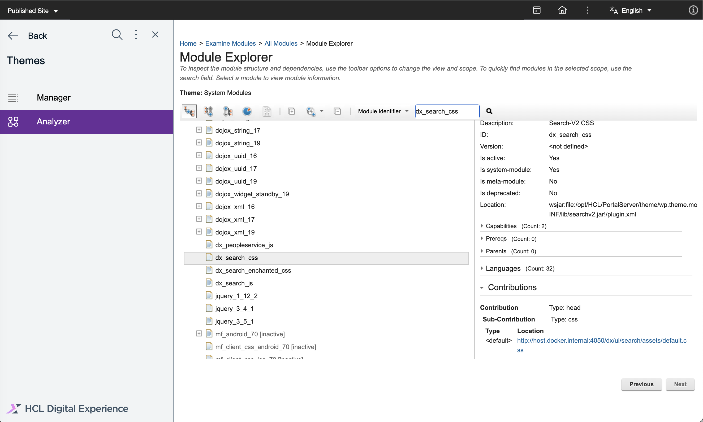

# Customizations of Search V2

This topic provides information on the possible style customizations for Search V2. There are two options:

- [Provide a custom CSS theme module with some styling overrides.](#providing-a-custom-css-theme-module-with-some-styling-overrides)
- [Provide a custom CSS theme module with all search stylings and some styling adjustments.](#providing-a-custom-css-theme-module-with-all-search-stylings-and-some-styling-adjustments)

## Provide a custom CSS theme module with some stylings overrides

1. Create a new module under Practitioner Studio
    1. Connect against the Core theme section via WebDav
        - Please open the theme resources from your DX system via WebDav to adjust some resources. Please follow this  [instruction](../../manage_content/wcm_delivery/webdav/administer_webdav/mash_webdav_store.md) here.
        - You can also use the DxClient tool to do that. Please follow this [instruction](../../extend_dx/development_tools/dxclient/index.md) here.

    2. Create a new theme module
        1. A connection against the `themes` folder via WebDav should be done
        2. Now you have to open the `PractitionerStudio` theme
        3. Create a new folder under the `modules` folder with a unique module ID (for example: `dx_search_custom_css`)
        4. Please apply this structure to the new module
            - `../PractitionerStudio/modules/<unique-module-id>/localization.properties`
            - `../PractitionerStudio/modules/<unique-module-id>/head/`
            - `../PractitionerStudio/modules/<unique-module-id>/head/index.css`

        5. Add NLS information to the `localization.properties` file
            - `title.en=DX Search Customization CSS`
            - `description.en=DX Search Customization CSS`

        6. Add styling overrides to the `index.css` file

        7. Verify the `index.css` stylings by clicking the **Sub-Contribution** link
            

2. Use the new custom CSS module in a theme profile
    
    Edit the `../PractitionerStudio/profiles/profile_search_v2.json` and add the new unique module ID to the profile.

3. Open DX and start a new search

    Your styling changes should be visible when you start a new search.

## Provide a custom CSS theme module with all search stylings and some styling adjustments

1. Download the current stylings via the Theme analyzer
    

    For more information please check this [instruction](../components/#getting-the-default-theme-modules) here.

2. Edit the stylings
    - Please use a formatting tool to get a formatted version of the CSS content
    - Now you can adjust some stylings

3. Create a new module under Practitioner Studio
    1. Connect against the Core theme section via WebDav
        - Please open the theme resources from your DX system via WebDav to adjust some resources. Please follow this  [instruction](../../manage_content/wcm_delivery/webdav/administer_webdav/mash_webdav_store.md) here.
        - You can also use the DxClient tool to do that. Please follow this [instruction](../../extend_dx/development_tools/dxclient/index.md) here.

    2. Create a new theme module
        1. A connection agains the `themes` folder via WebDav should be done
        2. Now you have to open the `PractitionerStudio` theme
        3. Create a new folder under the `modules` folder with a unique module ID (for example: `dx_search_custom_css`)
        4. Please apply this structure to the new module
            - `../PractitionerStudio/modules/<unique-module-id>/localization.properties`
            - `../PractitionerStudio/modules/<unique-module-id>/head/`
            - `../PractitionerStudio/modules/<unique-module-id>/head/index.css`

        5. Add NLS information to the `localization.properties` file
            - `title.en=DX Search Customization CSS`
            - `description.en=DX Search Customization CSS`

        6. Transfer your formatted and adjusted stylings to the `index.css` file

        7. Verify the `index.css` stylings by clicking the **Sub-Contribution** link
            

5. Use the new custom css module in a theme profile
    
    Edit the `../PractitionerStudio/profiles/profile_search_v2.json` and replace the `dx_search_css` module ID with the new custom unique module ID.

6. Open DX and start a new search

    Your styling changes should be visible when you start a new search.