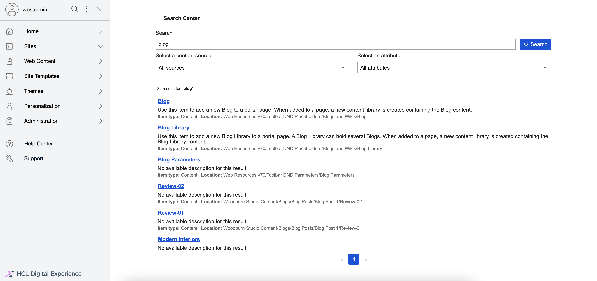
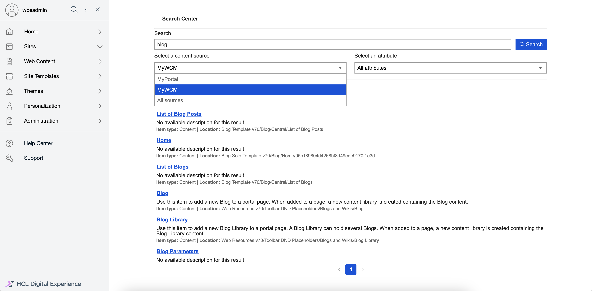
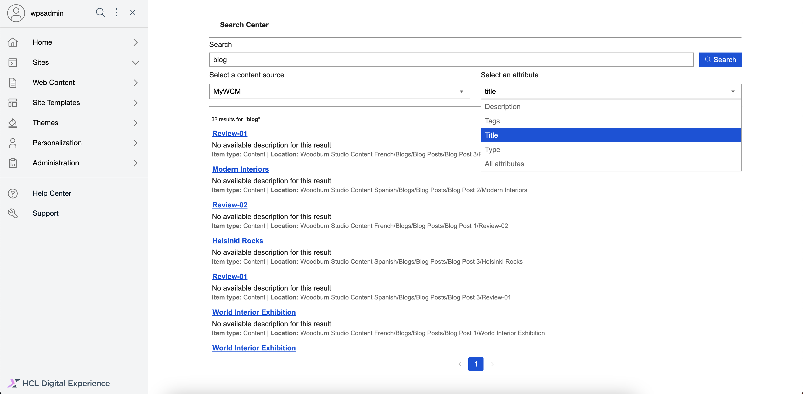
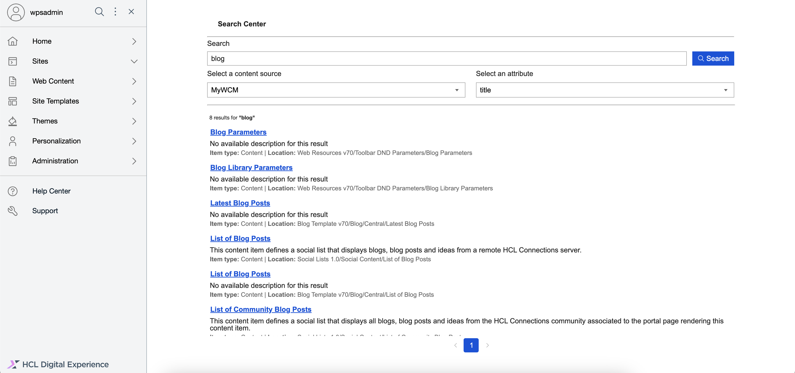
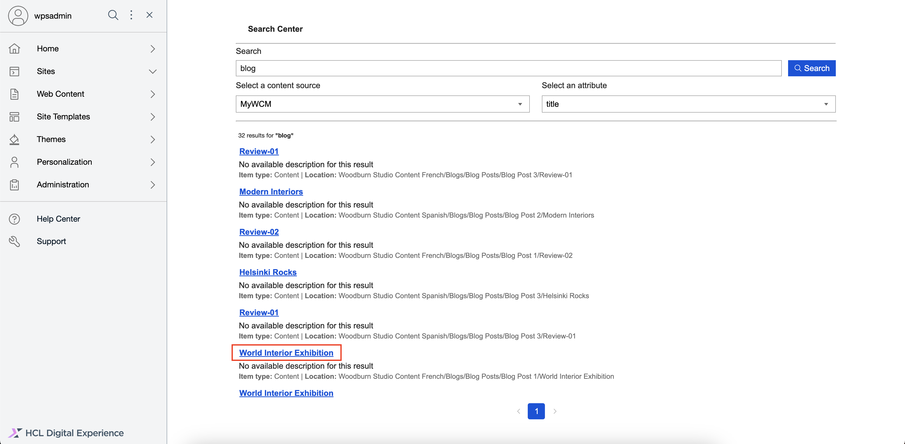

# Using Search V2

Generate search results from different content sources (from WCM or Portal) using Search V2. This section details how to generate a set of search results in Search V2.

## Prerequisites

- Starting from HCL Digital Experience (DX) 9.5 CF224, you can enable Search V2. For instructions on how to manually install Search V2 on supported environments, refer to [Installing HCL Digital Experience 9.5 Search V2](./installation.md).

- For instructions on how to access the Search V2 UI, refer to [Accessing HCL DX 9.5 Search V2](./access.md).

## Generating a set of search results

A set of search results is generated based on the keywords or phrases you enter in the Search input field. You can get more specific results if you define the content source to search from and specify the attributes to search for, such as the title, description, type, or tags.

1.  Log in to your HCL DX 9.5 platform then select **Search** from the Practitioner Studio homepage.

    

2.  In the Search V2 user interface, enter your search terms on the **Search** field, then click **Search**. In the example below, the term "blog" is searched.

    

3.  View the search results generated. Above the list of results, you can see the total number of results found for the search term. In the example below, the term "blog" generated 32 search results.

    

4.  Refine the search results further by selecting a content source and attribute, then click **Search** again.

    1. Click the **Select a content source** dropdown and select a content source, such as "MyWCM".

        

    2. Click the **Select an attribute** dropdown and select an attribute, such as "title".

        

5.  View the search results generated again. By selecting a content source and attribute, searching for the term "blog" generated eight, more specific search results.

    

6.  Click on a search result link.

    

7.  View the opened item in a new tab.

    

## Other search result scenarios

- If the search term yields no results, the following message is displayed.
    
    

- If the search engine is down or unavailable, the following message is displayed.
    
    